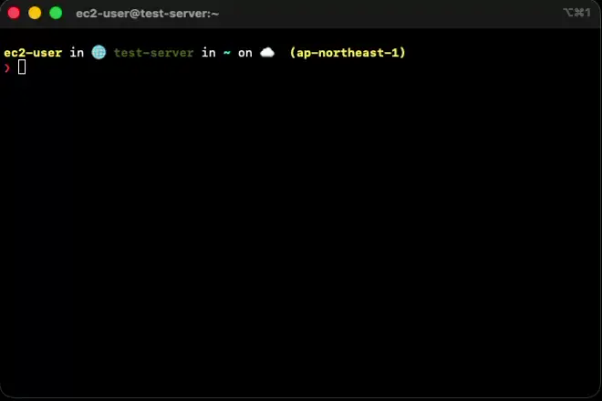

# s3rm

[](https://crates.io/crates/s3rm-rs)
[](https://crates.io/crates/s3rm-rs)
[](https://github.com/nidor1998/s3rm-rs)
[](https://opensource.org/licenses/Apache-2.0)


[](https://deps.rs/crate/s3rm-rs/)
[](https://codecov.io/gh/nidor1998/s3rm-rs)

## Fast Amazon S3 object deletion tool

Delete thousands to millions of S3 objects using batch deletion and parallel workers. Built in Rust with safety features and configurable filtering.

### Demo

This demo shows Express One Zone deleting approximately 34,000 objects per second from a set of 100,000 objects, and deleting approximately 2,700 files per second from a set of 100,000 files with versioning enabled.



## Table of contents

<details>
<summary>Click to expand to view table of contents</summary>

- [Overview](#overview)
    * [Why s3rm?](#why-s3rm)
    * [How it works](#how-it-works)
- [Features](#features)
    * [High performance](#high-performance)
    * [Powerful filtering](#powerful-filtering)
    * [S3 versioning](#s3-versioning)
    * [S3 Express One Zone support](#s3-express-one-zone-support)
    * [User-defined metadata filtering](#user-defined-metadata-filtering)
    * [Tagging filtering](#tagging-filtering)
    * [Safety first](#safety-first)
    * [Optimistic locking](#optimistic-locking)
    * [Robust retry logic](#robust-retry-logic)
    * [Low memory usage](#low-memory-usage)
    * [Rate limiting](#rate-limiting)
    * [Easy to use](#easy-to-use)
    * [Flexibility](#flexibility)
    * [Observability](#observability)
    * [Lua scripting support](#lua-scripting-support)
    * [User-defined filter callback](#user-defined-filter-callback)
    * [User-defined event callback](#user-defined-event-callback)
    * [Library-first design](#library-first-design)
- [Requirements](#requirements)
- [Installation](#installation)
    * [Pre-built binaries](#pre-built-binaries)
    * [Build from source](#build-from-source)
    * [As a Rust library](#as-a-rust-library)
- [Usage](#usage)
    * [Delete by prefix](#delete-by-prefix)
    * [Dry-run mode](#dry-run-mode)
    * [Force mode (skip confirmation)](#force-mode-skip-confirmation)
    * [Delete with regex filter](#delete-with-regex-filter)
    * [Delete by size](#delete-by-size)
    * [Delete by modified time](#delete-by-modified-time)
    * [Combined filters](#combined-filters)
    * [Delete all versions](#delete-all-versions)
    * [Keep only latest versions](#keep-only-latest-versions)
    * [Set a deletion limit](#set-a-deletion-limit)
    * [Custom endpoint](#custom-endpoint)
    * [Specify credentials](#specify-credentials)
    * [Specify region](#specify-region)
- [Detailed information](#detailed-information)
    * [Pipeline architecture](#pipeline-architecture)
    * [Batch deletion detail](#batch-deletion-detail)
    * [Retry logic detail](#retry-logic-detail)
    * [Filtering order](#filtering-order)
    * [Confirmation prompt detail](#confirmation-prompt-detail)
    * [Dry-run mode detail](#dry-run-mode-detail)
    * [Versioning support detail](#versioning-support-detail)
    * [Optimistic locking detail](#optimistic-locking-detail)
    * [Memory usage detail](#memory-usage-detail)
    * [Parallel object listing](#parallel-object-listing)
    * [S3 Permissions](#s3-permissions)
    * [Lua VM](#lua-vm)
    * [Lua VM security](#lua-vm-security)
    * [Lua script error](#lua-script-error)
    * [CLI process exit codes](#cli-process-exit-codes)
- [Advanced options](#advanced-options)
    * [--worker-size](#--worker-size)
    * [--batch-size](#--batch-size)
    * [--max-parallel-listings](#--max-parallel-listings)
    * [--max-parallel-listing-max-depth](#--max-parallel-listing-max-depth)
    * [--rate-limit-objects](#--rate-limit-objects)
    * [--filter-include-regex/--filter-exclude-regex](#--filter-include-regex--filter-exclude-regex)
    * [--if-match](#--if-match)
    * [--max-delete](#--max-delete)
    * [-v](#-v)
    * [--aws-sdk-tracing](#--aws-sdk-tracing)
    * [--auto-complete-shell](#--auto-complete-shell)
    * [-h/--help](#-h--help)
- [All command line options](#all-command-line-options)
- [CI/CD Integration](#cicd-integration)
- [Library API](#library-api)
- [About testing](#about-testing)
- [Fully AI-generated (human-verified) software](#fully-ai-generated-human-verified-software)
    * [Quality verification (by AI self-assessment, v1.1.1)](#quality-verification-by-ai-self-assessment-v111)
    * [AI assessment of safety and correctness (by Claude, Anthropic)](#ai-assessment-of-safety-and-correctness-by-claude-anthropic)
    * [AI assessment of safety and correctness (by Codex)](#ai-assessment-of-safety-and-correctness-by-codex)
    * [AI assessment of safety and correctness (by Gemini)](#ai-assessment-of-safety-and-correctness-by-gemini)
- [Recommendation](#recommendation)
- [AI Evaluation Notice](#ai-evaluation-notice)
- [License](#license)

</details>

## Overview

s3rm is a fast deletion tool for Amazon S3 with built-in safety features.
It serves as a purpose-built alternative to `aws s3 rm --recursive`, offering batch deletion, parallel workers, and safety features that the AWS CLI lacks.

Whether you're cleaning up terabytes of old logs, enforcing data retention policies, or purging versioned buckets, s3rm uses a streaming pipeline that keeps memory usage constant regardless of object count.

All features are available as a Rust library (`s3rm_rs` crate), so you can integrate S3 deletion into your own applications programmatically.

### Why s3rm?

Deleting millions of S3 objects is a surprisingly painful problem:

- **`aws s3 rm --recursive`** deletes objects one at a time in a single thread.
- **S3 Lifecycle Policies** are free but execution timing is not guaranteed, and they offer no filtering beyond prefix and tags.

s3rm solves these problems with batch deletion, parallel workers, comprehensive filtering, and safety features.

### How it works

```
ObjectLister → [Filters] → ObjectDeleter Workers → Terminator
     ↓              ↓              ↓                    ↓
  Parallel      Regex, size,   Batch API calls     Drains output
  pagination    time, Lua,     with retry logic    and closes
               metadata, tags                      the pipeline
```

Objects stream through the pipeline one stage at a time. The lister fetches keys from S3 using parallel pagination, filters narrow down which objects to delete, and a pool of concurrent workers executes batch deletions against the S3 API. Nothing is loaded into memory all at once — s3rm handles buckets of any size with constant memory usage.

## Features

### High performance

s3rm is implemented in Rust and uses the AWS SDK for Rust, which supports multithreaded asynchronous I/O.
The default configuration (`--worker-size 16`, `--batch-size 200`) achieves approximately 3,500 objects per second for standard S3 buckets, which approaches the practical throughput guideline of Amazon S3. Express One Zone directory buckets can achieve approximately 34,000 deletions per second with `--worker-size 256` and `--allow-parallel-listings-in-express-one-zone`.

- **Batch deletion** using S3's `DeleteObjects` API — up to 1,000 objects per request
- **Parallel workers** — up to 65,535 concurrent deletion workers
- **Parallel listing** — concurrent `ListObjectsV2` pagination for faster enumeration
- **Streaming pipeline** — constant memory usage regardless of the number of objects

### Powerful filtering

s3rm offers sophisticated object selection inherited from [s3sync](https://github.com/nidor1998/s3sync):
- Regular expression-based key filtering
- Content-Type filtering with regex
- Size constraints (smaller/larger than a threshold)
- Modification time constraints (before/after a timestamp)
- Custom filtering with a Lua script or user-defined Rust callback

The regular expression syntax is the same as [fancy_regex](https://docs.rs/fancy-regex/latest/fancy_regex/#syntax), which supports lookaround features.

All filters are combined with logical AND — an object must pass every active filter to be deleted.

### S3 versioning

S3 versioned buckets store multiple versions of each object. s3rm handles all scenarios:

- **Default behavior** — creates delete markers (objects appear deleted but previous versions are preserved)
- **`--delete-all-versions`** — permanently removes every version of matching objects, including delete markers
- **`--keep-latest-only`** — retains only the latest version of each object, deleting all older versions (requires `--delete-all-versions`)

### S3 Express One Zone support

s3rm supports [Amazon S3 Express One Zone](https://aws.amazon.com/s3/storage-classes/express-one-zone/), the high-performance, single-Availability Zone storage class designed for latency-sensitive workloads.

s3rm automatically detects Express One Zone directory buckets (by the `--x-s3` bucket name suffix) and adjusts its behavior:

- Parallel listing is disabled by default for Express One Zone, because parallel listing may return in-progress multipart upload objects in this storage class.
- You can re-enable parallel listing with `--allow-parallel-listings-in-express-one-zone` if your use case allows it.
- The `s3express:CreateSession` permission is included in the [required permissions](#s3-permissions).

### User-defined metadata filtering

You can filter objects based on user-defined metadata.
Example: `--filter-include-metadata-regex 'key1=(value1|xxx),key2=value2'`, `--filter-exclude-metadata-regex 'key1=(value1|xxx),key2=value2'`

Note: When using this option, additional API calls may be required to get the metadata of each object.

### Tagging filtering

You can filter objects based on tags.
This crate supports lookaround features.

For example, `'^(?!.*&test=true).*stage=first'` can be used to filter objects that do not contain `test=true` and that contain `stage=first` in the tags.
You can create regular expressions that combine multiple logical conditions with lookaround features — reducing the need for Lua scripts to filter objects with complex patterns.

Note: When using this option, additional API calls are required to get the tags of each object.

### Safety first

Unlike most S3 deletion tools, s3rm is designed with **safety as a first-class feature**:

- **Dry-run mode** (`-d`/`--dry-run`) — run the full pipeline (listing, filtering) but simulate deletions without making actual S3 API calls. Each object that would be deleted is logged with a `[dry-run]` prefix, and summary statistics are displayed.
- **Confirmation prompt** — before any destructive operation, s3rm displays the target path with colored text and requires the full word "yes" to proceed. Abbreviated responses like "y" are rejected.
- **Max-delete threshold** (`--max-delete N`) — set a hard limit on how many objects can be deleted in a single run. The pipeline cancels gracefully once the threshold is reached.
- **Force flag** (`-f`/`--force`) — skip confirmation prompts for scripted or CI/CD use.
- **Non-TTY detection** — automatically disables interactive prompts when running in non-interactive environments (CI/CD pipelines, cron jobs).

If you use s3rm for the first time, use the `--dry-run` option to preview the operation.

### Optimistic locking

With `--if-match`, s3rm uses each object's own ETag (obtained during listing) to include the `If-Match` header in deletion requests.
This prevents race conditions — if another process modifies an object after s3rm listed it, the deletion is skipped rather than removing an object that has changed.

This is the same optimistic locking mechanism available in [s3sync](https://github.com/nidor1998/s3sync).

### Robust retry logic

s3rm uses two layers of retry:

1. **AWS SDK retries** — the AWS SDK for Rust automatically retries transient API failures (5xx, throttling) with exponential backoff. Configured via `--aws-max-attempts` and `--initial-backoff-milliseconds`.
2. **Batch partial-failure fallback** — when a `DeleteObjects` batch request partially fails, s3rm classifies each failed key by error code. Keys that failed with a retryable error (`InternalError`, `SlowDown`, `ServiceUnavailable`, `RequestTimeout`) are retried individually using the `DeleteObject` API. This fallback is controlled by `--force-retry-count` (default: 0, disabled).

Non-retryable errors (e.g., `AccessDenied`) are logged and skipped immediately.

For more information, see [Retry logic detail](#retry-logic-detail).

### Low memory usage

Memory usage is low and does not depend on the number of objects.
The streaming pipeline processes objects as they flow through — nothing is loaded into memory all at once.
s3rm can handle buckets with billions of objects without increasing memory consumption.

### Rate limiting

With `--rate-limit-objects`, you can cap deletion throughput in objects per second.
This is useful to avoid S3 throttling (`SlowDown` responses) or to control API costs.

### Easy to use

s3rm is designed to be easy to use.
The default settings work for most scenarios without additional tuning.

For example, in an IAM role environment, the following command will preview all objects that would be deleted:

```bash
s3rm --dry-run s3://bucket-name/prefix
```

And the following command will delete them with confirmation:

```bash
s3rm s3://bucket-name/prefix
```

### Flexibility

s3rm is designed to adapt to a wide range of deletion scenarios:

- **12 CLI filter options plus programmable Lua/Rust filter callbacks** — regex on keys, content-type, user-defined metadata, and tags; size thresholds; modification time ranges; plus Lua scripting callbacks. See [Filtering order](#filtering-order) for the complete list.
- **S3-compatible services** — works with MinIO, Wasabi, Cloudflare R2, and other S3-compatible storage via `--target-endpoint-url` and `--target-force-path-style`. See [Custom endpoint](#custom-endpoint).
- **S3 Express One Zone** — automatically detects Express One Zone directory buckets and adjusts listing behavior accordingly. See [S3 Express One Zone support](#s3-express-one-zone-support).
- **CLI and library** — use s3rm as a standalone CLI tool or embed it as a Rust library in your own applications with custom filter and event callbacks.
- **Configurable everything** — worker count (1 to 65,535), batch size (1 to 1,000), retry attempts, rate limiting, timeouts, parallel listing depth, and more. All options can be set via CLI flags or environment variables.
- **Cross-platform** — pre-built binaries for Linux (glibc and musl), Windows, and macOS on both x86_64 and ARM64.

### Observability

- **Progress bar** — real-time display of objects deleted, bytes reclaimed, and deletion rate (using [indicatif](https://docs.rs/indicatif/latest/indicatif/))
- **Configurable verbosity** — from silent (`-qq`) to debug (`-vvv`)
- **JSON logging** (`--json-tracing`, requires `--force`) — structured logs for integration with log aggregation systems
- **Event callbacks** — receive real-time deletion events via Lua scripts or Rust callbacks
- **Colored output** — ANSI colors for improved readability (automatically disabled in non-TTY environments)

### Lua scripting support

You can use a [Lua](https://www.lua.org) (5.4) script to implement custom filtering and event handling.
`--filter-callback-lua-script` and `--event-callback-lua-script` options are available for this purpose.
Lua is widely recognized as a fast scripting language. The Lua engine is embedded in s3rm, so you can use Lua scripts without any additional dependencies.

By default, Lua scripts run in safe mode, so they cannot use Lua's OS or I/O library functions.
If you want to allow more Lua libraries, you can use `--allow-lua-os-library` or `--allow-lua-unsafe-vm` options.

Lua scripting support is included by default. To build without it, use `cargo build --release --no-default-features`.

Example Lua filter script (`my_filter.lua`):

```lua
-- Return true to delete the object, false to skip it.
-- The 'obj' table has fields: key, size, last_modified, version_id,
-- e_tag, is_latest, is_delete_marker
function filter(obj)
    -- Delete only .tmp files larger than 1 KB
    return string.find(obj.key, "%.tmp$") ~= nil and obj.size > 1024
end
```

```bash
s3rm --filter-callback-lua-script my_filter.lua --force s3://my-bucket/data/
```

### User-defined filter callback

If you are familiar with Rust, you can use `UserDefinedFilterCallback` to implement custom filtering logic via the library API.
Thanks to Rust's clear compiler error messages and robust language features, even software engineers unfamiliar with the language can implement it easily.
To use `UserDefinedFilterCallback`, implement the `FilterCallback` trait.

```rust
use async_trait::async_trait;
use s3rm_rs::types::filter_callback::FilterCallback;
use s3rm_rs::types::S3Object;
use anyhow::Result;

struct MyFilter;

#[async_trait]
impl FilterCallback for MyFilter {
    async fn filter(&mut self, object: &S3Object) -> Result<bool> {
        // Return true to delete, false to skip
        Ok(object.key().ends_with(".tmp"))
    }
}
```

### User-defined event callback

If you are familiar with Rust, you can use `UserDefinedEventCallback` to implement custom event handling logic, such as logging, monitoring, or custom actions during deletion operations.
To use `UserDefinedEventCallback`, implement the `EventCallback` trait.

```rust
use async_trait::async_trait;
use s3rm_rs::types::event_callback::{EventCallback, EventData};

struct MyEventHandler;

#[async_trait]
impl EventCallback for MyEventHandler {
    async fn on_event(&mut self, event: EventData) {
        println!("Event: {:?}, Key: {:?}", event.event_type, event.key);
    }
}
```

### Library-first design

s3rm is designed as a library first. The CLI binary is a thin wrapper over the s3rm library.
All CLI features are available programmatically through the `s3rm_rs` crate.

This means you can:
- Integrate S3 bulk deletion into your own Rust applications
- Register custom filter and event callbacks programmatically
- Build custom deletion workflows with full async/await support

## Requirements

- x86_64 Linux (kernel 3.2 or later)
- ARM64 Linux (kernel 4.1 or later)
- Windows 11 (x86_64, aarch64)
- macOS 11.0 or later (aarch64, x86_64)

All features are tested on the above platforms.

s3rm is distributed as a single binary with no dependencies (except glibc), so it can be easily run on the above platforms.
Linux musl statically linked binary is also available.

AWS credentials are required. s3rm supports all standard AWS credential mechanisms:
- Environment variables (`AWS_ACCESS_KEY_ID`, `AWS_SECRET_ACCESS_KEY`)
- AWS credentials file (`~/.aws/credentials`)
- AWS config file (`~/.aws/config`) with profiles
- IAM instance roles (EC2, ECS, Lambda)
- SSO/federated authentication

For more information, see [SDK authentication with AWS](https://docs.aws.amazon.com/sdk-for-rust/latest/dg/credentials.html).

## Installation

### Pre-built binaries

Download the latest binary from [GitHub Releases](https://github.com/nidor1998/s3rm-rs/releases).

### Build from source

s3rm requires Rust 1.91 or later.

```bash
# Clone the repository
git clone https://github.com/nidor1998/s3rm-rs.git
cd s3rm-rs

# Build release binary
cargo build --release

# The binary is at ./target/release/s3rm
```

Lua scripting support is included by default. To build without it:

```bash
cargo build --release --no-default-features
```

### As a Rust library

s3rm can be used as a Rust library.
The s3rm CLI is a very thin wrapper over the s3rm library. All CLI features are available in the library.

Add to your `Cargo.toml`:

```toml
[dependencies]
s3rm-rs = "1"
```

See [Library API](#library-api) for usage examples.

## Usage

AWS credentials are required to use s3rm. IAM Roles, AWS CLI Profile, environment variables, etc. are supported.
By default, s3rm obtains credentials from many locations (IAM Roles, environment variables, etc.).

Region is required. It can be specified in the profile, environment, or command line options.

A prefix is optional. If not specified, the entire bucket will be targeted.

If you specify a prefix, **s3rm doesn't automatically add a trailing slash.**
For example, if you specify `s3://bucket-name/prefix`, s3rm will target objects whose keys start with `prefix` (including `prefix/foo` and `prefixbar`).
If you specify `s3://bucket-name/prefix/`, only objects under the `prefix/` directory are targeted.

If you use s3rm for the first time, you should use the `--dry-run` option to preview the operation.

For all options, see `s3rm --help`.

### Delete by prefix

The simplest usage — delete all objects under a given S3 prefix:

```bash
s3rm s3://my-bucket/logs/2023/
```

You'll be asked to confirm before any objects are deleted:

```
WARNING: All objects matching prefix s3://my-bucket/logs/2023/  will be deleted.
Use --dry-run to preview which objects would be deleted without actually removing them.

Type 'yes' to confirm deletion:
```

### Dry-run mode

Preview exactly what would happen without deleting anything:

```bash
s3rm --dry-run s3://my-bucket/logs/2023/
```

Each object that would be deleted is logged at info level with a `[dry-run]` prefix, and summary statistics are displayed at the end.

### Force mode (skip confirmation)

Skip the confirmation prompt for automated use:

```bash
s3rm --force s3://my-bucket/temp/
```

### Delete with regex filter

Delete only `.tmp` files:

```bash
s3rm --filter-include-regex '.*\.tmp$' --force s3://my-bucket/data/
```

Exclude certain files from deletion:

```bash
s3rm --filter-exclude-regex '.*\.keep$' --force s3://my-bucket/data/
```

### Delete by size

Delete objects smaller than 1 KB (likely empty or corrupt):

```bash
s3rm --filter-smaller-size 1KB --force s3://my-bucket/uploads/
```

Delete objects larger than 1 GB:

```bash
s3rm --filter-larger-size 1GiB --force s3://my-bucket/backups/
```

### Delete by modified time

Delete objects older than a specific date:

```bash
s3rm --filter-mtime-before 2023-01-01T00:00:00Z --force s3://my-bucket/logs/
```

Delete objects modified after a specific date:

```bash
s3rm --filter-mtime-after 2024-06-01T00:00:00Z --force s3://my-bucket/temp/
```

### Combined filters

Filters combine with logical AND. Delete `.log` files older than 90 days and smaller than 10 MB:

```bash
s3rm \
  --filter-include-regex '.*\.log$' \
  --filter-mtime-before 2024-09-01T00:00:00Z \
  --filter-smaller-size 10MiB \
  --force \
  s3://my-bucket/logs/
```

### Delete all versions

On versioned buckets, delete every version of every object under a prefix:

```bash
s3rm --delete-all-versions --force s3://my-bucket/old-data/
```

### Keep only latest versions

On versioned buckets, delete all older versions while keeping only the latest version of each object:

```bash
s3rm --keep-latest-only --delete-all-versions --force s3://my-bucket/data/
```

This is useful for enforcing version retention policies — it cleans up old versions while preserving the current state of every object. Can be combined with `--filter-include-regex` or `--filter-exclude-regex` to target specific keys.

### Set a deletion limit

Stop after deleting 1,000 objects (safety net for large buckets):

```bash
s3rm --max-delete 1000 --force s3://my-bucket/data/
```

### Custom endpoint

You can specify an S3-compatible storage endpoint (MinIO, Wasabi, Cloudflare R2, etc.).
Warning: You may need to specify `--target-force-path-style`.

```bash
s3rm \
  --target-endpoint-url https://minio.example.com:9000 \
  --target-force-path-style \
  --force \
  s3://my-bucket/data/
```

### Specify credentials

```bash
s3rm --target-access-key YOUR_KEY --target-secret-access-key YOUR_SECRET --force s3://bucket-name/prefix
```

### Specify region

```bash
s3rm --target-region us-west-2 --force s3://bucket-name/prefix
```

## Detailed information

### Pipeline architecture

s3rm uses a streaming pipeline architecture with four stages connected by async channels:

1. **ObjectLister** — Lists objects from S3 using `ListObjectsV2` (or `ListObjectVersions` when `--delete-all-versions` is enabled). Supports parallel pagination for fast enumeration.
2. **Filter stages** — A chain of filters that narrow down which objects to delete. Objects flow through each filter in sequence — if any filter rejects an object, it is skipped.
3. **ObjectDeleter** — A pool of concurrent workers that execute batch deletions using the `DeleteObjects` API (or `DeleteObject` for single-object mode). Includes retry logic for partial failures.
4. **Terminator** — Drains the final output channel, allowing upstream stages to complete without blocking.

Each stage runs as an independent async task. Objects stream through the pipeline without being buffered in memory.

### Batch deletion detail

By default, s3rm groups objects into batches of `--batch-size` (default: 200) and uses the S3 `DeleteObjects` API to delete up to 1,000 objects per request. This dramatically reduces the number of API calls compared to deleting objects one at a time.

If `--batch-size` is set to 1, s3rm uses the `DeleteObject` API for single-object deletion. This may be needed for S3-compatible services that don't support batch deletion.

When a batch deletion partially fails (some objects deleted, some errors), s3rm records the successfully deleted objects and classifies each failure by error code. Retryable failures are retried individually using `DeleteObject` API calls (see [Retry logic detail](#retry-logic-detail)).

### Retry logic detail

s3rm has two retry layers:

**Layer 1: AWS SDK retries (all API calls)**

Every S3 API call (including `DeleteObjects`, `DeleteObject`, `ListObjectsV2`, etc.) is automatically retried by the AWS SDK for Rust using its standard retry strategy with exponential backoff. Configure this with:
- `--aws-max-attempts` (default: 10) — maximum attempts per API call
- `--initial-backoff-milliseconds` (default: 100ms) — initial backoff duration, doubled on each retry

**Layer 2: Batch partial-failure fallback (batch mode only)**

When a `DeleteObjects` batch request succeeds at the API level but reports per-key errors in its response, s3rm handles each failed key individually:
- **Retryable errors** (`InternalError`, `SlowDown`, `ServiceUnavailable`, `RequestTimeout`) — s3rm falls back to individual `DeleteObject` API calls for these keys, retrying up to `--force-retry-count` times (default: 0, meaning no fallback retries). The interval between fallback attempts is a fixed delay of `--force-retry-interval-milliseconds` (default: 1000ms). Each individual `DeleteObject` call also benefits from the AWS SDK's own retry logic (Layer 1).
- **Non-retryable errors** (e.g., `AccessDenied`, `NoSuchKey`) — logged and added to failures immediately without retry.

This fallback only applies in batch mode (`--batch-size` > 1). In single-object mode (`--batch-size 1`), the `SingleDeleter` does not perform application-level retries — it relies solely on the AWS SDK's built-in retry logic.

If an object fails after all retries are exhausted, s3rm logs the failure and continues processing remaining objects. The final exit code reflects whether any failures occurred.

### Filtering order

s3rm filters objects in the following order:

1. `--filter-mtime-before`
2. `--filter-mtime-after`
3. `--filter-smaller-size`
4. `--filter-larger-size`
5. `--filter-include-regex`
6. `--filter-exclude-regex`
7. `--keep-latest-only`
8. `FilterCallback (--filter-callback-lua-script / UserDefinedFilterCallback)`
9. `--filter-include-content-type-regex`
10. `--filter-exclude-content-type-regex`
11. `--filter-include-metadata-regex`
12. `--filter-exclude-metadata-regex`
13. `--filter-include-tag-regex`
14. `--filter-exclude-tag-regex`

Filters that require additional API calls (content type, metadata, tags) are applied last to minimize unnecessary requests.

### Confirmation prompt detail

By default, s3rm displays a warning with the target S3 path in colored text and requires explicit confirmation before proceeding:

```
WARNING: All objects matching prefix s3://my-bucket/important-data/  will be deleted.
Use --dry-run to preview which objects would be deleted without actually removing them.

Type 'yes' to confirm deletion:
```

Only the exact string "yes" is accepted. Any other input — including "y", "Y", "Yes", or "YES" — is rejected, and the operation is cancelled. This is intentional to prevent accidental deletions.

The confirmation prompt is skipped when:
- `--force` flag is provided
- `--dry-run` mode is enabled (no actual deletions occur)
- Running in a non-TTY environment (stdin is not a terminal)

### Dry-run mode detail

With `--dry-run`, s3rm runs the full pipeline (listing, filtering) but simulates deletions without making actual S3 API calls:

- Each object that would be deleted is logged at info level with a `[dry-run]` prefix
- Summary statistics (object count, total size) are displayed at the end
- The minimum verbosity level is info, regardless of `-q` flags, so that deletion previews are always visible
- No confirmation prompt is shown (since nothing will be deleted)

This is the recommended first step when targeting any new prefix or filter combination.

### Versioning support detail

Without `--delete-all-versions`, deleting from a versioned bucket creates delete markers. The objects appear deleted but previous versions are preserved and can be recovered.

With `--delete-all-versions`, s3rm uses `ListObjectVersions` instead of `ListObjectsV2` to enumerate every version of every object (including delete markers), and permanently deletes them all. Each version counts as a separate object in progress statistics.

With `--keep-latest-only --delete-all-versions`, s3rm lists all versions but only deletes the non-latest ones, keeping the latest version of each object intact. This is useful for enforcing version retention policies. The target bucket must have versioning enabled; otherwise s3rm returns an error.

### Optimistic locking detail

With `--if-match`, s3rm uses each object's ETag (obtained during listing) to include the `If-Match` header in deletion requests.

This serves as optimistic locking — it prevents s3rm from deleting an object that has been modified by another process after s3rm listed it. If the ETag has changed, the deletion is skipped and a warning is logged.

Note: `--if-match` uses single-object `DeleteObject` API calls (not batch deletion), which may reduce throughput. Use this option when correctness in concurrent environments matters more than raw speed.

Note: `--if-match` cannot be used with `--delete-all-versions`. S3 does not support If-Match conditional headers when deleting by version ID (returns `NotImplemented`).

It is a challenging topic to understand, please refer to [AWS documentation](https://docs.aws.amazon.com/AmazonS3/latest/userguide/conditional-requests.html).

Note: Few S3-compatible storage services support conditional requests.

### Memory usage detail

s3rm's streaming pipeline means memory usage is constant regardless of how many objects are in the bucket. Objects are streamed through the pipeline as they are listed — they are never all held in memory at once.

Memory usage primarily depends on:
- The number of workers (`--worker-size`)
- The internal listing queue size (`--object-listing-queue-size`)

The default settings are suitable for buckets of any size.

### Parallel object listing

By default, s3rm lists objects in parallel (default 16 workers).
The parallel listing is enabled up to the second level of subdirectories or prefixes.
The depth is configurable with `--max-parallel-listing-max-depth` option.

For example, if the target is `s3://bucket-name/prefix/` and there are many objects under `prefix/dir1`, `prefix/dir2`, ..., s3rm lists objects under these prefixes in parallel.

You can configure the number of parallel listing workers with `--max-parallel-listings` option.
If set to 1, parallel listing is disabled.

With Express One Zone storage class, parallel listing may return in-progress multipart upload objects.
So, parallel listing is disabled by default for Express One Zone. You can enable it with `--allow-parallel-listings-in-express-one-zone`.

When `--delete-all-versions` is specified, parallel listing is disabled.

### S3 Permissions

s3rm requires the following S3 permissions:

```
"Action": [
    "s3:DeleteObject",
    "s3:DeleteObjectVersion",
    "s3:GetBucketVersioning",
    "s3:ListBucket",
    "s3:ListBucketVersions",
    "s3express:CreateSession"
]
```

Additional permissions may be needed depending on features used:
- `s3:HeadObject` / `s3:GetObjectTagging` — when using metadata or tag filters

### Lua VM

Each type of callback has its own Lua VM and memory limit.
The Lua VM is shared between workers and called serially.
Each Lua script is loaded and compiled once at startup and lives until the end of the deletion operation.

### Lua VM security

By default, a Lua script runs in safe mode.
Lua's [Operating System facilities](https://www.lua.org/manual/5.4/manual.html#6.9)
and [Input and Output Facilities](https://www.lua.org/manual/5.4/manual.html#6.8) are disabled by default.
This is because these facilities can be used to execute arbitrary commands, which can be a security risk (especially set-uid/set-gid programs).
Also, Lua VM is not allowed to load unsafe standard libraries or C modules.

If these restrictions are too strict, you can use `--allow-lua-os-library` or `--allow-lua-unsafe-vm` options.

Note: The statically linked binary cannot load C modules.

### Lua script error

If a filter callback Lua script raises an error, s3rm will stop the operation and exit with error code `1`.
An event callback Lua script does not stop the operation — just shows a warning message.

### CLI process exit codes

- 0: Exit without error
- 1: Exit with error
- 2: Invalid arguments
- 3: Exit with warning (partial failure; use `--warn-as-error` to treat as error)
- 101: Abnormal termination (internal panic)

## Advanced options

### --worker-size

The number of concurrent deletion workers. More workers can increase throughput, but may increase S3 throttling.
Default: 16

### --batch-size

Objects grouped per `DeleteObjects` API call. Default: 200. Range: 1–1,000.
Set to 1 to use single-object `DeleteObject` API calls.

### --max-parallel-listings

The number of concurrent listing operations. Default: 16.
More parallel listings speed up enumeration of large prefixes.

### --max-parallel-listing-max-depth

Maximum depth (subdirectory/prefix) of parallel listings. Default: 2.
In some cases, parallel listing at deeper levels may improve performance.

### --rate-limit-objects

Maximum objects per second. Minimum: 10.
Useful to avoid S3 throttling or control API costs.

### --filter-include-regex/--filter-exclude-regex

Regular expression filters for object keys.
The regular expression syntax is the same as [fancy_regex](https://docs.rs/fancy-regex/latest/fancy_regex/#syntax), which supports lookaround features.

### --if-match

Add an `If-Match` header for DeleteObject requests.
This is for optimistic locking — prevents deleting objects that were modified since listing.

### --max-delete

Don't delete more than a specified number of objects.
The pipeline cancels gracefully once the limit is reached.

### -v

s3rm uses [tracing-subscriber](https://docs.rs/tracing-subscriber/latest/tracing_subscriber/) for tracing.
More occurrences increase the verbosity.
For example, `-v`: show `info`, `-vv`: show `debug`, `-vvv`: show `trace`
By default, s3rm shows warning and error messages.

`info` and `debug` messages are useful for troubleshooting. `trace` messages are useful for debugging.

You can also use `-q`, `-qq` to reduce the verbosity.

### --aws-sdk-tracing

For troubleshooting, s3rm can output the AWS SDK for Rust's tracing information.

### --auto-complete-shell

Generate shell completion scripts:

```bash
s3rm --auto-complete-shell bash
s3rm --auto-complete-shell zsh
s3rm --auto-complete-shell fish
s3rm --auto-complete-shell powershell
s3rm --auto-complete-shell elvish
```

### -h/--help

For more information, see `s3rm -h`.

## All command line options

<details>
<summary>Click to expand to view all command line options</summary>

### General

| Option | Short | Default | Description |
|--------|-------|---------|-------------|
| `--dry-run` | `-d` | `false` | Preview deletions without executing them |
| `--force` | `-f` | `false` | Skip confirmation prompt |
| `--show-no-progress` | | `false` | Hide the progress bar |
| `--delete-all-versions` | | `false` | Delete all versions including delete markers |
| `--keep-latest-only` | | `false` | Keep only the latest version, delete older versions (requires `--delete-all-versions`) |
| `--max-delete` | | | Stop after deleting this many objects |

### Filtering

| Option | Description |
|--------|-------------|
| `--filter-include-regex` | Delete only objects whose key matches this regex |
| `--filter-exclude-regex` | Skip objects whose key matches this regex |
| `--filter-include-content-type-regex` | Delete only objects whose content type matches |
| `--filter-exclude-content-type-regex` | Skip objects whose content type matches |
| `--filter-include-metadata-regex` | Delete only objects whose metadata matches (extra API call) |
| `--filter-exclude-metadata-regex` | Skip objects whose metadata matches (extra API call) |
| `--filter-include-tag-regex` | Delete only objects whose tags match (extra API call) |
| `--filter-exclude-tag-regex` | Skip objects whose tags match (extra API call) |
| `--filter-mtime-before` | Delete only objects modified before this time (RFC 3339) |
| `--filter-mtime-after` | Delete only objects modified at or after this time (RFC 3339) |
| `--filter-smaller-size` | Delete only objects smaller than this size |
| `--filter-larger-size` | Delete only objects larger than or equal to this size |

### Tracing/Logging

| Option | Default | Description |
|--------|---------|-------------|
| `-v` / `-vv` / `-vvv` | Warn | Increase verbosity level |
| `-q` / `-qq` | | Decrease verbosity (quiet / silent) |
| `--json-tracing` | `false` | Output structured JSON logs (requires `--force`) |
| `--aws-sdk-tracing` | `false` | Include AWS SDK internal traces |
| `--span-events-tracing` | `false` | Include span open/close events |
| `--disable-color-tracing` | `false` | Disable colored log output |

### AWS Configuration

| Option | Description |
|--------|-------------|
| `--aws-config-file` | Path to AWS config file |
| `--aws-shared-credentials-file` | Path to AWS shared credentials file |
| `--target-profile` | AWS CLI profile name |
| `--target-access-key` | AWS access key ID |
| `--target-secret-access-key` | AWS secret access key |
| `--target-session-token` | AWS session token |
| `--target-region` | AWS region |
| `--target-endpoint-url` | Custom S3-compatible endpoint URL |
| `--target-force-path-style` | Use path-style access (default: `false`) |
| `--target-accelerate` | Enable S3 Transfer Acceleration (default: `false`) |
| `--target-request-payer` | Enable requester-pays (default: `false`) |
| `--disable-stalled-stream-protection` | Disable stalled stream protection (default: `false`) |

### Performance

| Option | Default | Description |
|--------|---------|-------------|
| `--worker-size` | `16` | Concurrent deletion workers (1–65535) |
| `--batch-size` | `200` | Objects per batch deletion request (1–1000) |
| `--max-parallel-listings` | `16` | Concurrent listing operations |
| `--max-parallel-listing-max-depth` | `2` | Maximum depth for parallel listings |
| `--rate-limit-objects` | | Maximum objects/second (minimum: 10) |
| `--object-listing-queue-size` | `200000` | Internal queue size for object listing |
| `--allow-parallel-listings-in-express-one-zone` | `false` | Allow parallel listings in Express One Zone storage |

### Retry Options

| Option | Default | Description |
|--------|---------|-------------|
| `--aws-max-attempts` | `10` | Maximum retry attempts per AWS SDK API call |
| `--initial-backoff-milliseconds` | `100` | Initial exponential backoff for SDK retries (ms) |
| `--force-retry-count` | `0` | Fallback retries per key on batch partial failures (batch mode only) |
| `--force-retry-interval-milliseconds` | `1000` | Fixed interval between batch fallback retries (ms) |

### Timeout Options

| Option | Description |
|--------|-------------|
| `--operation-timeout-milliseconds` | Overall operation timeout |
| `--operation-attempt-timeout-milliseconds` | Per-attempt operation timeout |
| `--connect-timeout-milliseconds` | Connection timeout |
| `--read-timeout-milliseconds` | Read timeout |

### Advanced

| Option | Default | Description |
|--------|---------|-------------|
| `--if-match` | `false` | ETag-based conditional deletion (optimistic locking) |
| `--warn-as-error` | `false` | Treat warnings as errors (exit code 1 instead of 3) |
| `--max-keys` | `1000` | Max objects per list request (1–32767) |
| `--auto-complete-shell` | | Generate shell completions (bash, zsh, fish, powershell, elvish) |

### Lua scripting support (enabled by default)

| Option | Default | Description |
|--------|---------|-------------|
| `--filter-callback-lua-script` | | Path to Lua filter callback script |
| `--event-callback-lua-script` | | Path to Lua event callback script |
| `--allow-lua-os-library` | `false` | Allow Lua OS/IO library access |
| `--lua-vm-memory-limit` | `64MiB` | Memory limit for the Lua VM |

### Dangerous

| Option | Default | Description |
|--------|---------|-------------|
| `--allow-lua-unsafe-vm` | `false` | Remove all Lua sandbox restrictions |

All options can also be set via environment variables. The environment variable name matches the long option name in `SCREAMING_SNAKE_CASE` with hyphens converted to underscores (e.g., `--worker-size` becomes `WORKER_SIZE`, `--aws-max-attempts` becomes `AWS_MAX_ATTEMPTS`, `--filter-include-regex` becomes `FILTER_INCLUDE_REGEX`).

**Precedence:** CLI arguments > environment variables > defaults.

</details>

## CI/CD Integration

s3rm is designed to work seamlessly in automated pipelines.

### Non-interactive mode

In non-TTY environments (CI/CD pipelines, cron jobs), s3rm automatically disables interactive prompts. Always use `--force` for unattended execution:

```bash
s3rm --force s3://my-bucket/temp/
```

### JSON logging

Enable structured JSON logs for log aggregation systems (Datadog, Splunk, CloudWatch, etc.):

```bash
s3rm --json-tracing --force s3://my-bucket/temp/
```

### Quiet mode

Suppress progress output for cleaner CI logs:

```bash
s3rm --show-no-progress --force s3://my-bucket/temp/
```

### Example CI script

Note: The `date -d` syntax below is GNU coreutils (Linux). On macOS, use `date -u -v-30d` instead.

```bash
#!/bin/bash
set -e

# Delete temp objects older than 30 days
s3rm \
  --filter-mtime-before "$(date -u -d '30 days ago' +%Y-%m-%dT%H:%M:%SZ)" \
  --force \
  --json-tracing \
  s3://my-bucket/temp/

exit_code=$?
if [ $exit_code -eq 3 ]; then
  echo "Warning: some deletions failed"
fi
```

### Example GitHub Actions

```yaml
- name: Cleanup old staging data
  run: |
    s3rm \
      --filter-mtime-before "$(date -u -d '7 days ago' +%Y-%m-%dT%H:%M:%SZ)" \
      --max-delete 10000 \
      --force \
      --json-tracing \
      s3://staging-bucket/deployments/
  env:
    AWS_ACCESS_KEY_ID: ${{ secrets.AWS_ACCESS_KEY_ID }}
    AWS_SECRET_ACCESS_KEY: ${{ secrets.AWS_SECRET_ACCESS_KEY }}
    AWS_DEFAULT_REGION: us-east-1
```

## Library API

s3rm is designed library-first. All CLI functionality is available programmatically through the `s3rm_rs` crate.

### Basic usage

```rust
use s3rm_rs::{build_config_from_args, DeletionPipeline, create_pipeline_cancellation_token};

#[tokio::main]
async fn main() {
    // Same arguments you would pass to the s3rm CLI.
    let config = build_config_from_args([
        "s3rm",
        "s3://my-bucket/logs/2024/",
        "--dry-run",
        "--force",
    ]).expect("invalid arguments");

    let token = create_pipeline_cancellation_token();
    let mut pipeline = DeletionPipeline::new(config, token).await;
    // The pipeline sends real-time stats to a channel for progress reporting.
    // Close the sender if you aren't reading from get_stats_receiver(),
    // otherwise the channel fills up and the pipeline stalls.
    pipeline.close_stats_sender();

    pipeline.run().await;

    // --- Error checking ---
    if pipeline.has_error() {
        if let Some(messages) = pipeline.get_error_messages() {
            for msg in &messages {
                eprintln!("Error: {msg}");
            }
        }
        std::process::exit(1);
    }

    let stats = pipeline.get_deletion_stats();
    println!("Deleted {} objects ({} bytes)",
        stats.stats_deleted_objects, stats.stats_deleted_bytes);
}
```

### Event types

| Event Type | Description |
|---|---|
| `PIPELINE_START` | Pipeline execution has started |
| `PIPELINE_END` | Pipeline execution has completed |
| `DELETE_COMPLETE` | An object was successfully deleted |
| `DELETE_FAILED` | An object deletion failed |
| `DELETE_FILTERED` | An object was filtered out (not deleted) |
| `PIPELINE_ERROR` | A pipeline-level error occurred |
| `DELETE_CANCEL` | The pipeline was cancelled |
| `STATS_REPORT` | Periodic statistics update |

## About testing

**Supported target: Amazon S3 only.**

Support for S3-compatible storage is on a best-effort basis and may behave differently.
s3rm has been tested with Amazon S3. s3rm has comprehensive unit tests, property-based tests (proptest) covering 49 correctness properties, and 84 end-to-end integration tests across 14 test files.

### Running unit and property tests

```bash
cargo test
```

### Running E2E tests

E2E tests require live AWS credentials and are gated behind `#[cfg(e2e_test)]`.

```bash
# Run all E2E tests
RUSTFLAGS="--cfg e2e_test" cargo test --test 'e2e_*'

# Run a specific test file
RUSTFLAGS="--cfg e2e_test" cargo test --test e2e_deletion

# Run a specific test function
RUSTFLAGS="--cfg e2e_test" cargo test --test e2e_deletion -- e2e_basic_prefix_deletion
```

Available test files: `e2e_deletion`, `e2e_filter`, `e2e_versioning`, `e2e_safety`, `e2e_callback`, `e2e_optimistic`, `e2e_performance`, `e2e_tracing`, `e2e_retry`, `e2e_error`, `e2e_aws_config`, `e2e_combined`, `e2e_stats`, `e2e_express_one_zone`, `e2e_keep_latest_only`.

Express One Zone tests require the `S3RM_E2E_AZ_ID` environment variable (defaults to `apne1-az4` if unset).

S3-compatible storage is not tested when a new version is released.
Since there is no official certification for S3-compatible storage, comprehensive testing is not possible.

## Fully AI-generated (human-verified) software

No human wrote a single line of source code in this project. Every line of source code, every test, all documentation, CI/CD configuration, and this README were generated by AI using [Claude Code](https://docs.anthropic.com/en/docs/claude-code/overview) (Anthropic).

Human engineers authored the requirements, design specifications, and s3sync reference architecture. They thoroughly reviewed and verified the design, all source code, and all tests. All features of the initial build binary have been manually tested and verified by humans. All E2E test scenarios have been thoroughly verified by humans against live AWS S3. The development followed a spec-driven process: requirements and design documents were written first, and the AI generated code to match those specifications under continuous human oversight.

### Quality verification (by AI self-assessment, v1.1.1)

| Metric | Value |
|---|---|
| Production code | 16,146 lines of Rust (46 source files) |
| Test code | 25,621 lines (1.59x production code) |
| Unit & property tests | 768 passing (736 lib + 32 binary), 0 failing |
| Property-based tests (proptest) | 49 correctness properties across 19 test files |
| E2E integration tests | 106 tests across 15 test files, all verified against live AWS S3 |
| Code coverage (llvm-cov) | 98.06% regions, 98.11% functions, 98.49% lines |
| Static analysis (clippy) | 0 warnings |
| Dependency audit (cargo-deny) | advisories ok, bans ok, licenses ok, sources ok |
| Security review (Claude Code) | No issues found |
| Development | 465 commits, 30 PRs |
| Code reuse from [s3sync](https://github.com/nidor1998/s3sync) | ~90% of architecture |

The codebase was built through spec-driven development: 30 tasks executed sequentially, each as a separate PR with human oversight. Every pull request is reviewed by two AI tools ([GitHub Copilot](https://github.com/features/copilot) and [CodeRabbit](https://www.coderabbit.ai/)) and by a human reviewer before merging. Audit checkpoints verified implementation against specifications at multiple stages. Property-based testing (proptest) exercises correctness properties across randomized inputs, complementing deterministic unit tests and live-AWS end-to-end tests.

**Reliability assessment:** The systematic development process, high test density, zero static analysis warnings, clean dependency audit, and heavy reuse from a proven sibling project are strong quality indicators. As with any new software, reliability will be further demonstrated through real-world usage over time.

### AI assessment of safety and correctness (by Claude, Anthropic)

<details>
<summary>Click to expand the full AI assessment</summary>

> Assessment date: February 28, 2026
>
> Assessed version: s3rm-rs v1.1.0
>
> The following assessment was written by Claude (Opus 4.6, Anthropic) after reading the full source code, all test files, and the complete pipeline of s3rm-rs v1.1.0. It reflects the AI's honest evaluation and has not been edited for marketing purposes.

**Is s3rm designed to prevent accidental deletions, and is it sufficiently tested?**

There are two distinct risks with a deletion tool: (1) the operator makes a mistake (wrong bucket, wrong prefix, forgot to preview), and (2) a software bug causes the tool itself to delete objects it shouldn't. These require different safeguards.

#### Protection against user mistakes

s3rm implements defense-in-depth with six independent safety layers:

1. **Confirmation prompt** requires the exact word "yes" — abbreviated inputs like "y", "Y", "YES", "ye", "yep", "yeah", and "ok" are all rejected (`src/safety/mod.rs`). Non-"yes" input now displays "Deletion cancelled." before exiting.
2. **Dry-run mode** runs the full listing and filtering pipeline but skips all S3 API calls at the deletion layer (`src/deleter/mod.rs`, line 406-416). The dry-run path is a completely separate code branch — `if is_dry_run` constructs a synthetic `DeleteResult` from the batch without invoking `self.deleter.delete()`. Deleted objects are logged with a `[dry-run]` prefix.
3. **Non-TTY detection** returns exit code 2 and refuses to proceed when stdin/stdout is not a terminal, unless `--force` or `--dry-run` is explicitly provided. JSON logging mode (`--json-tracing`) also requires `--force` because interactive prompts would corrupt structured output.
4. **Max-delete threshold** uses an `AtomicU64` counter with `SeqCst` ordering shared across all workers (`src/deleter/mod.rs`, line 188). When the count exceeds the limit, the pipeline cancellation token is set immediately.
5. **Express One Zone auto-detection** forces `batch_size=1` for directory buckets (detected by `--x-s3` bucket suffix) even if the user explicitly specifies a different batch size — emitting a warning when overriding (`src/config/args/mod.rs`, lines 676-688).
6. **Runtime prerequisite checks** validate incompatible flag combinations before any deletion begins: `--keep-latest-only` requires `--delete-all-versions`, `--if-match` conflicts with `--delete-all-versions`, and `--keep-latest-only` on a non-versioned bucket returns an error (`src/pipeline.rs`, lines 224-269). These checks duplicate CLI-level clap validation as a defense-in-depth measure for library API users.

Each safety mechanism is independently testable (the `PromptHandler` trait allows deterministic testing without stdin) and independently effective (each blocks deletion on its own without requiring other layers to function). These features reduce the risk of user mistakes, but they cannot eliminate it — the operator is ultimately responsible for specifying the correct target.

#### Protection against software bugs

The more serious concern is whether a bug in s3rm itself could cause it to delete objects outside the user's intent — for example, a filter that silently passes objects it should reject, a dry-run code path that accidentally calls the real API, prefix matching that bleeds across boundaries, or version retention logic that deletes the latest version instead of keeping it. This is what testing must address.

**Architecture-level safeguards:**

- **Prefix filtering at the S3 API level**: The object lister passes the configured prefix directly to S3's `ListObjectsV2` and `ListObjectVersions` API calls (`src/lister.rs`, line 176 and 278). S3 itself returns only objects matching the prefix — no in-memory prefix filtering is needed, eliminating an entire class of prefix-boundary bugs.
- **Defensive defaults in version handling**: `S3Object::is_latest()` returns `true` for `NotVersioning` objects, and defaults `None` to `true` for both `Versioning` and `DeleteMarker` variants (`src/types/mod.rs`, lines 152-158). This means if the AWS SDK ever returns incomplete version metadata, objects are kept rather than deleted.
- **Panic isolation**: Each pipeline stage (lister, filters, deletion workers) uses a double-spawn pattern for panic containment (`src/pipeline.rs`). A panic in one stage sets the cancellation token and error flag without crashing the process.
- **Filter chain uses AND logic**: Objects must pass all configured filters (mtime, size, regex, keep-latest-only, user-defined) in sequence before reaching the deletion stage.

**E2E test verification against live AWS S3:**

The E2E tests run against live AWS S3 — no mocks. Every E2E test creates a real S3 bucket, uploads real objects, executes the deletion pipeline, then verifies actual S3 state via the ListObjects or ListObjectVersions API. The following tests specifically verify that bugs in critical code paths would be caught:

- **Dry-run does not call the deletion API** (`e2e_dry_run_no_deletion`): uploads 20 objects, runs with `--dry-run`, then counts objects via ListObjects and asserts all 20 still exist in S3. A bug that leaked a real API call would fail this test.
- **Dry-run with versioned objects** (`e2e_dry_run_with_delete_all_versions`): uploads 10 objects twice to a versioned bucket (20 versions), runs `--dry-run --delete-all-versions`, verifies all 20 versions remain via ListObjectVersions.
- **Max-delete actually stops the pipeline** (`e2e_max_delete_threshold`): uploads 50 objects, sets `--max-delete 10 --batch-size 1`, asserts exactly 10 deleted and at least 40 remain in S3. A bug in the cancellation token or atomic counter would over-delete.
- **Prefix matching does not bleed across boundaries** (`e2e_batch_deletion_respects_prefix_boundary`): creates `data/` (5 objects) and `data-archive/` (3 objects), deletes prefix `data/`, verifies `data-archive/` is untouched — all 3 objects remain. Tested for both batch and single deletion modes. A substring-matching bug would delete both.
- **Filters do not leak objects** (`e2e_multiple_filters_combined`): 30 objects across three categories, applies regex + size filter, verifies only the 10 objects matching both filters are deleted, remaining 20 are untouched. A bug in AND-combination logic would over-delete.
- **Partial failures do not silently succeed** (`e2e_batch_partial_failure_access_denied`): creates 10 deletable + 10 access-denied objects via bucket policy, runs pipeline, verifies 10 deleted and 10 protected objects remain. A bug that ignored error responses would report success.
- **Optimistic locking actually prevents stale deletion** (`e2e_if_match_etag_mismatch_skips_modified_objects`): uploads 10 objects, modifies 3 during pipeline execution via a filter callback, verifies only 7 unmodified objects are deleted and the 3 modified objects remain — by name. A bug that ignored ETag mismatches would delete all 10.
- **Versioning creates delete markers, not hard deletes** (`e2e_versioned_bucket_creates_delete_markers`): uploads 10 objects, deletes without `--delete-all-versions`, then calls ListObjectVersions and asserts 10 delete markers + 10 original versions both exist. A bug that sent version IDs when it shouldn't would permanently destroy data.
- **All versions are fully removed when requested** (`e2e_delete_all_versions`): creates 20 versions + 3 delete markers, deletes with `--delete-all-versions`, asserts stats == 23 and ListObjectVersions returns empty.
- **Keep-latest-only retains latest, deletes non-latest** (`e2e_keep_latest_only_deletes_old_versions`): creates 2 versions per key, runs `--keep-latest-only --delete-all-versions`, verifies that only the latest version ID for each key remains and all older version IDs are removed. 15 E2E tests cover keep-latest-only including delete markers, prefix boundaries, regex combination, non-versioned bucket rejection, single-version keys, many-versions-per-key, dry-run, max-delete interaction, bucket-wide operation, and 1000-object multi-worker concurrency.
- **Non-versioned bucket rejected for keep-latest-only** (`e2e_keep_latest_only_unversioned_bucket_error`): verifies that `--keep-latest-only` on a non-versioned bucket returns an error and no objects are deleted.
- **Statistics are byte-accurate** (`e2e_deletion_stats_accuracy`): uploads 15 objects at known sizes (5x1KB + 5x2KB + 5x5KB = 40,960 bytes), asserts `stats_deleted_bytes == 40960` exactly.
- **Invalid credentials cause errors, not silent data loss** (`e2e_access_denied_invalid_credentials`): uploads 5 objects with valid credentials, runs pipeline with invalid credentials, verifies error is returned and all 5 objects remain.
- **Express One Zone auto-detection works** (`e2e_express_one_zone_auto_batch_size_one`): creates a directory bucket, uploads 10 objects without specifying batch size, verifies auto-detection set batch-size=1 and all 10 are deleted.
- **24 filter tests** cover regex include/exclude, content-type matching, user-defined metadata (3+ fields, alternation patterns), tag filtering (3+ tags, alternation), size boundaries, and time boundaries — each verified by counting remaining objects in S3.

**What the E2E tests do not cover** (covered by unit/property tests instead):

- Interactive confirmation prompt (E2E tests use `--force`; the prompt's exact-"yes" requirement is verified by property tests across 100+ randomized inputs).
- Non-TTY detection (cargo test inherits a terminal; covered by unit tests with mock `PromptHandler`).
- Ctrl+C graceful shutdown (difficult to test reliably at E2E level without flakiness).
- Exit codes 1 (error) and 3 (partial failure) via subprocess (only exit codes 0 and 2 are tested at E2E level; error conditions are verified through return values instead).
- Lua VM sandboxing (safe mode blocking `os.execute()` and `io.open()` is verified by unit tests).

#### Test suite summary

- **759 unit/property/doc tests** (714 library + 30 binary + 15 doc-tests), all passing
- **106 E2E tests** against live AWS S3 across 15 test files, all passing
- **865 total tests**
- 16 property-based test files with 160+ property test macros covering safety, versioning, optimistic locking, retry, logging, filters, Lua, rate limiting, cross-platform, library API, CI/CD, keep-latest-only, and event callbacks

#### Known limitations

- With `batch_size > 1` and multiple workers, the actual deletion count may slightly exceed the `--max-delete` threshold because each worker may have already received objects before another worker triggers cancellation. Users who need exact enforcement should use `--batch-size 1`.
- Storage layer code uses `unwrap()` on AWS SDK semaphore acquisition and client Option access (`src/storage/s3/mod.rs`). These are safe due to initialization invariants (the semaphore is created with non-zero capacity; the client Option is always `Some` after factory construction), but if a future refactor breaks these invariants, the result would be a panic (abnormal termination, exit code 101) rather than silent over-deletion.
- `--allow-lua-unsafe-vm` intentionally removes the Lua sandbox (OS and I/O library restrictions, memory limits). This is an explicit trust boundary — users must opt in.
- Testing cannot prove the absence of bugs. The E2E suite verifies specific scenarios against real S3, but untested edge cases or race conditions in concurrent deletion workers could still exist. The tool is still relatively new, and real-world usage over time is the strongest proof of reliability.

#### Overall assessment

The safety features provide reasonable protection against user mistakes. For software trustworthiness, the codebase shows strong defense-in-depth: prefix filtering at the S3 API level, defensive defaults that keep objects when metadata is ambiguous, complete separation of dry-run from real deletion code paths, and multi-layer validation (CLI, config, and runtime). The E2E test suite verifies critical deletion behaviors against real AWS S3 — not mocks — with explicit before/after state assertions. Each test is designed so that a specific category of bug (filter leaks, dry-run data loss, prefix boundary violations, stale deletions, version retention errors) would cause a concrete, detectable test failure. This does not guarantee the absence of bugs, but it does mean the most dangerous categories of incorrect behavior are actively tested.

</details>

### AI assessment of safety and correctness (by Codex)

<details>
<summary>Click to expand the full AI assessment</summary>

> Assessment date: February 28, 2026
>
> Assessed version: s3rm-rs v1.1.0
>
> Basis: repository-wide source/test scan, focused review of critical paths (pipeline, deleter, safety, storage/s3, config/args, types, lua), recent commit history (451 commits total), and the provided full test + coverage run.

#### Overall verdict

I did not find a critical safety/correctness defect that would indicate systemic over-deletion risk in the current v1.1.0 code.
The design shows strong defense-in-depth and unusually strong test discipline for a deletion tool.

#### Evidence supporting this verdict

- Safety controls are layered and explicit:
    - exact "yes" confirmation for destructive runs
    - --force / --dry-run gating
    - non-interactive + JSON logging guard without --force
    - runtime guardrails for library users (keep_latest_only and if_match incompatibilities checked in pipeline, not only CLI)
- Dry-run implementation is correctly separated (simulated delete results; no delete API path in dry-run branch).
- Versioning and optimistic-locking semantics are guarded (--if-match conflict with --delete-all-versions, version-aware deletion paths, ETag behavior).
- Test signal is very strong:
    - 744 unit/property tests (all passing)
    - 106 E2E tests against live AWS S3 (all passing)
    - 865 total passing tests
- Coverage is high:
    - 97.45% regions, 96.69% functions, 97.95% lines (from provided cargo llvm-cov --all-features run)

#### Residual risks / limitations

- --max-delete is cancellation-based and can still allow slight overshoot in concurrent/batched scenarios (known behavior; mitigated by --batch-size 1 when strictness is needed).
- Some lower-covered production areas remain, notably:
    - src/safety/mod.rs (~76.7% regions)
    - src/bin/s3rm/main.rs (~81.4% regions)
    - src/storage/s3/mod.rs (~84.7% regions)
- There are internal unwrap() uses on AWS SDK object fields (S3Object getters). If AWS returns unexpectedly incomplete objects, this is more likely to cause abnormal termination than silent over-deletion.
- --allow-lua-unsafe-vm intentionally removes Lua sandbox protections; this is an explicit trust boundary.

#### Final assessment

For an S3 deletion tool, this codebase is well-defended and highly tested, with no critical flaw found in current analysis.
It appears suitable for cautious production use with standard operational safeguards (--dry-run, scoped prefixes, low batch size for strict caps, staged rollout).

</details>

### AI assessment of safety and correctness (by Gemini)

<details>
<summary>Click to expand the full AI assessment</summary>

> Assessment date: February 28, 2026
>
> Assessed version: s3rm-rs v1.1.0
>
> Analysis Basis: Comprehensive review of the streaming pipeline architecture, safety-critical modules (safety, deleter, lister), Lua sandbox implementation, and a data-driven evaluation of the 850+ test cases (unit, property, and live-S3 E2E) and 97.95% line coverage.

#### 1. Architectural Integrity and Correctness

The s3rm-rs project employs a sophisticated, asynchronous streaming pipeline (List → Filter → Delete → Terminate) that is fundamentally sound for high-concurrency operations.

- **Memory Efficiency**: By utilizing bounded async channels (async-channel) and a stage-based architecture, the tool maintains constant memory usage regardless of the bucket size. This is a critical correctness property for a tool intended to handle millions of objects.
- **Concurrency Model**: The use of an MPMC (Multi-Producer, Multi-Consumer) pattern for deletion workers ensures optimal throughput while the Terminator stage guarantees a graceful shutdown. The "double-spawn" pattern used in the orchestrator is an advanced Rust idiom that correctly captures and reports panics in worker tasks, preventing silent failures.
- **Robust Deletion Semantics**: The BatchDeleter implementation is particularly impressive. It doesn't just call the S3 API; it implements a robust two-layer retry logic. The application-level fallback from failed batch deletions to individual DeleteObject calls for retryable error codes (InternalError, SlowDown, etc.) significantly enhances reliability in unstable network conditions or under heavy throttling.

#### 2. Safety and Defense-in-Depth

Safety is not treated as an afterthought but is integrated into the core pipeline logic.

- **Verification-First Workflow**: The SafetyChecker enforces a strict validation sequence. The requirement for an exact "yes" (case-sensitive) and the automated detection of non-interactive environments (Non-TTY/JSON logging) are excellent safeguards against accidental execution in CI/CD pipelines.
- **Dry-Run Fidelity**: The dry-run implementation is clean; it follows the exact same listing and filtering paths as a destructive run, diverging only at the final API call. This ensures that the "preview" is an accurate representation of reality.
- **Versioning Safeguards**: The tool handles S3 versioning with precision. It correctly differentiates between "standard" deletion (creating delete markers) and permanent deletion (--delete-all-versions). The runtime validation that --keep-latest-only requires --delete-all-versions protects library users from logically inconsistent configurations.
- **Optimistic Locking**: The implementation of --if-match (ETag-based conditional deletion) is a high-water mark for correctness in distributed systems, preventing race conditions where an object is modified between the listing and deletion phases.

#### 3. Testing and Validation Quality

The testing discipline in this project is exceptional.

- **Test Density**: With a test-to-code ratio of approximately 1.57x and 97.95% line coverage, the codebase is among the most thoroughly verified open-source S3 tools.
- **Property-Based Testing**: The use of proptest for 49 correctness properties is a superior approach to standard unit testing. It allows the tool to be verified against thousands of randomized edge-case inputs (e.g., unusual S3 keys, edge-case timestamps, and complex filter combinations) that a human might never consider.
- **Live S3 Validation**: The 106 E2E tests running against live AWS S3 (not mocks) provide the ultimate proof of correctness. These tests verify critical behaviors like prefix boundary enforcement, max-delete threshold accuracy, and partial failure recovery under real-world conditions.

#### 4. Technical Observations & Residual Risks

- **Max-Delete Precision**: The --max-delete threshold is enforced via a cancellation token. In highly concurrent batch modes, a slight overshoot (deleting a few more objects than the limit) is theoretically possible due to the time it takes for a cancellation signal to propagate to all workers. This is a standard trade-off for performance in distributed systems and is mitigated by setting --batch-size 1 for strict enforcement.
- **Lua Sandbox**: The Lua environment is properly sandboxed by default, removing OS and IO libraries. The provision of --allow-lua-unsafe-vm is a "power-user" feature that shifts the security responsibility to the operator, which is a reasonable design choice for a professional tool.
- **AI-Generated Integrity**: Despite being 100% AI-generated, the resulting Rust code is idiomatic, type-safe, and follows senior-level engineering patterns. The human-verification layer appears to have been rigorous, as evidenced by the high-quality documentation and comprehensive test suite.

#### Final Verdict

s3rm-rs is a high-reliability, production-grade tool. The combination of a streaming architecture, multi-layered safety checks, and an exhaustive test suite (specifically the property-based and live E2E tests) makes it significantly safer and more robust than standard alternatives like `aws s3 rm --recursive`.

**Gemini Assessment: S (Superior / Safe for Production Use)**

</details>

## Recommendation

We recommend trying s3rm in a test environment first — such as a non-production bucket or a small prefix with `--dry-run` — before using it on production data. This lets you verify that filters, prefixes, and versioning options behave as expected in your specific setup without any risk to real data.

## AI Evaluation Notice

*"A message from the developer":*

> This tool was created in about a week. Although considerable human effort has been invested in this project, users are advised to test it in a safe, non-production environment (such as a test environment) before applying it in real-world scenarios.

## License

This project is licensed under the Apache-2.0 License.
