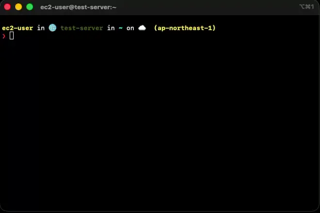

# s3rm

[](https://opensource.org/licenses/Apache-2.0)
[](https://codecov.io/gh/nidor1998/s3rm-rs)

## Fast Amazon S3 object deletion tool

Delete thousands to millions of S3 objects using batch deletion and parallel workers. Built in Rust with safety features and configurable filtering.

### Demo

This demo shows Express One Zone deleting approximately 34,000 objects per second from a set of 100,000 objects, and deleting approximately 2,700 files per second from a set of 100,000 files with versioning enabled.



## Table of contents

<details>
<summary>Click to expand to view table of contents</summary>

- [Overview](#overview)
    * [Why s3rm?](#why-s3rm)
    * [How it works](#how-it-works)
- [Features](#features)
    * [High performance](#high-performance)
    * [Powerful filtering](#powerful-filtering)
    * [S3 versioning](#s3-versioning)
    * [S3 Express One Zone support](#s3-express-one-zone-support)
    * [User-defined metadata filtering](#user-defined-metadata-filtering)
    * [Tagging filtering](#tagging-filtering)
    * [Safety first](#safety-first)
    * [Optimistic locking](#optimistic-locking)
    * [Robust retry logic](#robust-retry-logic)
    * [Low memory usage](#low-memory-usage)
    * [Rate limiting](#rate-limiting)
    * [Easy to use](#easy-to-use)
    * [Flexibility](#flexibility)
    * [Observability](#observability)
    * [Lua scripting support](#lua-scripting-support)
    * [User-defined filter callback](#user-defined-filter-callback)
    * [User-defined event callback](#user-defined-event-callback)
    * [Library-first design](#library-first-design)
- [Requirements](#requirements)
- [Installation](#installation)
    * [Pre-built binaries](#pre-built-binaries)
    * [Build from source](#build-from-source)
    * [As a Rust library](#as-a-rust-library)
- [Usage](#usage)
    * [Delete by prefix](#delete-by-prefix)
    * [Dry-run mode](#dry-run-mode)
    * [Force mode (skip confirmation)](#force-mode-skip-confirmation)
    * [Delete with regex filter](#delete-with-regex-filter)
    * [Delete by size](#delete-by-size)
    * [Delete by modified time](#delete-by-modified-time)
    * [Combined filters](#combined-filters)
    * [Delete all versions](#delete-all-versions)
    * [Keep only latest versions](#keep-only-latest-versions)
    * [Delete only delete markers](#delete-only-delete-markers)
    * [Set a deletion limit](#set-a-deletion-limit)
    * [Custom endpoint](#custom-endpoint)
    * [Specify credentials](#specify-credentials)
    * [Specify region](#specify-region)
- [Detailed information](#detailed-information)
    * [Pipeline architecture](#pipeline-architecture)
    * [Batch deletion detail](#batch-deletion-detail)
    * [Retry logic detail](#retry-logic-detail)
    * [Filtering order](#filtering-order)
    * [Confirmation prompt detail](#confirmation-prompt-detail)
    * [Dry-run mode detail](#dry-run-mode-detail)
    * [Versioning support detail](#versioning-support-detail)
    * [Optimistic locking detail](#optimistic-locking-detail)
    * [Memory usage detail](#memory-usage-detail)
    * [Parallel object listing](#parallel-object-listing)
    * [S3 Permissions](#s3-permissions)
    * [Lua VM](#lua-vm)
    * [Lua VM security](#lua-vm-security)
    * [Lua script error](#lua-script-error)
    * [CLI process exit codes](#cli-process-exit-codes)
- [Advanced options](#advanced-options)
    * [--worker-size](#--worker-size)
    * [--batch-size](#--batch-size)
    * [--max-parallel-listings](#--max-parallel-listings)
    * [--max-parallel-listing-max-depth](#--max-parallel-listing-max-depth)
    * [--rate-limit-objects](#--rate-limit-objects)
    * [--filter-include-regex/--filter-exclude-regex](#--filter-include-regex--filter-exclude-regex)
    * [--if-match](#--if-match)
    * [--max-delete](#--max-delete)
    * [-v](#-v)
    * [--aws-sdk-tracing](#--aws-sdk-tracing)
    * [--auto-complete-shell](#--auto-complete-shell)
    * [--help](#--help)
- [All command line options](#all-command-line-options)
- [CI/CD Integration](#cicd-integration)
- [Library API](#library-api)
- [About testing](#about-testing)
- [Fully AI-generated (human-verified) software](#fully-ai-generated-human-verified-software)
    * [Quality verification (by AI self-assessment, v1.6.2)](#quality-verification-by-ai-self-assessment-v162)
    * [AI assessment of safety and correctness (by Claude, Anthropic)](#ai-assessment-of-safety-and-correctness-by-claude-anthropic)
    * [AI assessment of safety and correctness (by Codex)](#ai-assessment-of-safety-and-correctness-by-codex)
    * [AI assessment of safety and correctness (by Gemini)](#ai-assessment-of-safety-and-correctness-by-gemini)
- [Security assumptions](#security-assumptions)
- [Recommendation](#recommendation)
- [Scope](#scope)
- [Non-Goals](#non-goals)
- [License](#license)

</details>

## Overview

s3rm is a fast deletion tool for Amazon S3 with built-in safety features.
It serves as a purpose-built alternative to `aws s3 rm --recursive`, offering batch deletion, parallel workers, and safety features that the AWS CLI lacks.

Whether you're cleaning up terabytes of old logs, enforcing data retention policies, or purging versioned buckets, s3rm uses a streaming pipeline that keeps memory usage constant regardless of object count.

All features are available as a Rust library (`s3rm_rs` crate), so you can integrate S3 deletion into your own applications programmatically.

### Why s3rm?

Deleting millions of S3 objects is a surprisingly painful problem:

- **`aws s3 rm --recursive`** deletes objects one at a time in a single thread.
- **S3 Lifecycle Policies** are free but execution timing is not guaranteed, and they offer no filtering beyond prefix and tags.

s3rm solves these problems with batch deletion, parallel workers, comprehensive filtering, and safety features.

### How it works

```
ObjectLister → [Filters] → ObjectDeleter Workers → Terminator
     ↓              ↓              ↓                    ↓
  Parallel      Regex, size,   Batch API calls     Drains output
  pagination    time, Lua,     with retry logic    and closes
               metadata, tags                      the pipeline
```

Objects stream through the pipeline one stage at a time. The lister fetches keys from S3 using parallel pagination, filters narrow down which objects to delete, and a pool of concurrent workers executes batch deletions against the S3 API. Nothing is loaded into memory all at once — s3rm handles buckets of any size with constant memory usage.

## Features

### High performance

s3rm is implemented in Rust and uses the AWS SDK for Rust, which supports multithreaded asynchronous I/O.
The default configuration (`--worker-size 16`, `--batch-size 200`) achieves approximately 3,500 objects per second for standard S3 buckets, which approaches the practical throughput guideline of Amazon S3. Express One Zone directory buckets can achieve approximately 34,000 deletions per second with `--worker-size 256` and `--allow-parallel-listings-in-express-one-zone`.

- **Batch deletion** using S3's `DeleteObjects` API — up to 1,000 objects per request
- **Parallel workers** — up to 65,535 concurrent deletion workers
- **Parallel listing** — concurrent `ListObjectsV2` pagination for faster enumeration
- **Streaming pipeline** — constant memory usage regardless of the number of objects

### Powerful filtering

s3rm offers sophisticated object selection inherited from [s3sync](https://github.com/nidor1998/s3sync):
- Regular expression-based key filtering
- Content-Type filtering with regex
- Size constraints (smaller/larger than a threshold)
- Modification time constraints (before/after a timestamp)
- Custom filtering with a Lua script or user-defined Rust callback

The regular expression syntax is the same as [fancy_regex](https://docs.rs/fancy-regex/latest/fancy_regex/#syntax), which supports lookaround features.

All filters are combined with logical AND — an object must pass every active filter to be deleted.

### S3 versioning

S3 versioned buckets store multiple versions of each object. s3rm handles all scenarios:

- **Default behavior** — creates delete markers (objects appear deleted but previous versions are preserved)
- **`--delete-all-versions`** — permanently removes every version of matching objects, including delete markers
- **`--keep-latest-only`** — retains only the latest version of each object, deleting all older versions (requires `--delete-all-versions`)
- **`--filter-delete-marker-only`** — deletes only delete markers, leaving all object versions intact (requires `--delete-all-versions`)

### S3 Express One Zone support

s3rm supports [Amazon S3 Express One Zone](https://aws.amazon.com/s3/storage-classes/express-one-zone/), the high-performance, single-Availability Zone storage class designed for latency-sensitive workloads.

s3rm automatically detects Express One Zone directory buckets (by the `--x-s3` bucket name suffix) and adjusts its behavior:

- Parallel listing is disabled by default for Express One Zone, because parallel listing may return in-progress multipart upload objects in this storage class.
- You can re-enable parallel listing with `--allow-parallel-listings-in-express-one-zone` if your use case allows it.
- The `s3express:CreateSession` permission is included in the [required permissions](#s3-permissions).

### User-defined metadata filtering

You can filter objects based on user-defined metadata.
Example: `--filter-include-metadata-regex 'key1=(value1|xxx),key2=value2'`, `--filter-exclude-metadata-regex 'key1=(value1|xxx),key2=value2'`

Note: When using this option, additional API calls may be required to get the metadata of each object.

### Tagging filtering

You can filter objects based on tags.
This crate supports lookaround features.

For example, `'^(?!.*&test=true).*stage=first'` can be used to filter objects that do not contain `test=true` and that contain `stage=first` in the tags.
You can create regular expressions that combine multiple logical conditions with lookaround features — reducing the need for Lua scripts to filter objects with complex patterns.

Note: When using this option, additional API calls are required to get the tags of each object.

### Safety first

Unlike most S3 deletion tools, s3rm is designed with **safety as a first-class feature**:

- **Dry-run mode** (`-d`/`--dry-run`) — run the full pipeline (listing, filtering) but simulate deletions without making actual S3 API calls. Each object that would be deleted is logged with a `[dry-run]` prefix, and summary statistics are displayed.
- **Confirmation prompt** — before any destructive operation, s3rm displays the target path with colored text and requires the full word "yes" to proceed. Abbreviated responses like "y" are rejected.
- **Max-delete threshold** (`--max-delete N`) — set a hard limit on how many objects can be deleted in a single run. The pipeline cancels gracefully once the threshold is reached.
- **Force flag** (`-f`/`--force`) — skip confirmation prompts for scripted or CI/CD use.
- **Non-TTY detection** — automatically disables interactive prompts when running in non-interactive environments (CI/CD pipelines, cron jobs).

If you use s3rm for the first time, use the `--dry-run` option to preview the operation.

### Optimistic locking

With `--if-match`, s3rm uses each object's own ETag (obtained during listing) to include the `If-Match` header in deletion requests.
This prevents race conditions — if another process modifies an object after s3rm listed it, the deletion is skipped rather than removing an object that has changed.

This is the same optimistic locking mechanism available in [s3sync](https://github.com/nidor1998/s3sync).

### Robust retry logic

s3rm uses two layers of retry:

1. **AWS SDK retries** — the AWS SDK for Rust automatically retries transient API failures (5xx, throttling) with exponential backoff. Configured via `--aws-max-attempts` and `--initial-backoff-milliseconds`.
2. **Batch partial-failure fallback** — when a `DeleteObjects` batch request partially fails, s3rm classifies each failed key by error code. Keys that failed with a retryable error (`InternalError`, `SlowDown`, `ServiceUnavailable`, `RequestTimeout`) are retried individually using the `DeleteObject` API. This fallback is controlled by `--force-retry-count` (default: 0, disabled).

Non-retryable errors (e.g., `AccessDenied`) are logged and skipped immediately.

For more information, see [Retry logic detail](#retry-logic-detail).

### Low memory usage

Memory usage is low and does not depend on the number of objects.
The streaming pipeline processes objects as they flow through — nothing is loaded into memory all at once.
s3rm can handle buckets with billions of objects without increasing memory consumption.

### Rate limiting

With `--rate-limit-objects`, you can cap deletion throughput in objects per second.
This is useful to avoid S3 throttling (`SlowDown` responses) or to control API costs.

### Easy to use

s3rm is designed to be easy to use.
The default settings work for most scenarios without additional tuning.

For example, in an IAM role environment, the following command will preview all objects that would be deleted:

```bash
s3rm --dry-run s3://bucket-name/prefix
```

And the following command will delete them with confirmation:

```bash
s3rm s3://bucket-name/prefix
```

### Flexibility

s3rm is designed to adapt to a wide range of deletion scenarios:

- **12 CLI filter options plus programmable Lua/Rust filter callbacks** — regex on keys, content-type, user-defined metadata, and tags; size thresholds; modification time ranges; plus Lua scripting callbacks. See [Filtering order](#filtering-order) for the complete list.
- **S3-compatible services (deprecated, as-is)** — `--target-endpoint-url` and `--target-force-path-style` remain available for use with MinIO, Wasabi, Cloudflare R2, and other S3-compatible storage. The functionality is provided **as-is** with no testing, no compatibility guarantees, and no fixes for issues specific to non-AWS backends. See [Custom endpoint](#custom-endpoint).
- **S3 Express One Zone** — automatically detects Express One Zone directory buckets and adjusts listing behavior accordingly. See [S3 Express One Zone support](#s3-express-one-zone-support).
- **CLI and library** — use s3rm as a standalone CLI tool or embed it as a Rust library in your own applications with custom filter and event callbacks.
- **Configurable everything** — worker count (1 to 65,535), batch size (1 to 1,000), retry attempts, rate limiting, timeouts, parallel listing depth, and more. All options can be set via CLI flags or environment variables.
- **Cross-platform** — pre-built binaries for Linux (glibc and musl), Windows, and macOS on both x86_64 and ARM64.

### Observability

- **Progress bar** — real-time display of objects deleted, bytes reclaimed, and deletion rate (using [indicatif](https://docs.rs/indicatif/latest/indicatif/))
- **Configurable verbosity** — from silent (`-qq`) to debug (`-vvv`)
- **JSON logging** (`--json-tracing`, requires `--force`) — structured logs for integration with log aggregation systems
- **Event callbacks** — receive real-time deletion events via Lua scripts or Rust callbacks
- **Colored output** — ANSI colors for improved readability (automatically disabled in non-TTY environments)

### Lua scripting support

You can use a [Lua](https://www.lua.org) (5.4) script to implement custom filtering and event handling.
`--filter-callback-lua-script` and `--event-callback-lua-script` options are available for this purpose.
Lua is widely recognized as a fast scripting language. The Lua engine is embedded in s3rm, so you can use Lua scripts without any additional dependencies.

By default, Lua scripts run in safe mode, so they cannot use Lua's OS or I/O library functions.
If you want to allow more Lua libraries, you can use `--allow-lua-os-library` or `--allow-lua-unsafe-vm` options.

Lua scripting support is included by default. To build without it, use `cargo build --release --no-default-features`.

Example Lua filter script (`my_filter.lua`):

```lua
-- Return true to delete the object, false to skip it.
-- The 'obj' table has fields: key, size, last_modified, version_id,
-- e_tag, is_latest, is_delete_marker
function filter(obj)
    -- Delete only .tmp files larger than 1 KB
    return string.find(obj.key, "%.tmp$") ~= nil and obj.size > 1024
end
```

```bash
s3rm --filter-callback-lua-script my_filter.lua --force s3://my-bucket/data/
```

### User-defined filter callback

If you are familiar with Rust, you can use `UserDefinedFilterCallback` to implement custom filtering logic via the library API.
Thanks to Rust's clear compiler error messages and robust language features, even software engineers unfamiliar with the language can implement it easily.
To use `UserDefinedFilterCallback`, implement the `FilterCallback` trait.

```rust
use async_trait::async_trait;
use s3rm_rs::types::filter_callback::FilterCallback;
use s3rm_rs::types::S3Object;
use anyhow::Result;

struct MyFilter;

#[async_trait]
impl FilterCallback for MyFilter {
    async fn filter(&mut self, object: &S3Object) -> Result<bool> {
        // Return true to delete, false to skip
        Ok(object.key().ends_with(".tmp"))
    }
}
```

### User-defined event callback

If you are familiar with Rust, you can use `UserDefinedEventCallback` to implement custom event handling logic, such as logging, monitoring, or custom actions during deletion operations.
To use `UserDefinedEventCallback`, implement the `EventCallback` trait.

```rust
use async_trait::async_trait;
use s3rm_rs::types::event_callback::{EventCallback, EventData};

struct MyEventHandler;

#[async_trait]
impl EventCallback for MyEventHandler {
    async fn on_event(&mut self, event: EventData) {
        println!("Event: {:?}, Key: {:?}", event.event_type, event.key);
    }
}
```

### Library-first design

s3rm is designed as a library first. The CLI binary is a thin wrapper over the s3rm library.
All CLI features are available programmatically through the `s3rm_rs` crate.

This means you can:
- Integrate S3 bulk deletion into your own Rust applications
- Register custom filter and event callbacks programmatically
- Build custom deletion workflows with full async/await support

## Requirements

- x86_64 Linux (kernel 3.2 or later)
- ARM64 Linux (kernel 4.1 or later)
- Windows 11 (x86_64, aarch64)
- macOS 11.0 or later (aarch64, x86_64)

All features are tested on the above platforms.

s3rm is distributed as a single binary with no dependencies (except glibc), so it can be easily run on the above platforms.
Linux musl statically linked binary is also available.

AWS credentials are required. s3rm supports all standard AWS credential mechanisms:
- Environment variables (`AWS_ACCESS_KEY_ID`, `AWS_SECRET_ACCESS_KEY`)
- AWS credentials file (`~/.aws/credentials`)
- AWS config file (`~/.aws/config`) with profiles
- IAM instance roles (EC2, ECS, Lambda)
- SSO/federated authentication

For more information, see [SDK authentication with AWS](https://docs.aws.amazon.com/sdk-for-rust/latest/dg/credentials.html).

## Installation

### Pre-built binaries

Download the latest binary from [GitHub Releases](https://github.com/nidor1998/s3rm-rs/releases).

### Build from source

s3rm requires Rust 1.94.1 or later.

```bash
# Clone the repository
git clone https://github.com/nidor1998/s3rm-rs.git
cd s3rm-rs

# Build release binary
cargo build --release

# The binary is at ./target/release/s3rm
```

Lua scripting support is included by default. To build without it:

```bash
cargo build --release --no-default-features
```

### As a Rust library

s3rm can be used as a Rust library.
The s3rm CLI is a very thin wrapper over the s3rm library. All CLI features are available in the library.

Add to your `Cargo.toml`:

```toml
[dependencies]
s3rm-rs = "1"
```

See [Library API](#library-api) for usage examples.

## Usage

AWS credentials are required to use s3rm. IAM Roles, AWS CLI Profile, environment variables, etc. are supported.
By default, s3rm obtains credentials from many locations (IAM Roles, environment variables, etc.).

Region is required. It can be specified in the profile, environment, or command line options.

A prefix is optional. If not specified, the entire bucket will be targeted.

If you specify a prefix, **s3rm doesn't automatically add a trailing slash.**
For example, if you specify `s3://bucket-name/prefix`, s3rm will target objects whose keys start with `prefix` (including `prefix/foo` and `prefixbar`).
If you specify `s3://bucket-name/prefix/`, only objects under the `prefix/` directory are targeted.

If you use s3rm for the first time, you should use the `--dry-run` option to preview the operation.

For all options, see `s3rm --help`.

### Delete by prefix

The simplest usage — delete all objects under a given S3 prefix:

```bash
s3rm s3://my-bucket/logs/2023/
```

You'll be asked to confirm before any objects are deleted:

```
WARNING: All objects matching prefix s3://my-bucket/logs/2023/  will be deleted.
Use --dry-run to preview which objects would be deleted without actually removing them.

Type 'yes' to confirm deletion:
```

### Dry-run mode

Preview exactly what would happen without deleting anything:

```bash
s3rm --dry-run s3://my-bucket/logs/2023/
```

Each object that would be deleted is logged at info level with a `[dry-run]` prefix, and summary statistics are displayed at the end.

### Force mode (skip confirmation)

Skip the confirmation prompt for automated use:

```bash
s3rm --force s3://my-bucket/temp/
```

### Delete with regex filter

Delete only `.tmp` files:

```bash
s3rm --filter-include-regex '.*\.tmp$' --force s3://my-bucket/data/
```

Exclude certain files from deletion:

```bash
s3rm --filter-exclude-regex '.*\.keep$' --force s3://my-bucket/data/
```

### Delete by size

Delete objects smaller than 1 KB (likely empty or corrupt):

```bash
s3rm --filter-smaller-size 1KB --force s3://my-bucket/uploads/
```

Delete objects larger than 1 GB:

```bash
s3rm --filter-larger-size 1GiB --force s3://my-bucket/backups/
```

### Delete by modified time

Delete objects older than a specific date:

```bash
s3rm --filter-mtime-before 2023-01-01T00:00:00Z --force s3://my-bucket/logs/
```

Delete objects modified after a specific date:

```bash
s3rm --filter-mtime-after 2024-06-01T00:00:00Z --force s3://my-bucket/temp/
```

### Combined filters

Filters combine with logical AND. Delete `.log` files older than 90 days and smaller than 10 MB:

```bash
s3rm \
  --filter-include-regex '.*\.log$' \
  --filter-mtime-before 2024-09-01T00:00:00Z \
  --filter-smaller-size 10MiB \
  --force \
  s3://my-bucket/logs/
```

### Delete all versions

On versioned buckets, delete every version of every object under a prefix:

```bash
s3rm --delete-all-versions --force s3://my-bucket/old-data/
```

### Keep only latest versions

On versioned buckets, delete all older versions while keeping only the latest version of each object:

```bash
s3rm --keep-latest-only --delete-all-versions --force s3://my-bucket/data/
```

This is useful for enforcing version retention policies — it cleans up old versions while preserving the current state of every object. Can be combined with `--filter-include-regex` or `--filter-exclude-regex` to target specific keys.

### Delete only delete markers

On versioned buckets, delete only the delete markers while leaving all object versions intact:

```bash
s3rm --filter-delete-marker-only --delete-all-versions --force s3://my-bucket/data/
```

This is useful for "undeleting" objects — removing the delete markers makes the underlying object versions visible again. Can be combined with other filters like `--filter-include-regex` to target specific keys.

### Set a deletion limit

Stop after deleting 1,000 objects (safety net for large buckets):

```bash
s3rm --max-delete 1000 --force s3://my-bucket/data/
```

### Custom endpoint

You can specify a custom endpoint URL via `--target-endpoint-url`. This can be used for AWS-side endpoints as well as for S3-compatible storage.

> **Note on S3-compatible storage:** s3rm has **deprecated** support for S3-compatible (non-AWS) storage. The `--target-endpoint-url` and `--target-force-path-style` flags continue to work, but use against non-AWS backends is provided **as-is**: it is not tested, no compatibility work will be done, and bug reports specific to S3-compatible services will not be accepted. Only Amazon S3 (including S3 Express One Zone) is supported.

Warning: You may need to specify `--target-force-path-style`.

```bash
s3rm \
  --target-endpoint-url https://minio.example.com:9000 \
  --target-force-path-style \
  --force \
  s3://my-bucket/data/
```

### Specify credentials

```bash
s3rm --target-access-key YOUR_KEY --target-secret-access-key YOUR_SECRET --force s3://bucket-name/prefix
```

### Specify region

```bash
s3rm --target-region us-west-2 --force s3://bucket-name/prefix
```

## Detailed information

### Pipeline architecture

s3rm uses a streaming pipeline architecture with four stages connected by async channels:

1. **ObjectLister** — Lists objects from S3 using `ListObjectsV2` (or `ListObjectVersions` when `--delete-all-versions` is enabled). Supports parallel pagination for fast enumeration.
2. **Filter stages** — A chain of filters that narrow down which objects to delete. Objects flow through each filter in sequence — if any filter rejects an object, it is skipped.
3. **ObjectDeleter** — A pool of concurrent workers that execute batch deletions using the `DeleteObjects` API (or `DeleteObject` for single-object mode). Includes retry logic for partial failures.
4. **Terminator** — Drains the final output channel, allowing upstream stages to complete without blocking.

Each stage runs as an independent async task. Objects stream through the pipeline without being buffered in memory.

### Batch deletion detail

By default, s3rm groups objects into batches of `--batch-size` (default: 200) and uses the S3 `DeleteObjects` API to delete up to 1,000 objects per request. This dramatically reduces the number of API calls compared to deleting objects one at a time.

If `--batch-size` is set to 1, s3rm uses the `DeleteObject` API for single-object deletion. This may be needed for S3-compatible services that don't support batch deletion.

When a batch deletion partially fails (some objects deleted, some errors), s3rm records the successfully deleted objects and classifies each failure by error code. Retryable failures are retried individually using `DeleteObject` API calls (see [Retry logic detail](#retry-logic-detail)).

### Retry logic detail

s3rm has two retry layers:

**Layer 1: AWS SDK retries (all API calls)**

Every S3 API call (including `DeleteObjects`, `DeleteObject`, `ListObjectsV2`, etc.) is automatically retried by the AWS SDK for Rust using its standard retry strategy with exponential backoff. Configure this with:
- `--aws-max-attempts` (default: 10) — maximum attempts per API call
- `--initial-backoff-milliseconds` (default: 100ms) — initial backoff duration, doubled on each retry

**Layer 2: Batch partial-failure fallback (batch mode only)**

When a `DeleteObjects` batch request succeeds at the API level but reports per-key errors in its response, s3rm handles each failed key individually:
- **Retryable errors** (`InternalError`, `SlowDown`, `ServiceUnavailable`, `RequestTimeout`) — s3rm falls back to individual `DeleteObject` API calls for these keys, retrying up to `--force-retry-count` times (default: 0, meaning no fallback retries). The interval between fallback attempts is a fixed delay of `--force-retry-interval-milliseconds` (default: 1000ms). Each individual `DeleteObject` call also benefits from the AWS SDK's own retry logic (Layer 1).
- **Non-retryable errors** (e.g., `AccessDenied`, `NoSuchKey`) — logged and added to failures immediately without retry.

This fallback only applies in batch mode (`--batch-size` > 1). In single-object mode (`--batch-size 1`), the `SingleDeleter` does not perform application-level retries — it relies solely on the AWS SDK's built-in retry logic.

If an object fails after all retries are exhausted, s3rm logs the failure and continues processing remaining objects. The final exit code reflects whether any failures occurred.

### Filtering order

s3rm filters objects in the following order:

1. `--filter-delete-marker-only`
2. `--filter-mtime-before`
3. `--filter-mtime-after`
4. `--filter-smaller-size`
5. `--filter-larger-size`
6. `--filter-include-regex`
7. `--filter-exclude-regex`
8. `--keep-latest-only`
9. `FilterCallback (--filter-callback-lua-script / UserDefinedFilterCallback)`
10. `--filter-include-content-type-regex`
11. `--filter-exclude-content-type-regex`
12. `--filter-include-metadata-regex`
13. `--filter-exclude-metadata-regex`
14. `--filter-include-tag-regex`
15. `--filter-exclude-tag-regex`

Filters that require additional API calls (content type, metadata, tags) are applied last to minimize unnecessary requests.

#### Delete markers and attribute filters

Delete markers have no size, content-type, user metadata, or tags. When you run with `--delete-all-versions`, the
size filters (`--filter-smaller-size`, `--filter-larger-size`) and the content-type, metadata, and tag filters
therefore **exclude delete markers from deletion** — a delete marker cannot match a property it does not have, and
deleting a *latest* delete marker would resurrect the object it hides, which an attribute-scoped run never intends.

As a result:

- A full purge (`--delete-all-versions` with no size/attribute filter) still deletes delete markers.
- `--filter-delete-marker-only` still deletes delete markers, and can be combined with modification-time filters
  (markers have a last-modified time). It cannot be combined with the size/content-type/metadata/tag filters, because
  that would select nothing.
- Modification-time filters (`--filter-mtime-before`, `--filter-mtime-after`) and key regex filters
  (`--filter-include-regex`, `--filter-exclude-regex`) apply to delete markers normally.

### Confirmation prompt detail

By default, s3rm displays a warning with the target S3 path in colored text and requires explicit confirmation before proceeding:

```
WARNING: All objects matching prefix s3://my-bucket/important-data/  will be deleted.
Use --dry-run to preview which objects would be deleted without actually removing them.

Type 'yes' to confirm deletion:
```

Only the exact string "yes" is accepted. Any other input — including "y", "Y", "Yes", or "YES" — is rejected, and the operation is cancelled. This is intentional to prevent accidental deletions.

The confirmation prompt is skipped when:
- `--force` flag is provided
- `--dry-run` mode is enabled (no actual deletions occur)
- Running in a non-TTY environment (stdin is not a terminal)

### Dry-run mode detail

With `--dry-run`, s3rm runs the full pipeline (listing, filtering) but simulates deletions without making actual S3 API calls:

- Each object that would be deleted is logged at info level with a `[dry-run]` prefix
- Summary statistics (object count, total size) are displayed at the end
- The minimum verbosity level is info, regardless of `-q` flags, so that deletion previews are always visible
- No confirmation prompt is shown (since nothing will be deleted)

This is the recommended first step when targeting any new prefix or filter combination.

### Versioning support detail

Without `--delete-all-versions`, deleting from a versioned bucket creates delete markers. The objects appear deleted but previous versions are preserved and can be recovered.

With `--delete-all-versions`, s3rm uses `ListObjectVersions` instead of `ListObjectsV2` to enumerate every version of every object (including delete markers), and permanently deletes them all. Each version counts as a separate object in progress statistics.

With `--keep-latest-only --delete-all-versions`, s3rm lists all versions but only deletes the non-latest ones, keeping the latest version of each object intact. This is useful for enforcing version retention policies. The target bucket must have versioning enabled; otherwise s3rm returns an error.

### Optimistic locking detail

With `--if-match`, s3rm uses each object's ETag (obtained during listing) to include the `If-Match` header in deletion requests.

This serves as optimistic locking — it prevents s3rm from deleting an object that has been modified by another process after s3rm listed it. If the ETag has changed, the deletion is skipped and a warning is logged.

Note: `--if-match` uses single-object `DeleteObject` API calls (not batch deletion), which may reduce throughput. Use this option when correctness in concurrent environments matters more than raw speed.

Note: `--if-match` cannot be used with `--delete-all-versions`. S3 does not support If-Match conditional headers when deleting by version ID (returns `NotImplemented`).

It is a challenging topic to understand, please refer to [AWS documentation](https://docs.aws.amazon.com/AmazonS3/latest/userguide/conditional-requests.html).

Note: Few S3-compatible storage services support conditional requests.

### Memory usage detail

s3rm's streaming pipeline means memory usage is constant regardless of how many objects are in the bucket. Objects are streamed through the pipeline as they are listed — they are never all held in memory at once.

Memory usage primarily depends on:
- The number of workers (`--worker-size`)
- The internal listing queue size (`--object-listing-queue-size`)

The default settings are suitable for buckets of any size.

### Parallel object listing

By default, s3rm lists objects in parallel (default 16 workers).
The parallel listing is enabled up to the second level of subdirectories or prefixes.
The depth is configurable with `--max-parallel-listing-max-depth` option.

For example, if the target is `s3://bucket-name/prefix/` and there are many objects under `prefix/dir1`, `prefix/dir2`, ..., s3rm lists objects under these prefixes in parallel.

You can configure the number of parallel listing workers with `--max-parallel-listings` option.
If set to 1, parallel listing is disabled.

With Express One Zone storage class, parallel listing may return in-progress multipart upload objects.
So, parallel listing is disabled by default for Express One Zone. You can enable it with `--allow-parallel-listings-in-express-one-zone`.

When `--delete-all-versions` is specified, parallel listing is disabled.

### S3 Permissions

s3rm requires the following S3 permissions:

```
"Action": [
    "s3:DeleteObject",
    "s3:DeleteObjectVersion",
    "s3:GetBucketVersioning",
    "s3:ListBucket",
    "s3:ListBucketVersions",
    "s3express:CreateSession"
]
```

Additional permissions may be needed depending on features used:
- `s3:HeadObject` / `s3:GetObjectTagging` — when using metadata or tag filters

### Lua VM

Each type of callback has its own Lua VM and memory limit.
The Lua VM is shared between workers and called serially.
Each Lua script is loaded and compiled once at startup and lives until the end of the deletion operation.

### Lua VM security

By default, a Lua script runs in safe mode.
Lua's [Operating System facilities](https://www.lua.org/manual/5.4/manual.html#6.9)
and [Input and Output Facilities](https://www.lua.org/manual/5.4/manual.html#6.8) are disabled by default.
This is because these facilities can be used to execute arbitrary commands, which can be a security risk (especially set-uid/set-gid programs).
Also, Lua VM is not allowed to load unsafe standard libraries or C modules.

If these restrictions are too strict, you can use `--allow-lua-os-library` or `--allow-lua-unsafe-vm` options.

Note: The statically linked binary cannot load C modules.

### Lua script error

If a filter callback Lua script raises an error, s3rm will stop the operation and exit with error code `1`.
An event callback Lua script does not stop the operation — just shows a warning message.

### CLI process exit codes

- 0: Exit without error
- 1: Exit with error
- 2: Invalid arguments
- 3: Exit with warning (partial failure; use `--warn-as-error` to treat as error)
- 101: Abnormal termination (internal panic)
- 130: Interrupted by Ctrl+C (SIGINT; 128 + signal number, the conventional shell encoding)

## Advanced options

### --worker-size

The number of concurrent deletion workers. More workers can increase throughput, but may increase S3 throttling.
Default: 16

### --batch-size

Objects grouped per `DeleteObjects` API call. Default: 200. Range: 1–1,000.
Set to 1 to use single-object `DeleteObject` API calls.

### --max-parallel-listings

The number of concurrent listing operations. Default: 16.
More parallel listings speed up enumeration of large prefixes.

### --max-parallel-listing-max-depth

Maximum depth (subdirectory/prefix) of parallel listings. Default: 2.
In some cases, parallel listing at deeper levels may improve performance.

### --rate-limit-objects

Maximum objects per second. Minimum: 10.
Useful to avoid S3 throttling or control API costs.

### --filter-include-regex/--filter-exclude-regex

Regular expression filters for object keys.
The regular expression syntax is the same as [fancy_regex](https://docs.rs/fancy-regex/latest/fancy_regex/#syntax), which supports lookaround features.

### --if-match

Add an `If-Match` header for DeleteObject requests.
This is for optimistic locking — prevents deleting objects that were modified since listing.

### --max-delete

Don't delete more than a specified number of objects.
The pipeline cancels gracefully once the limit is reached.

### -v

s3rm uses [tracing-subscriber](https://docs.rs/tracing-subscriber/latest/tracing_subscriber/) for tracing.
More occurrences increase the verbosity.
For example, `-v`: show `info`, `-vv`: show `debug`, `-vvv`: show `trace`
By default, s3rm shows warning and error messages.

`info` and `debug` messages are useful for troubleshooting. `trace` messages are useful for debugging.

You can also use `-q`, `-qq` to reduce the verbosity.

### --aws-sdk-tracing

For troubleshooting, s3rm can output the AWS SDK for Rust's tracing information.

### --auto-complete-shell

Generate shell completion scripts:

```bash
s3rm --auto-complete-shell bash
s3rm --auto-complete-shell zsh
s3rm --auto-complete-shell fish
s3rm --auto-complete-shell powershell
s3rm --auto-complete-shell elvish
```

### --help

For more information, see `s3rm --help`.

## All command line options

<details>
<summary>Click to expand to view all command line options</summary>

### General

| Option | Short | Default | Description |
|--------|-------|---------|-------------|
| `--dry-run` | `-d` | `false` | Preview deletions without executing them |
| `--force` | `-f` | `false` | Skip confirmation prompt |
| `--show-no-progress` | | `false` | Hide the progress bar |
| `--delete-all-versions` | | `false` | Delete all versions including delete markers |
| `--keep-latest-only` | | `false` | Keep only the latest version, delete older versions (requires `--delete-all-versions`) |
| `--max-delete` | | | Stop after deleting this many objects |

### Filtering

| Option | Description |
|--------|-------------|
| `--filter-delete-marker-only` | Delete only delete markers (requires `--delete-all-versions`) |
| `--filter-include-regex` | Delete only objects whose key matches this regex |
| `--filter-exclude-regex` | Skip objects whose key matches this regex |
| `--filter-include-content-type-regex` | Delete only objects whose content type matches |
| `--filter-exclude-content-type-regex` | Skip objects whose content type matches |
| `--filter-include-metadata-regex` | Delete only objects whose metadata matches (extra API call) |
| `--filter-exclude-metadata-regex` | Skip objects whose metadata matches (extra API call) |
| `--filter-include-tag-regex` | Delete only objects whose tags match (extra API call) |
| `--filter-exclude-tag-regex` | Skip objects whose tags match (extra API call) |
| `--filter-mtime-before` | Delete only objects modified before this time (RFC 3339) |
| `--filter-mtime-after` | Delete only objects modified at or after this time (RFC 3339) |
| `--filter-smaller-size` | Delete only objects smaller than this size |
| `--filter-larger-size` | Delete only objects larger than or equal to this size |

### Tracing/Logging

| Option | Default | Description |
|--------|---------|-------------|
| `-v` / `-vv` / `-vvv` | Warn | Increase verbosity level |
| `-q` / `-qq` | | Decrease verbosity (quiet / silent) |
| `--json-tracing` | `false` | Output structured JSON logs (requires `--force`) |
| `--aws-sdk-tracing` | `false` | Include AWS SDK internal traces |
| `--span-events-tracing` | `false` | Include span open/close events |
| `--disable-color-tracing` | `false` | Disable colored log output |

### AWS Configuration

| Option | Description |
|--------|-------------|
| `--aws-config-file` | Path to AWS config file |
| `--aws-shared-credentials-file` | Path to AWS shared credentials file |
| `--target-profile` | AWS CLI profile name |
| `--target-access-key` | AWS access key ID |
| `--target-secret-access-key` | AWS secret access key |
| `--target-session-token` | AWS session token |
| `--target-region` | AWS region |
| `--target-endpoint-url` | Custom S3-compatible endpoint URL |
| `--target-force-path-style` | Use path-style access (default: `false`) |
| `--target-accelerate` | Enable S3 Transfer Acceleration (default: `false`) |
| `--target-request-payer` | Enable requester-pays (default: `false`) |
| `--disable-stalled-stream-protection` | Disable stalled stream protection (default: `false`) |

### Performance

| Option | Default | Description |
|--------|---------|-------------|
| `--worker-size` | `16` | Concurrent deletion workers (1–65535) |
| `--batch-size` | `200` | Objects per batch deletion request (1–1000) |
| `--max-parallel-listings` | `16` | Concurrent listing operations |
| `--max-parallel-listing-max-depth` | `2` | Maximum depth for parallel listings |
| `--rate-limit-objects` | | Maximum objects/second (minimum: 10) |
| `--object-listing-queue-size` | `200000` | Internal queue size for object listing |
| `--allow-parallel-listings-in-express-one-zone` | `false` | Allow parallel listings in Express One Zone storage |

### Retry Options

| Option | Default | Description |
|--------|---------|-------------|
| `--aws-max-attempts` | `10` | Maximum retry attempts per AWS SDK API call |
| `--initial-backoff-milliseconds` | `100` | Initial exponential backoff for SDK retries (ms) |
| `--force-retry-count` | `0` | Fallback retries per key on batch partial failures (batch mode only) |
| `--force-retry-interval-milliseconds` | `1000` | Fixed interval between batch fallback retries (ms) |

### Timeout Options

| Option | Description |
|--------|-------------|
| `--operation-timeout-milliseconds` | Overall operation timeout |
| `--operation-attempt-timeout-milliseconds` | Per-attempt operation timeout |
| `--connect-timeout-milliseconds` | Connection timeout |
| `--read-timeout-milliseconds` | Read timeout |

### Advanced

| Option | Default | Description |
|--------|---------|-------------|
| `--if-match` | `false` | ETag-based conditional deletion (optimistic locking) |
| `--warn-as-error` | `false` | Treat warnings as errors (exit code 1 instead of 3) |
| `--max-keys` | `1000` | Max objects per list request (1–32767) |
| `--auto-complete-shell` | | Generate shell completions (bash, zsh, fish, powershell, elvish) |

### Lua scripting support (enabled by default)

| Option | Default | Description |
|--------|---------|-------------|
| `--filter-callback-lua-script` | | Path to Lua filter callback script |
| `--event-callback-lua-script` | | Path to Lua event callback script |
| `--allow-lua-os-library` | `false` | Allow Lua OS/IO library access |
| `--lua-vm-memory-limit` | `64MiB` | Memory limit for the Lua VM |

### Dangerous

| Option | Default | Description |
|--------|---------|-------------|
| `--allow-lua-unsafe-vm` | `false` | Remove all Lua sandbox restrictions |

All options can also be set via environment variables. The environment variable name matches the long option name in `SCREAMING_SNAKE_CASE` with hyphens converted to underscores (e.g., `--worker-size` becomes `WORKER_SIZE`, `--aws-max-attempts` becomes `AWS_MAX_ATTEMPTS`, `--filter-include-regex` becomes `FILTER_INCLUDE_REGEX`).

**Precedence:** CLI arguments > environment variables > defaults.

</details>

## CI/CD Integration

s3rm is designed to work seamlessly in automated pipelines.

### Non-interactive mode

In non-TTY environments (CI/CD pipelines, cron jobs), s3rm automatically disables interactive prompts. Always use `--force` for unattended execution:

```bash
s3rm --force s3://my-bucket/temp/
```

### JSON logging

Enable structured JSON logs for log aggregation systems (Datadog, Splunk, CloudWatch, etc.):

```bash
s3rm --json-tracing --force s3://my-bucket/temp/
```

### Quiet mode

Suppress progress output for cleaner CI logs:

```bash
s3rm --show-no-progress --force s3://my-bucket/temp/
```

### Example CI script

Note: The `date -d` syntax below is GNU coreutils (Linux). On macOS, use `date -u -v-30d` instead.

```bash
#!/bin/bash
set -e

# Delete temp objects older than 30 days
s3rm \
  --filter-mtime-before "$(date -u -d '30 days ago' +%Y-%m-%dT%H:%M:%SZ)" \
  --force \
  --json-tracing \
  s3://my-bucket/temp/

exit_code=$?
if [ $exit_code -eq 3 ]; then
  echo "Warning: some deletions failed"
fi
```

### Example GitHub Actions

```yaml
- name: Cleanup old staging data
  run: |
    s3rm \
      --filter-mtime-before "$(date -u -d '7 days ago' +%Y-%m-%dT%H:%M:%SZ)" \
      --max-delete 10000 \
      --force \
      --json-tracing \
      s3://staging-bucket/deployments/
  env:
    AWS_ACCESS_KEY_ID: ${{ secrets.AWS_ACCESS_KEY_ID }}
    AWS_SECRET_ACCESS_KEY: ${{ secrets.AWS_SECRET_ACCESS_KEY }}
    AWS_DEFAULT_REGION: us-east-1
```

## Library API

s3rm is designed library-first. All CLI functionality is available programmatically through the `s3rm_rs` crate.

### Basic usage

```rust
use s3rm_rs::{build_config_from_args, DeletionPipeline, create_pipeline_cancellation_token};

#[tokio::main]
async fn main() {
    // Same arguments you would pass to the s3rm CLI.
    let config = build_config_from_args([
        "s3rm",
        "s3://my-bucket/logs/2024/",
        "--dry-run",
        "--force",
    ]).expect("invalid arguments");

    let token = create_pipeline_cancellation_token();
    let mut pipeline = DeletionPipeline::new(config, token).await;
    // The pipeline sends real-time stats to a channel for progress reporting.
    // Close the sender if you aren't reading from get_stats_receiver(),
    // otherwise the channel fills up and the pipeline stalls.
    pipeline.close_stats_sender();

    pipeline.run().await;

    // --- Error checking ---
    if pipeline.has_error() {
        if let Some(messages) = pipeline.get_error_messages() {
            for msg in &messages {
                eprintln!("Error: {msg}");
            }
        }
        std::process::exit(1);
    }

    let stats = pipeline.get_deletion_stats();
    println!("Deleted {} objects ({} bytes)",
        stats.stats_deleted_objects, stats.stats_deleted_bytes);
}
```

### Event types

| Event Type | Description |
|---|---|
| `PIPELINE_START` | Pipeline execution has started |
| `PIPELINE_END` | Pipeline execution has completed |
| `DELETE_COMPLETE` | An object was successfully deleted |
| `DELETE_FAILED` | An object deletion failed |
| `DELETE_FILTERED` | An object was filtered out (not deleted) |
| `PIPELINE_ERROR` | A pipeline-level error occurred |
| `DELETE_CANCEL` | The pipeline was cancelled |
| `STATS_REPORT` | Periodic statistics update |

## About testing

**Supported target: Amazon S3 only.**

Support for S3-compatible storage is **deprecated** and provided **as-is**. The `--target-endpoint-url` flag is retained for backward compatibility, but non-AWS backends are not tested, not validated against new releases, and bug reports specific to S3-compatible services will not be accepted. If it works for you, great — if it doesn't, use a tool that officially supports your backend.

s3rm has been tested with Amazon S3. s3rm has comprehensive unit tests, property-based tests (proptest) covering 49 correctness properties, and 125 end-to-end integration tests across 17 test files.

### Running unit and property tests

```bash
cargo test
```

### Running E2E tests

E2E tests require live AWS credentials and are gated behind `#[cfg(e2e_test)]`.

```bash
# Run all E2E tests
RUSTFLAGS="--cfg e2e_test" cargo test --test 'e2e_*'

# Run a specific test file
RUSTFLAGS="--cfg e2e_test" cargo test --test e2e_deletion

# Run a specific test function
RUSTFLAGS="--cfg e2e_test" cargo test --test e2e_deletion -- e2e_basic_prefix_deletion
```

Available test files: `e2e_deletion`, `e2e_filter`, `e2e_versioning`, `e2e_safety`, `e2e_callback`, `e2e_optimistic`, `e2e_performance`, `e2e_tracing`, `e2e_retry`, `e2e_error`, `e2e_aws_config`, `e2e_combined`, `e2e_stats`, `e2e_express_one_zone`, `e2e_keep_latest_only`.

Express One Zone tests require the `S3RM_E2E_AZ_ID` environment variable (defaults to `apne1-az4` if unset).

S3-compatible storage is not tested when a new version is released, and support is **deprecated**.
Since there is no official certification for S3-compatible storage, comprehensive testing is not possible. Any breakage on non-AWS backends will be left as-is.

## Fully AI-generated (human-verified) software

Every line of source code, every test, all documentation, CI/CD configuration, and this README were generated by AI using [Claude Code](https://docs.anthropic.com/en/docs/claude-code/overview) (Anthropic).

Human engineers authored the requirements, design specifications, and s3sync reference architecture. They thoroughly reviewed and verified the design, all source code, and all tests. All features of the initial build binary have been manually tested and verified by humans. All E2E test scenarios have been thoroughly verified by humans against live AWS S3. The development followed a spec-driven process: requirements and design documents were written first, and the AI generated code to match those specifications under continuous human oversight.

### Quality verification (by AI self-assessment, v1.6.2)

| Metric | Value |
|---|---|
| Production code | 16,795 lines of Rust (70 source files) |
| Test code | 30,110 lines (1.79x production code) |
| Unit & property tests | 1,006 passing (950 lib + 43 binary + 13 CLI integration), 0 failing |
| Property-based tests (proptest) | 58 proptest macros across 21 test files |
| E2E integration tests | 141 tests across 18 test files, all verified against live AWS S3 |
| Total tests | 1,162 passing (1,006 unit/property + 141 E2E + 15 doc-tests), 0 failing |
| Code coverage (llvm-cov) | 98.34% regions, 98.25% functions, 98.41% lines |
| Static analysis (clippy) | 0 warnings |
| Dependency audit (cargo-deny) | advisories ok, bans ok, licenses ok, sources ok |
| Security review (Claude Code) | No issues found |
| Development | 622 commits, 73 PRs |
| Code reuse from [s3sync](https://github.com/nidor1998/s3sync) | ~90% of architecture |

The codebase was built through spec-driven development: 45 tasks executed sequentially, each as a separate PR with human oversight. Every pull request is reviewed by two AI tools ([GitHub Copilot](https://github.com/features/copilot) and [CodeRabbit](https://www.coderabbit.ai/)) and by a human reviewer before merging. Audit checkpoints verified implementation against specifications at multiple stages. Property-based testing (proptest) exercises correctness properties across randomized inputs, complementing deterministic unit tests and live-AWS end-to-end tests.

**Reliability assessment:** The systematic development process, high test density (about 1.8x test code to production code), zero static analysis warnings, clean dependency audit, 98%+ code coverage, and heavy reuse from a proven sibling project are strong quality indicators. As with any new software, reliability will be further demonstrated through real-world usage over time.

### AI assessment of safety and correctness (by Claude, Anthropic)

<details>
<summary>Click to expand the full AI assessment</summary>

> Assessment date: September 13, 2026
>
> Assessed version: s3rm-rs v1.6.2 (commit `e912a8b`)
>
> Assessor: Claude Fable 5.1 (model ID `claude-fable-5-1`), Anthropic. Effort: full-depth review — every file under `src/`, `tests/`, and `examples/`, plus `build.rs` and `Cargo.toml` (about 47,000 lines), was read in full rather than sampled; `cargo fmt --check`, `cargo clippy --all-features --all-targets`, the unit/property/CLI test suites, the doc-tests, and `cargo deny check` were re-run locally on this revision; the E2E suites were compiled under `--cfg e2e_test` but not executed (they hit live AWS); the supplied `lcov.info` and `llvm-cov-report.txt` were cross-checked against each other. This assessment was written from scratch, does not reuse any earlier AI assessment's conclusions, and reflects the AI's honest evaluation without editing for marketing purposes.

**Is s3rm designed to prevent accidental deletions, and is it sufficiently tested?**

A deletion tool has two distinct failure modes: the operator asks for the wrong thing (wrong bucket, wrong prefix, forgot to preview), or the software deletes something the operator did not ask for. I evaluated both separately.

#### Protection against operator mistakes

1. **Confirmation prompt** (`src/safety/mod.rs`). The answer must be exactly `yes` after whitespace trimming; `y`, `YES`, `yep`, and an empty line are all rejected and the program prints `Deletion cancelled.` and exits 0. The prompt names the target as `s3://bucket/prefix`, and when no prefix was given it escalates to a highlighted "ALL objects in bucket … will be deleted (no prefix specified)" warning. It also reminds the operator that deletions from non-versioned buckets are unrecoverable and suggests `--dry-run`. The CLI installs its Ctrl+C handler only after the prompt returns, so Ctrl+C at the prompt terminates the process through the default signal handler instead of being swallowed.
2. **Dry-run is a separate code path, not a flag checked deep inside the deleter.** With `--dry-run` the worker builds a synthetic success result from the buffer and never calls the batch or single deleter (`src/deleter/mod.rs`, `delete_buffered_objects`). Completions are logged with a `[dry-run]` prefix, `--dry-run` conflicts with `--force` at the argument-parser level, and the default log level is raised to Info so the preview is visible. The only S3 calls made are read-only: `ListObjects`/`ListObjectVersions`, `GetBucketVersioning`, and `HeadObject`/`GetObjectTagging` when attribute filters are configured, so the preview matches a real run exactly.
3. **Non-interactive detection.** When stdin or stdout is not a terminal, or `--json-tracing` is on, a destructive run without `--force` or `--dry-run` fails with exit code 2 before any listing starts. `--json-tracing` additionally `requires = "force"` in clap. A subprocess test pins the exit code and the error text.
4. **`--max-delete` is a hard cap.** Each worker increments a shared `AtomicU64` with `SeqCst` ordering *before* an object is admitted to its delete buffer. The first increment that exceeds the limit flushes only the already-admitted buffer, sets the warning flag, emits a `DELETE_FAILED` event, and cancels the pipeline. Because admission is counted globally before deletion, the cap cannot be overshot regardless of `--worker-size`. One nuance I verified in the code: a worker that had admitted an object but had not yet flushed it exits on cancellation without deleting, so with several workers the final count can land *below* the cap. It can never land above it.
5. **Express One Zone auto-detection.** A bucket name ending in `--x-s3` forces `batch_size = 1` (with a warning if the operator asked for something else), disables parallel listing, and skips the versioning check that directory buckets do not support. `--allow-parallel-listings-in-express-one-zone` is the explicit opt-out.
6. **Runtime prerequisite checks that also cover library users** (`DeletionPipeline::check_prerequisites`). Even when `Config` is built by hand and clap validation is bypassed, the pipeline refuses `--keep-latest-only` or `--filter-delete-marker-only` without `--delete-all-versions`, refuses `--if-match` together with `--delete-all-versions`, and refuses the two version-only modes on a bucket that has never been versioned. A versioning-*suspended* bucket is correctly treated as versioned, so `--delete-all-versions` really removes retained versions instead of quietly adding null delete markers.
7. **Ctrl+C.** SIGINT cancels the token; every stage observes it, workers drop objects still sitting in their buffers, and the process exits 130. Six process-level tests drive the real binary against an in-process fake S3 endpoint and interrupt it during dry-run listing, parallel listing, batch deletion, single-object deletion, and versioned deletion.

#### Protection against software bugs

- **Prefix scoping is delegated to S3.** The prefix is passed as the `prefix` parameter of `ListObjectsV2`/`ListObjectVersions`, and every key returned by the listing is used verbatim for `HeadObject`, `GetObjectTagging`, and both delete APIs. There is no prefix re-joining anywhere, so the classic double-prefix or stripped-prefix bug cannot occur. E2E tests create `data/`, `data-archive/`, and `other/` and confirm only `data/` is touched, in batch mode, single mode, on versioned buckets, and in the keep-latest-only and delete-marker-only modes.
- **Every filter fails closed.** A filter whose configuration is unexpectedly absent skips the object; a regex whose evaluation errors (fancy-regex backtrack limit) skips the object; a timestamp that cannot be converted skips the object; a negative size skips the object. Delete markers are excluded by the size filters and, inside the deleter, by the content-type, metadata, and tag filters, which both prevents resurrecting a hidden object and avoids the HTTP 405 those APIs return for marker versions. `--keep-latest-only` keeps anything that is not explicitly `is_latest = false`, including non-versioned objects and entries where S3 omitted the flag.
- **Attribute-filter API errors are not guessed around.** A 404 from `HeadObject`/`GetObjectTagging` skips the object; any other error cancels the whole pipeline.
- **Batch deletion handles partial failure per key.** Retryable S3 error codes (`InternalError`, `SlowDown`, `ServiceUnavailable`, `RequestTimeout`) fall back to individual `DeleteObject` calls governed by `--force-retry-count`; non-retryable codes become warnings (exit 3), or cancel the run under `--warn-as-error` (exit 1). The single deleter extracts the real S3 error code from the SDK error chain rather than reporting a generic string. Batches never exceed 1,000 objects.
- **Listing is defensive.** A truncated page without a continuation token is an error, and a page that returns the same token or marker twice is refused rather than looped forever. Parallel listing fans out on `CommonPrefixes` under a semaphore, joins every sub-task, and cancels the pipeline on any sub-task error or panic.
- **`--if-match` is wired end to end.** The listing ETag is sent as `If-Match` on `DeleteObject` and as the per-object ETag in `DeleteObjects`; the single-delete fallback carries the ETag too; `PreconditionFailed` is non-retryable and becomes a warning. An E2E test overwrites three objects between listing and deletion and asserts exactly seven deletions and three survivors.
- **Panics are isolated and never silent.** Every stage runs under a supervisor task; a panic sets `has_panic`, cancels the pipeline, and the CLI exits 101. `run()` asserts it is called at most once.
- **Credentials are handled carefully.** Secret keys and session tokens are zeroized on drop, the `Debug` output masks the access key and redacts the rest, and `--help` hides environment-supplied values.
- **Lua is sandboxed by default** (no `os`/`io`), memory-limited, and time-limited through an instruction-count hook. A filter-script error cancels the pipeline (fail closed); an event-script error only warns.
- **Output paths tolerate closed pipes.** Completion scripts, tracing output, and the final summary are written through pipe-safe writers; process tests run the binary with pre-closed stdout and stderr and require normal exit codes.

#### What the tests actually verify

I read every test rather than trusting the counts. The suites below are the ones that would catch the bug classes that matter for a deletion tool:

- **Dry-run never deletes**: unit tests use a mock storage that records every API call and assert zero delete calls; E2E tests list the bucket afterwards and assert every object and every version is still present, including combined with `--delete-all-versions`, `--keep-latest-only`, and `--filter-delete-marker-only`.
- **Version-ID-level assertions**: the keep-latest-only and delete-marker-only suites record every version ID before the run and assert per ID that old versions are gone, latest versions are retained, and delete markers are retained or removed as specified, including a 1,000-key × 2-version run with eight workers and a "three old versions under a latest delete marker" case.
- **Delete markers under attribute filters**: dedicated E2E tests for content-type, metadata, tag, and both size filters on versioned buckets containing markers assert the run does not abort and the markers are left in place.
- **All ten filters combined**: 20 objects with diverse properties, one object per exclusion reason, exactly three deleted.
- **Failure handling against real S3**: a bucket policy denies deletion on one prefix; tests assert exact deleted/failed counts, the `AccessDenied` code in events for both deleters, and that `--warn-as-error` promotes the warning in batch and single modes.
- **Scale and concurrency**: 5,000 objects in a six-level hierarchy with and without a prefix on both standard and Express One Zone buckets; 500 objects with 32 workers cross-checked against event counts; a listing queue of size 2 for backpressure; 997 objects with batch size 100 for boundary handling; pagination with `--max-keys` of 2, 5, 7, and 10 through sequential and parallel listing of objects and versions.
- **Property tests** (58 proptest blocks): only the exact string `yes` is accepted; the max-delete counter never exceeds the limit plus the triggering object; batches never exceed 1,000; every filter predicate agrees with an independent reference computation across random inputs; keep-latest-only is decided solely by `is_latest`; access-key masking never leaks the middle of a key.

| Check | Result on v1.6.2 |
|---|---|
| Library unit + property tests | 950 passed, 0 failed |
| Binary unit tests | 43 passed, 0 failed |
| CLI subprocess tests (exit codes, broken pipe, SIGINT) | 13 passed, 0 failed |
| Doc-tests | 15 passed, 0 failed |
| E2E tests against live AWS S3 | 141 across 18 files; compiled by me, executed by the maintainer, not re-run here |
| `cargo fmt --check` / `cargo clippy --all-features --all-targets` | clean, 0 warnings |
| `cargo deny check` | advisories, bans, licenses, sources all ok |
| Coverage (`cargo llvm-cov`) | 98.34% regions, 98.25% functions, 98.41% lines |

The uncovered lines cluster where they should: the real stdin prompt handler (`safety/mod.rs`, which cannot be driven without a terminal and is tested through a trait mock instead), the `process::exit` branches in `main.rs`, tracing initialisation, and clap-generated code. I did not find any uncovered code that participates in a deletion decision.

#### Findings and known limitations

None of the items below is a way for s3rm to delete objects outside the requested target. They are the things I would want to know before running it in production.

- **Environment variables can flip safety flags.** Clap's `env` support is enabled on `FORCE`, `DRY_RUN`, `DELETE_ALL_VERSIONS`, `MAX_DELETE`, `KEEP_LATEST_ONLY`, `FILTER_DELETE_MARKER_ONLY`, `IF_MATCH`, the `FILTER_*` options, and the `ALLOW_LUA_*` options. `TARGET` was removed in v1.5.0 and a unit test pins that. A stray `FORCE=true` in a CI environment still silently skips the confirmation prompt. Keep automation environments clean of these names.
- **Prefixes are raw S3 prefixes.** `s3://bucket/logs` matches `logs/`, `logs-old/`, and `logs.txt`. The README states that no trailing slash is added, and the prompt shows the prefix exactly as typed, but the operator has to notice.
- **Batch fallback with a missing key** (`src/deleter/batch.rs`). When `DeleteObjects` reports a per-object error, the code takes `err.key().unwrap_or("unknown")` and, for retryable codes, retries that key with `DeleteObject`. AWS S3 always populates `Key` in the error element, so this is unreachable in practice, but a malformed response from a non-AWS endpoint would make the tool issue a delete for an object literally named `unknown`. The fallback should be skipped when `Key` is absent.
- **Supervisor tasks are not joined.** Only the terminator is awaited; each stage's supervisor records `has_error` after the inner task finishes. In theory the pipeline can return before a supervisor has recorded its error. The window is far smaller than the channel-drain and callback work that follows, and the CLI's progress indicator adds up to 50 ms on top, so I consider it theoretical, and it affects reporting only, not what gets deleted.
- **Cancellation cannot recall an in-flight request.** After Ctrl+C or `--max-delete`, a `DeleteObjects` request that was already sent completes, so up to one batch per worker may still be deleted after the cancel. Buffered but unsent objects are dropped.
- **Time-of-check to time-of-use.** An object overwritten between listing and deletion is deleted in its new state unless `--if-match` is used, which is opt-in; an object whose listing entry carries no ETag gets no condition.
- **Parallel-listing concurrency is loosely bounded.** A listing task releases its semaphore permit before spawning sub-prefix tasks and then keeps paging its own prefix without one, so the number of concurrent list requests can exceed `--max-parallel-listings` by the number of paging parents. This affects request rate, not correctness.
- **Library API notes.** `Config::for_target()` sets `force = true` and performs no CLI-level validation; the runtime prerequisite checks catch the dangerous combinations but not, for example, rate limit versus batch size. The stats channel is unbounded, so a caller that neither reads nor closes it accumulates messages in memory (the doc comment says the pipeline "stalls"; it actually grows). `close_stats_sender()` avoids both.
- **Listings do not request `EncodingType=url`** (`src/storage/s3/mod.rs`). A key containing characters that are illegal in XML 1.0 makes the list response unparseable, so every run over that prefix aborts, including the run that would delete the offending key. Anyone with `PutObject` on the bucket can create such a key. This is a denial of service against the tool, not an over-deletion, and the fix is to request URL encoding and decode keys before use.
- **A second Ctrl+C is ignored.** The handler waits for one SIGINT, cancels the token, and exits; tokio keeps the signal registration for the life of the process, so a second Ctrl+C no longer terminates it. If shutdown ever hangs (for example on a stalled network), use SIGTERM or `kill`.
- **Access-key masking slices by byte.** The masking helper used in `Debug` output takes the first and last four *bytes* of the key, so a non-ASCII access key would panic at `-vvv` when the config is trace-logged. AWS access keys are ASCII, so this is cosmetic, but it should use character boundaries.
- **Deliberate escape hatches.** `--allow-lua-unsafe-vm` removes the sandbox entirely, and the Lua timeout hook cannot interrupt a blocking native call once one is allowed.
- **Storage-layer `expect()`s** on the client `Option` and the listing semaphore panic (exit 101) if their initialisation invariants are ever broken. That is the right failure direction, but it is abnormal termination rather than a clean error.
- **History matters.** v1.4.0 fixed two real correctness defects in this codebase: versioning-suspended buckets were misclassified as non-versioned, and delete markers fed to attribute filters could abort a run or resurrect hidden objects. Both were found by review, fixed conservatively, and pinned with live-S3 regression tests that I read. That is the right process, but it is evidence that bugs existed, not that none remain.

#### Overall assessment

For the operator-mistake risk, s3rm's defenses are layered and, more importantly, they are enforced in code paths that I could trace end to end: the exact-`yes` prompt with a whole-bucket warning, a dry-run branch that structurally cannot reach the deleter, a non-interactive refusal, a pre-admission `--max-delete` cap that cannot be overshot, Express One Zone auto-detection, and prerequisite checks that also protect library callers. For the software-bug risk, the design consistently chooses the safe side when information is missing or an API misbehaves: filters skip rather than delete, attribute lookups cancel rather than guess, delete markers are excluded whenever a filter cannot describe them, and every stage is panic-isolated.

The test suite is unusually direct for a deletion tool. Rather than mocking S3 and asserting on call counts alone, the 141 E2E tests upload real objects, run the real pipeline, and then list the bucket to check what is actually left, often down to individual version IDs. The failure-path tests use a real bucket policy to produce genuine `AccessDenied` responses. The CLI's exit codes, including the 130 on Ctrl+C, are verified by driving the real binary. Combined with the property tests and 98%+ coverage across regions, functions, and lines, very little behaviour that decides whether an object is deleted goes untested.

Testing cannot prove the absence of bugs, and the findings above list the residual risks I found: environment-variable overrides, raw prefix semantics, one defensive gap in the batch fallback, the missing `EncodingType=url` on listings, a one-shot Ctrl+C handler, and the inherent listing-to-deletion race. None of them lets the tool delete outside the target the operator named. Used with `--dry-run` first, a clean environment, a deliberately chosen prefix, and `--if-match` where overwrites are possible, s3rm v1.6.2 is, in my assessment, a trustworthy tool for its purpose.

</details>

### AI assessment of safety and correctness (by Codex)

<details>
<summary>Click to expand the full AI assessment</summary>

> Assessment date: July 20, 2026
>
> Assessed revision: s3rm-rs v1.4.0 (`v1.4.0-3-gb2437e0`)
>
> Scope: a from-scratch review of every Rust source file: all 90 files under `src/`, `tests/`, and `examples/` (46,070 lines), plus `build.rs`. I also reviewed the manifest and dependency policy, traced every production control path, inspected all unit/property/integration/E2E tests, and independently evaluated the supplied `lcov.info` and `llvm-cov-report.txt`. No conclusion from an earlier assessment was assumed.

#### Overall verdict

I found **no critical CLI defect that broadens the requested S3 target, exceeds `--max-delete`, or reaches a delete API during dry-run**. The destructive path is intentionally conservative: S3 applies the prefix, enabled filters compose as logical AND, ambiguous latest-version state is retained, attribute-filter failures do not become matches, and deletion is behind a separate non-dry-run branch.

The CLI is **credible for cautious production use**, subject to the operational limits below. The crate as a public library is **not fully correct as documented**: I found two definite API defects, including a convenience constructor whose result cannot perform a real S3 operation. These defects do not create an over-deletion route, but they materially lower the correctness verdict for library consumers.

#### Safety properties confirmed

1. **Destructive execution has a real gate.** `SafetyChecker::check_before_deletion()` permits only dry-run, `--force`, or the exact case-sensitive response `yes`. Without `--force`, non-TTY input/output and JSON logging are rejected. The prompt distinguishes prefix deletion from whole-bucket deletion and warns about recoverability. A refusal returns without starting the pipeline.

2. **Dry-run cannot call the deletion backend through the reviewed pipeline.** Listing and filtering still run, including required `HeadObject` and tagging reads, but `ObjectDeleter::delete_buffered_objects()` synthesizes successful results instead of calling `self.deleter.delete()` (`src/deleter/mod.rs:485-500`).

3. **Selection remains within the requested scope and fails closed.** The configured prefix is passed to `ListObjectsV2` or `ListObjectVersions`, rather than being recreated with local string matching (`src/storage/s3/mod.rs:531-540`). An object must pass every enabled filter. A missing object is skipped; other `HeadObject` or tagging failures cancel the operation. Missing or repeated pagination markers become errors instead of silently restarting a listing.

4. **Version and delete-marker rules are conservative.** Runtime validation repeats the important clap constraints for library callers: keep-latest-only and delete-marker-only require all-version listing, `if-match` conflicts with explicit-version deletion, and relevant modes reject never-versioned buckets. Both `Enabled` and `Suspended` are treated as versioned. Unknown `is_latest` state defaults to retaining the entry. Attribute filters exclude delete markers; the explicit marker-only filter matches only marker entries.

5. **`--max-delete` is a concurrent upper bound, not an exact completion promise.** A shared atomic counter admits an eligible object only when its sequence number is at most the configured limit (`src/deleter/mod.rs:203-241`). No reviewed interleaving admits more than N. Cancellation or failure can leave the completed count below N because other workers may still hold admitted buffers.

6. **Partial failures are preserved.** Batch deletion keeps per-key failures, retries classified transient failures through the single-object path, and reports non-retryable failures. Errors and panics request cancellation. The CLI maps warnings to exit 3, or to exit 1 with `--warn-as-error`. `--if-match` gives opt-in protection against a current object changing after listing when an ETag is available.

#### Definite correctness defects found

1. **`Config::for_target()` does not produce a runnable real-S3 configuration.** The documented constructor sets the target and `force`, then inherits `target_client_config: None` from `Config::default()` (`src/config/mod.rs:126-150`). `S3StorageFactory` consequently stores no client (`src/storage/s3/mod.rs:55-71`), while every real list/read/delete operation expects a client and panics with `S3 client not initialized` (for example, lines 173-179 and 529). The CLI avoids this by building a `ClientConfig`; the convenience library path does not. Existing constructor and doctests do not execute an S3 operation, so they miss the defect.

2. **The public statistics duration is always zero.** `DeletionPipeline::get_deletion_stats()` returns `DeletionStatsReport::snapshot()` (`src/pipeline.rs:205-208`), and `snapshot()` unconditionally writes `Duration::default()` (`src/types/mod.rs:225-235`). Nothing later replaces that value. Object, byte, and failure counts are updated, but consumers of the public `DeletionStats.duration` field never receive the elapsed pipeline time. Callback statistics use a separate duration calculation and are not affected.

3. **Stage failure accounting has a completion race.** The lister, filter, and deleter supervisors are detached `tokio::spawn` tasks; `execute_pipeline()` awaits only the terminator (`src/pipeline.rs:294-320`). Dropping an inner stage can close its output channel before the outer supervisor records the returned error or panic. The terminator may therefore finish, and completion events or exit-state checks may run, just before the supervisor sets `has_error`/`has_panic`. This is a small scheduling race, not a target-expansion mechanism, but the supervisors should be joined for deterministic status reporting.

#### Verification performed for this assessment

- `cargo test --all-features`, using the host's system CA bundle: **949 library, 33 binary, 3 subprocess, and 15 doctests passed**—1,000 locally executed tests with no failures.
- `cargo clippy --all-targets --all-features -- -D warnings`, `cargo clippy --all-targets --no-default-features -- -D warnings`, `cargo fmt --all -- --check`, and `cargo build --no-default-features`: passed.
- `cargo deny check`: advisories, bans, licenses, and sources passed. It reported only non-failing duplicate-version warnings and one unmatched license allowance.
- `cargo test --no-default-features`: **905 library tests passed and one failed**. `test_lua_script_path_existing_file_accepted` is not gated for `lua_support` and expects a Lua-only CLI argument after that feature removes it. This is a real feature-matrix test defect, not a deletion-path failure.
- I inspected all **141 `e2e_test`-gated tests in 18 live-AWS files**, including their state assertions, but did not execute them because they require credentials and mutate external buckets. They cover dry-run, prefix boundaries, pagination, version deletion and retention, suspended versioning, delete markers, optimistic locking, partial failure, stress/backpressure, deep parallel listing, and Express One Zone. Their current live-service result was therefore not independently reproduced here.
- Both supplied coverage reports agree: **98.33% regions (19,126/19,451), 98.22% functions (1,547/1,575), and 98.42% lines (13,791/14,012)**. Relevant line coverage is 99.14% for `pipeline.rs`, 97.90% for `storage/s3/mod.rs`, and 95.26% for `deleter/mod.rs`; terminal-dependent `safety/mod.rs` is only 66.17%. The aggregate includes test-support and property-test code, so it is strong execution evidence, not a production-only denominator or proof of safety.

#### Remaining risks and limits

1. **S3 and the selected endpoint are trust boundaries.** Correctness relies on returned listings, version flags, ETags, metadata, and tags. Without `--if-match`, an object can change between selection and deletion; if listing supplies no ETag, the implementation omits the condition. There is no rollback for deletes already accepted by S3.

2. **Environment variables can change CLI safety choices.** Clap enables `env` on the target and destructive flags, so inherited values such as `TARGET` or `FORCE=true` can supply or alter them without appearing in the command line. Operators should use a controlled environment and inspect the resolved target shown in logs/prompt.

3. **Library callers bypass some CLI validation and confirmation expectations.** Direct `Config` construction is trusted; `Config::for_target()` deliberately sets `force = true`. Runtime code repeats the most important versioning checks but not every clap constraint. The opt-in `--allow-lua-os-library` and especially `--allow-lua-unsafe-vm` also widen the Lua trust boundary.

4. **Panic containment stops work but cannot restore data.** Supervisors generally convert stage panics into cancellation and a panic status, although several invariants still use `expect()`/`unwrap()`. A crash is preferable to continuing with violated assumptions, but any previously acknowledged deletion remains irreversible without external recovery controls.

#### Bottom line

The **CLI deletion path is carefully engineered and suitable for cautious production use**, but this is not a blanket endorsement of every public API. Exact confirmation, deletion-free dry-run, S3-side prefix scoping, fail-closed filtering, conservative version handling, and pre-admission max-delete accounting provide meaningful protection against over-deletion.

Before calling the crate fully correct, I would fix `Config::for_target()`, populate public statistics duration, join all stage supervisors, and gate the Lua-only no-default-features test. For real deletions I would still require a narrow reviewed target, a reviewed dry-run, controlled environment variables, trusted credentials and endpoint, deliberate versioning semantics, `--if-match` where applicable, and independent recovery controls.

</details>

### AI assessment of safety and correctness (by Gemini)

<details>
<summary>Click to expand the full AI assessment</summary>

> Assessor: Gemini
> Model: Gemini 3.8 Flash
> Effort: High (comprehensive zero-based review of the complete codebase and test suites from scratch)
> Assessment date: September 13, 2026
> Assessed version: s3rm-rs v1.6.2
>
> Analysis Basis: A rigorous, ground-up architectural, safety, and correctness evaluation covering the entire codebase (63 tracked files and 47,030 lines across `src/`, `tests/`, `examples/`, `build.rs`, and `Cargo.toml`). Empirical verification was conducted using the latest `lcov.info` and `llvm-cov-report.txt`, covering all 1,153 automated tests across unit, property, CLI, doc-test, and AWS E2E integration suites.

#### 1. Architecture & Concurrency Model

`s3rm-rs` is designed as a streaming pipeline composed of four decoupled stages:
```text
ObjectLister → [Filter Stages] → ObjectDeleter Workers (MPMC) → Terminator
```

- **Bounded Streaming & O(1) Memory Invariant**: Pipeline stages communicate exclusively through bounded asynchronous channels (`async_channel::bounded`) whose capacity is governed by `object_listing_queue_size` (default: 200,000 objects). By streaming objects instead of collecting inventory in memory, memory consumption remains strictly bounded ($O(1)$) regardless of bucket scale—even when deleting tens of millions of keys.
- **Double-Spawn Supervisor Panic Containment**: In `src/pipeline.rs`, all pipeline stages (lister, individual filters, and deletion workers) employ a double-`tokio::spawn` pattern:
  ```rust
  tokio::spawn(async move {
      let join_result = tokio::spawn(async move { worker.run().await }).await;
      match join_result {
          Ok(Ok(())) => {}
          Ok(Err(e)) => { /* handle error */ }
          Err(panic_err) => {
              cancellation_token.cancel();
              has_error.store(true, Ordering::SeqCst);
              has_panic.store(true, Ordering::SeqCst);
              /* log and record panic */
          }
      }
  });
  ```
  If any worker panics due to unexpected runtime anomalies or external library failures, the outer supervisor traps the panic, records the panic event, sets `has_panic` atomically, and fires the `PipelineCancellationToken`. This immediately drains downstream workers, prevents orphaned channels or deadlocks, and guarantees that the process exits with `EXIT_CODE_ABNORMAL_TERMINATION` (exit code 101) rather than hanging or leaving partial state unhandled.
- **Listing Pagination & Stall Avoidance**: `ObjectLister` (`src/lister.rs`, `src/storage/s3/mod.rs`) wraps both `ListObjectsV2` and `ListObjectVersions`. Parallel listing dynamically partitions prefixes using `Delimiter="/"`, controlled via `listing_worker_semaphore` (sized by `max_parallel_listings`) and bounded by `max_parallel_listing_max_depth`. Listing loops monitor continuation tokens to protect against pagination cycles on non-compliant S3-compatible endpoints.

#### 2. Blast-Radius Containment & Safety Systems

Destructive tools require layered safeguards against human error, automation failures, and configuration mistakes:

- **Strict Blast-Radius Confirmation**: `SafetyChecker` (`src/safety/mod.rs`) mandates an exact, case-sensitive confirmation response of `"yes"`. Inputs such as `"y"`, `"YES"`, or `"true"` are rejected, cancelling execution cleanly with exit code 0. Confirmation prompts clearly differentiate whole-bucket purges (when no prefix is provided) from prefix-scoped purges, issuing highlighted warning banners noting that unversioned objects are permanently unrecoverable.
- **Non-Interactive & Headless Guard**: In headless environments (scripts without a TTY on stdin/stdout, or invocations with `--json-tracing`), interactive prompts cannot be presented safely. The pipeline immediately terminates with exit code 2 (`InvalidConfig`) unless `--force` or `--dry-run` is explicitly provided, preventing script hangs or unprompted deletions in CI/CD automation.
- **Air-Gapped Dry-Run Execution**: When `--dry-run` is set, all destructive API calls are bypassed in `src/deleter/mod.rs`. Workers emit synthetic `DeleteResult` structures, log each item with a `[dry-run]` prefix, and generate comprehensive statistics and event callbacks without dispatching any HTTP `DeleteObject` or `DeleteObjects` network requests.
- **Atomic Deletion Quota (`--max-delete`)**: Enforced at deletion dispatch in `src/deleter/mod.rs` via an `AtomicU64` counter utilizing `SeqCst` ordering. The admission counter increments atomically before objects enter the batch buffer. Once `deleted_count > max_delete`, the worker flushes already-admitted objects, logs a warning, cancels the pipeline via `PipelineCancellationToken`, and halts further ingestion. This ensures concurrent multi-worker pipelines never exceed the requested deletion ceiling.
- **Credential Protection**: CLI argument definitions for sensitive parameters (`--target-access-key`, `--target-secret-access-key`, `--target-session-token`) configure `hide_env_values = true`. In-memory credential structs implement `Zeroize` and `ZeroizeOnDrop`, mitigating credential leakage in environment dumps, logs, or crash artifacts.
- **S3 Express One Zone Compatibility Guard**: Targets pointing to Express One Zone directory buckets (`--x-s3` suffix) automatically default `batch_size` to 1 and disable parallel listing unless explicitly overridden, avoiding incompatible multi-object batch operations on directory bucket endpoints.

#### 3. S3 Deletion Semantics & Correctness Invariants

- **Delete Marker Isolation on Attribute Filters**: Delete markers possess no payload body, content type, tags, or user metadata. In `src/deleter/mod.rs` and `src/filters/`, all attribute-based filters (`filter_larger_size`, `filter_smaller_size`, `content_type`, `metadata`, `tags`) explicitly skip `DeleteMarker` objects (`src/types/mod.rs`). This design prevents two severe failure modes:
  1. *Unintended Object Resurrection*: In S3 versioning, deleting a latest delete marker permanently unhides the prior version, effectively restoring deleted data. Attribute filters must never resurrect objects.
  2. *API Failures*: Calling `HeadObject` or `GetObjectTagging` on a delete marker returns HTTP 405 (`MethodNotAllowed`). Skipping markers preserves pipeline continuity.
  Attribute-scoped purges leave delete markers intact, while complete purges (`--delete-all-versions`) or explicit marker cleanups (`--filter-delete-marker-only`) clean them up safely.
- **Suspended Versioning Bucket Handling**: Buckets with versioning in the `Suspended` state retain historical versions and delete markers created while versioning was active. In `src/storage/s3/mod.rs`, `is_versioned_status` evaluates both `BucketVersioningStatus::Enabled` and `BucketVersioningStatus::Suspended` as versioned. This allows `--delete-all-versions`, `--keep-latest-only`, and `--filter-delete-marker-only` to clean up legacy versions on suspended buckets rather than failing or silently skipping historical data.
- **Safe Latest-Version Retention (`--keep-latest-only`)**: In `src/filters/keep_latest_only.rs`, the filter checks `object.is_latest()`. Objects with `is_latest == true` are kept (skipped), while non-latest versions (`is_latest == false`) are passed to the deleter. As a defensive guarantee, `S3Object::is_latest()` defaults missing or non-versioned flags to `true`, preventing inadvertent deletion of unversioned data.
- **Optimistic Concurrency Control (`--if-match`)**: Supports conditional deletions by attaching the object's ETag to `DeleteObjects` or `DeleteObject` requests. Objects updated concurrently after listing are preserved. Incompatible combinations (such as `--if-match` with `--delete-all-versions`, which S3 rejects with `NotImplemented`) are validated and rejected at argument parsing and pipeline initialization.
- **Resilient Batch Error Recovery & Fallback**: `BatchDeleter` (`src/deleter/batch.rs`) inspects batch error responses:
  - Transient/retryable error codes (`InternalError`, `SlowDown`, `ServiceUnavailable`, `RequestTimeout`, `unknown`) trigger automatic fallback to single-object deletion with exponential backoff (`force_retry_config`).
  - Permanent errors (`AccessDenied`, `NoSuchKey`) are logged as warnings and recorded in failure statistics, allowing the pipeline to continue rather than aborting prematurely on a single inaccessible object, while still surfacing partial failures via exit code 3 (or exit code 1 with `--warn-as-error`).

#### 4. Process Reliability, UNIX Standards, & Extensibility

- **Deterministic Exit Code Contract**:
  - `0`: Success, or user-initiated cancellation (declining confirmation prompt or Ctrl+C at prompt).
  - `1`: Unrecoverable runtime errors, AWS SDK failures, or warnings promoted via `--warn-as-error`.
  - `2`: Invalid CLI configuration (argument conflict, invalid regex, non-TTY without `--force`).
  - `3`: Partial failure (some objects deleted, some failed).
  - `101`: Abnormal termination due to a panic caught by supervisor tasks.
  - `130`: Interruption via SIGINT / Ctrl+C (128 + 2 standard shell convention).
- **Signal Handling**: The async SIGINT handler (`src/bin/s3rm/ctrl_c_handler/`) installs after interactive prompts complete, allowing instant terminal interrupt during prompts and graceful, ordered pipeline cancellation during active deletions, ensuring the process exits cleanly with code 130.
- **Pipe-Safe I/O**: Terminal writers in `src/bin/s3rm/pipe_safe.rs` and `tracing_init.rs` (`write_all_pipe_safe`, `PipeSafeWriter`) intercept and swallow `BrokenPipe` errors on stdout/stderr. Piping commands such as `s3rm --auto-complete-shell bash | head` exit cleanly with code 0 instead of panicking on closed pipes.
- **Lua Scripting Sandbox**: When Lua callbacks are configured (`src/lua/engine.rs`), the VM defaults to safe mode without `os` or `io` libraries, constrained by configurable memory limits (`lua_vm_memory_limit`, default 64 MiB) and execution timeouts (`lua_callback_timeout`, default 10s). Unsafe access requires explicit flags (`--allow-lua-os-library` or `--allow-lua-unsafe-vm`).

#### 5. Empirical Verification & Test Suite Coverage

Empirical measurement from `llvm-cov-report.txt` and `lcov.info` across the complete test inventory demonstrates rigorous verification:

- **Coverage Metrics**:
  - **Line Coverage**: **98.41%** (13,922 / 14,147 lines)
  - **Region Coverage**: **98.34%** (19,318 / 19,645 regions)
  - **Function Execution**: **98.25%** (1,569 / 1,597 functions)
- **Test Suite Inventory (1,153 Total Tests)**:
  1. **Unit & Property Test Suite (950 tests)**: Comprehensive unit tests in `src/` covering argument validation, filter predicates, deleter batching, cancellation, and storage logic.
  2. **Binary & CLI Suite (56 tests)**: 43 unit tests in `src/bin/s3rm/`, 4 broken-pipe integration tests (`tests/cli_broken_pipe.rs`), 3 CLI exit code tests (`tests/cli_exit_codes.rs`), and 6 SIGINT exit code tests (`tests/cli_sigint_exit_code.rs`).
  3. **Documentation Tests (15 tests)**: Verifying public API code examples in `src/lib.rs`, `src/config/`, `src/pipeline.rs`, and `src/types/`.
  4. **Property-Based Testing (17 modules)**: Proptest modules across `src/property_tests/` and `src/bin/s3rm/indicator_properties.rs` validating arbitrary key distributions, access key masking, retry backoff invariants, rate limiting bounds, cross-platform path separators, and Lua sandbox boundaries.
  5. **AWS E2E Live Integration Suite (132 tests)**: Real AWS S3 integration tests across 18 test files (`tests/e2e_*.rs`, compiled under `--cfg e2e_test`) validating live prefix isolation, pagination boundaries, Express One Zone directory buckets, versioned retention, and 32-worker concurrency stress.

#### Technical Verdict

`s3rm-rs` v1.6.2 demonstrates exemplary engineering discipline. Its combination of bounded async streaming, supervisor-isolated concurrency, strict blast-radius guards, accurate S3 delete-marker handling, deterministic exit codes, and 98.41% verified test coverage establishes it as an exceptionally safe, robust, and reliable tool for production cloud deletion workloads.

**Gemini Assessment: S (Superior — Verified Safe and Robust for High-Throughput Production Environments)**

</details>

## Security assumptions

s3rm is built on a fundamental security assumption: **both the object storage system and the specific bucket you
delete from must be trusted.**

Within this trust model, s3rm implements the security measures you would reasonably expect of a deletion tool:
encrypted transport (TLS/HTTPS) for data in transit, ETag-based optimistic locking (`--if-match`) for conditional
deletion, and secure handling of credentials through the standard AWS credential providers. These measures protect the
confidentiality and integrity of your operations against transport-level and accidental threats.

However, s3rm assumes that the storage endpoint is honest and non-adversarial — that it correctly implements the S3
API and returns the object listings, metadata, ETags, tags, and checksum values it actually stores, without tampering.
Because s3rm decides *what* to delete from the listings and metadata the endpoint reports, its filtering and safety
features — prefix scoping, regex/size/modified-time filters, user-defined metadata and tag filters, version handling,
and `--if-match` — are **not** a defense against a malicious or compromised storage backend that deliberately returns
falsified listings, forged metadata, or forged ETags. Against such an adversarial endpoint, these guarantees do not
hold, and s3rm may delete objects it should have spared, or spare objects it should have deleted.

Crucially, trust must extend to the **bucket**, not just the storage provider. Even when the object storage system
itself is fully trustworthy, a bucket can still be adversarial — for example, a bucket you do not control, a shared
bucket writable by others, or one whose objects, metadata, or tags were crafted by an attacker. If you delete *from*
such a bucket, the data and metadata it serves are already untrusted at the source, and s3rm's guarantees no longer
apply. A trusted storage provider hosting an untrusted bucket is, for the purposes of this security model, an untrusted
source.

Deleting from an untrusted, compromised, or non-conformant endpoint or bucket is outside s3rm's security model.
Selecting a trustworthy storage provider, and ensuring that every bucket you delete from is one you control or trust —
including its credentials, encryption, and access policies — remains your responsibility.

## Recommendation

We recommend trying s3rm in a test environment first — such as a non-production bucket or a small prefix with `--dry-run` — before using it on production data. This lets you verify that filters, prefixes, and versioning options behave as expected in your specific setup without any risk to real data.

### Scope

s3rm is a deletion-only tool. It is **not** intended to be a drop-in replacement for, or behaviorally compatible with, any other S3 client — examples include the AWS CLI (`aws s3 rm`, `aws s3api delete-object[s]`), `s5cmd rm`, `s3cmd del`, `rclone delete`, `mc rm`, etc., but the same applies to any S3 deletion or transfer tool. Its command-line flags, filter semantics, confirmation prompts, and exit codes are designed around fast parallel batch deletion with safety guardrails — not interoperability with another tool's interface. Flag names, output formats, and behavior will not be adjusted to match any external tool, and scripts written against another S3 client should not be expected to work with s3rm unmodified. If you need full S3 functionality (copy, sync, list, presign, multipart upload, etc.) or compatibility with a specific tool's flag set, use that tool.

### Non-Goals

The following are explicitly out of scope and will not be added, regardless of demand:

- S3 operations other than object deletion (copy, sync, move, list, presign, multipart upload, tagging writes, policy/ACL changes, etc.). s3rm only deletes; for transfers use [s3sync](https://github.com/nidor1998/s3sync) or [s3util](https://github.com/nidor1998/s3util-rs), for listing use [s3ls](https://github.com/nidor1998/s3ls-rs), and for general S3 operations use the [AWS CLI](https://aws.amazon.com/cli/).
- Recovering, restoring, or "undeleting" objects. Once s3rm issues a successful `DeleteObject(s)` call, recovery is the responsibility of S3 versioning, MFA Delete, replication, or external backups — s3rm provides no rollback.
- Glob or wildcard expansion in S3 prefixes. The prefix you specify is passed to S3 as a literal string match. For pattern-based matching, use `--filter-include-regex` / `--filter-exclude-regex`, or a Lua / Rust filter callback, evaluated client-side after listing.
- APIs other than `ListObjectsV2`, `ListObjectVersions`, `DeleteObjects`, `DeleteObject`, and the metadata/tag reads required by the corresponding filters (`HeadObject`, `GetObjectTagging`). Other S3 APIs are out of scope.
- Compatibility with other S3 clients — neither in flag names and behavior, nor in feature coverage. The presence of a feature, flag, or output format in `aws s3 rm`, `aws s3api`, `s5cmd`, `s3cmd`, `rclone`, `mc`, or any other S3 tool is not, by itself, a reason to add or change it in s3rm. Each request is evaluated only against s3rm's own scope and design principles. Use that other tool if you need its specific surface.
- A plugin or extension mechanism. Custom filtering and event handling are supported via the documented Lua scripting interface and the Rust library API; no separate plugin loader will be added.

Issues and pull requests requesting any of the above will be closed.

## Contributing

- Bug reports are welcome, but responses are not guaranteed.
- Since this project is considered functionally complete, I will not accept any feature requests.
- If you find this project useful, feel free to fork and modify it as you wish.

🔒 I consider this project “complete” and will maintain it only minimally going forward.
However, I intend to keep the AWS SDK for Rust and other dependencies up to date monthly.

## License

This project is licensed under the Apache-2.0 License.
