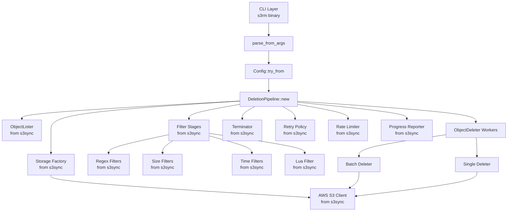
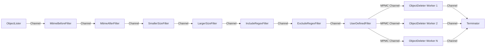

# Design Document: s3rm-rs

## Overview

s3rm-rs is a high-performance S3 object deletion tool built as a sibling to s3sync. The design maximizes code reuse from s3sync by adopting its library-first architecture, AWS client infrastructure, filtering system, Lua integration, and CLI patterns.

### Design Philosophy

1. **Library-First Architecture**: All core functionality resides in the `s3rm-rs` library. The CLI is a thin wrapper that configures and invokes library functions.
2. **Maximum s3sync Reuse (~90%)**: Reuse s3sync's AWS client setup, retry logic, filtering engine, Lua VM integration, progress reporting, configuration management, deletion pipeline, version handling, CLI orchestration, callback system, and test infrastructure.
3. **Minimal New Code (~10%)**: Only implement safety features (confirmation prompts, force flag, max-delete threshold) and minor CLI adjustments.
4. **CLI Alignment**: Follow s3sync's CLI patterns for options, flags, environment variables, and help text.

### Key Differences from s3sync

- **Single Target**: s3rm-rs operates on one target (bucket/prefix) instead of source/target pairs
- **Destructive Operations**: Adds safety features (dry-run, confirmation prompts, force flag)
- **Deletion APIs**: Uses DeleteObject and DeleteObjects instead of sync operations
- **Version Management**: Explicit support for deleting object versions and delete markers

## Architecture

### High-Level Component Diagram



### Component Reuse Strategy (~90% from s3sync)

**Components to Reuse from s3sync (No Modification)**:
- AWS S3 client setup and configuration (`storage/s3/client_builder.rs`)
- AWS credential loading (environment, files, IAM roles)
- Retry policy with exponential backoff (AWS SDK retry config)
- Rate limiter (`leaky-bucket` crate integration)
- Regex filtering engine (`pipeline/filter/include_regex.rs`, `exclude_regex.rs`)
- Size filters (`pipeline/filter/larger_size.rs`, `smaller_size.rs`)
- Time filters (`pipeline/filter/mtime_after.rs`, `mtime_before.rs`)
- Lua VM integration and sandbox (`lua/lua_script_callback_engine.rs`)
- Callback system: event, filter, preprocess managers (`callback/`)
- Progress reporter with indicatif (`bin/s3sync/cli/indicator.rs`)
- Tracing/logging infrastructure (`bin/s3sync/tracing/`)
- UI configuration: color, verbosity (`bin/s3sync/cli/ui_config.rs`)
- Ctrl+C signal handler (`bin/s3sync/cli/ctrl_c_handler/`)
- Configuration precedence (CLI > env > defaults)
- Object lister with parallel pagination (`pipeline/lister.rs`)
- Pipeline stage trait (`pipeline/stage.rs`)
- Terminator stage (`pipeline/terminator.rs`)
- Storage trait and S3 implementation (`storage/mod.rs`, `storage/s3/mod.rs`)
- Core types: statistics, errors, tokens, callbacks (`types/`)
- Test infrastructure (`tests/common/mod.rs`)
- Example patterns (`examples/`)

**Components to Adapt from s3sync (Copy and Modify)**:
- Deletion pipeline: Adapt from `pipeline/mod.rs` and `pipeline/deleter.rs` (s3sync already has delete logic for `--delete` mode)
- Batch grouping: Adapt from `pipeline/key_aggregator.rs` for deletion batching
- Version handling: Adapt from `pipeline/versioning_info_collector.rs`
- ObjectDeleter worker: Adapt from `pipeline/syncer.rs` (replace sync with delete operations)
- User-defined filter stage: Adapt from `pipeline/user_defined_filter.rs`
- Storage factory: Adapt from `pipeline/storage_factory.rs` (S3 only, no local storage)
- Config/CLI args: Adapt from `config/` (remove sync-specific options, add deletion options)
- Main binary: Adapt from `bin/s3sync/main.rs` and `bin/s3sync/cli/mod.rs`
- Dry-run mode: Already exists in s3sync, adapt for deletion context

**New Components for s3rm (~10% of codebase)**:
- Safety Features: Confirmation prompts, force flag, max-delete threshold checks
- CLI argument additions: `--delete-all-versions`, `--max-delete`, `--force`
- Deletion-specific tests (reuse test patterns and infrastructure from s3sync)

## Components and Interfaces

### 1. Library API (`s3rm-rs` crate)

The library exposes a high-level async API for deletion operations, following s3sync's pipeline pattern:

```rust
// Main deletion pipeline (similar to s3sync's Pipeline)
pub struct DeletionPipeline {
    config: Config,
    cancellation_token: CancellationToken,
    // Internal state
}

impl DeletionPipeline {
    pub async fn new(config: Config, cancellation_token: CancellationToken) -> Self;
    
    // Run the deletion pipeline (similar to s3sync's pipeline.run())
    pub async fn run(&mut self);
    
    // Check for errors
    pub fn has_error(&self) -> bool;
    pub fn get_errors_and_consume(&mut self) -> Option<Vec<Error>>;
    
    // Check for warnings
    pub fn has_warning(&self) -> bool;
    
    // Get deletion statistics
    pub async fn get_deletion_stats(&self) -> DeletionStats;
    
    // Close stats sender (to save memory if not needed)
    pub fn close_stats_sender(&mut self);
}

// Configuration (similar to s3sync's Config)
pub struct Config {
    // Internal configuration state
}

impl Config {
    // Build from parsed args (similar to s3sync)
    pub fn try_from(parsed_args: ParsedArgs) -> Result<Self, Error>;
}

// Parsed arguments structure
pub struct ParsedArgs {
    // Parsed CLI arguments
}

// Parse arguments from string array (similar to s3sync's parse_from_args)
pub fn parse_from_args<I, T>(args: I) -> Result<ParsedArgs, Error>
where
    I: IntoIterator<Item = T>,
    T: Into<String>;

// Cancellation token (similar to s3sync)
pub fn create_pipeline_cancellation_token() -> CancellationToken;

// Example usage (matching s3sync pattern):
// let args = vec![
//     "s3rm",
//     "s3://my-bucket/prefix/",
//     "--dry-run",
//     "--worker-size", "100",
// ];
// let parsed_args = parse_from_args(args).unwrap();
// let config = Config::try_from(parsed_args).unwrap();
// let cancellation_token = create_pipeline_cancellation_token();
// let mut pipeline = DeletionPipeline::new(config, cancellation_token).await;
// pipeline.close_stats_sender();
// pipeline.run().await;
// if pipeline.has_error() {
//     println!("{:?}", pipeline.get_errors_and_consume().unwrap()[0]);
// }
// let stats = pipeline.get_deletion_stats().await;

// Deletion statistics
pub struct DeletionStats {
    pub stats_deleted_objects: u64,
    pub stats_failed_objects: u64,
    pub stats_deleted_bytes: u64,
    pub duration: Duration,
}

// Callback registration (for programmatic use)
// Uses async_trait for async callback support
#[async_trait]
pub trait FilterCallback: Send {
    async fn filter(&mut self, object: &S3Object) -> Result<bool>;
    // Returns Ok(true) to delete, Ok(false) to skip, Err(_) to cancel pipeline
}

#[async_trait]
pub trait EventCallback: Send {
    async fn on_event(&mut self, event_data: EventData);
    // EventData is a flat struct with event_type, key, version_id, size,
    // error_message, and stats fields (not the DeletionEvent enum)
}

// Callback management (registration and execution)
pub struct FilterManager;  // Manages filter callbacks (Rust and Lua)
pub struct EventManager;   // Manages event callbacks with event type filtering
```

**Reuse from s3sync**: The Pipeline pattern, Config structure, parse_from_args function, and cancellation token are directly from s3sync. This provides a consistent API between s3sync and s3rm-rs.

### 2. Deletion Pipeline

The core orchestrator that coordinates all deletion operations using s3sync's streaming stage architecture:

```rust
pub struct DeletionPipeline {
    config: Config,
    target: Storage,  // from s3sync
    target_key_map: Option<ObjectKeyMap>,  // for tracking deleted objects
    cancellation_token: CancellationToken,
    stats_receiver: Receiver<DeletionStatistics>,
    has_error: Arc<AtomicBool>,
    has_warning: Arc<AtomicBool>,
    errors: Arc<Mutex<VecDeque<Error>>>,
    ready: bool,
    deletion_stats_report: Arc<Mutex<DeletionStatsReport>>,
}

impl DeletionPipeline {
    pub async fn new(config: Config, cancellation_token: CancellationToken) -> Self {
        // Initialize storage (reuse s3sync's storage factory)
        // Create stats channel
        // Initialize error tracking
        // Reuse s3sync's initialization pattern
    }
    
    pub async fn run(&mut self) {
        // 1. Check prerequisites (confirmation prompt, versioning)
        //    Note: dry-run does NOT abort — the pipeline runs fully
        //    but the deletion layer simulates deletions
        // 2. List objects (using s3sync's parallel lister)
        // 3. Filter objects (using s3sync's filter stages)
        // 4. Delete objects (using deletion workers; dry-run skips S3 API calls)
        // 5. Terminate pipeline
        // Note: All stages connected by async channels
    }
    
    // Error handling (from s3sync)
    pub fn has_error(&self) -> bool;
    pub fn get_errors_and_consume(&mut self) -> Option<Vec<Error>>;
    pub fn has_warning(&self) -> bool;
    
    // Statistics (from s3sync pattern)
    pub async fn get_deletion_stats(&self) -> DeletionStats;
    pub fn close_stats_sender(&mut self);
    
    // Internal stage creation (from s3sync)
    fn create_spsc_stage(&self, ...) -> (Stage, Receiver<S3Object>);
    fn create_mpmc_stage(&self, ...) -> Stage;
    
    // Pipeline stages (adapted from s3sync)
    fn list_target(&self) -> Receiver<S3Object>;
    fn filter_objects(&self, objects: Receiver<S3Object>) -> Receiver<S3Object>;
    fn delete_objects(&self, objects: Receiver<S3Object>) -> Receiver<S3Object>;
    fn terminate(&self, objects: Receiver<S3Object>) -> JoinHandle<()>;
}
```

### Stage Architecture (from s3sync):
- Each stage reads from an input channel and writes to an output channel
- Stages are connected in a pipeline: List → Filter → Delete → Terminate
- Multiple filter stages can be chained (regex, size, time, Lua)
- Multiple deletion workers process objects concurrently (MPMC pattern)
- Terminator stage consumes final output and closes pipeline

**Streaming Pipeline Diagram**:


**Workflow**:
1. **Check Prerequisites**: Validate configuration, check versioning, handle confirmation prompt (dry-run skips confirmation but pipeline still runs fully)
2. **List Stage**: Spawn ObjectLister to list target objects into channel
3. **Filter Stages**: Chain filter stages (each reads from previous, writes to next)
   - MtimeBeforeFilter (if configured)
   - MtimeAfterFilter (if configured)
   - SmallerSizeFilter (if configured)
   - LargerSizeFilter (if configured)
   - IncludeRegexFilter (if configured)
   - ExcludeRegexFilter (if configured)
   - UserDefinedFilter (Lua callback, if configured)
4. **Delete Stage**: Spawn multiple ObjectDeleter workers (MPMC pattern)
5. **Terminate Stage**: Consume final output and close channels

**Logging Approach** (from s3sync):
- Each component uses tracing macros (trace!, debug!, info!, warn!, error!)
- No separate AuditLogger component
- Verbosity controlled by tracing subscriber configuration
- JSON/text format controlled by subscriber configuration

### 3. Stage (Adapted from s3sync)

```rust
// Adapted from s3sync - remove source storage for deletion
pub struct Stage {
    config: Config,
    target: Box<dyn Storage>,  // Only target needed for deletion
    receiver: Option<Receiver<S3Object>>,
    sender: Option<Sender<S3Object>>,
    cancellation_token: CancellationToken,
    has_warning: Arc<AtomicBool>,
}

impl Stage {
    pub fn new(
        config: Config,
        target: Box<dyn Storage>,
        receiver: Option<Receiver<S3Object>>,
        sender: Option<Sender<S3Object>>,
        cancellation_token: CancellationToken,
        has_warning: Arc<AtomicBool>,
    ) -> Self;
}
```

The Stage struct encapsulates the context needed by each pipeline stage. For deletion, we only need target storage (no source).

### 4. Object Lister (Reused from s3sync)

```rust
// Reused from s3sync with no modifications
pub struct ObjectLister {
    stage: Stage,
}

impl ObjectLister {
    pub fn new(stage: Stage) -> Self;
    
    pub async fn list_target(&self, max_keys: Option<i32>) -> Result<(), Error> {
        // List objects from target storage
        // Send objects to stage.sender channel
        // Support parallel pagination
        // Reuse s3sync's implementation
    }
}
```

### 5. Filter Stages (Reused from s3sync)

```rust
// All filter implementations reused from s3sync
// Note: Content-type, metadata, and tagging filters are NOT separate stages
// They are implemented within ObjectDeleter (see below)

pub trait ObjectFilter {
    async fn filter(&self) -> Result<(), Error>;
}

// Time filters
pub struct MtimeBeforeFilter {
    stage: Stage,
    threshold: Option<DateTime<Utc>>,
}

pub struct MtimeAfterFilter {
    stage: Stage,
    threshold: Option<DateTime<Utc>>,
}

// Size filters
pub struct SmallerSizeFilter {
    stage: Stage,
    threshold: Option<u64>,
}

pub struct LargerSizeFilter {
    stage: Stage,
    threshold: Option<u64>,
}

// Regex filters (for key patterns only)
pub struct IncludeRegexFilter {
    stage: Stage,
    pattern: Option<Regex>,
}

pub struct ExcludeRegexFilter {
    stage: Stage,
    pattern: Option<Regex>,
}

// User-defined filter (Lua callbacks)
pub struct UserDefinedFilter {
    stage: Stage,
}

impl ObjectFilter for MtimeBeforeFilter {
    async fn filter(&self) -> Result<(), Error> {
        // Read from stage.receiver
        // Filter based on mtime
        // Write to stage.sender
        // Reuse s3sync's implementation
    }
}

// Similar implementations for other filters
```

**Filter Chaining** (from s3sync):
- Each filter reads from its input channel
- Applies filtering logic
- Writes passing objects to output channel
- Filters are spawned as separate tokio tasks
- Connected in sequence to form filter pipeline

**Important Note**: Content-type, metadata, and tagging filters are NOT separate stages. Following s3sync's pattern, these filters are implemented within ObjectDeleter because they require fetching object metadata/tags via HeadObject/GetObjectTagging API calls.

### 6. Object Deleter (New Component, adapted from s3sync's ObjectSyncer)

```rust
pub struct ObjectDeleter {
    stage: Stage,
    worker_index: usize,
    deletion_stats_report: Arc<Mutex<DeletionStatsReport>>,
    target_key_map: Option<ObjectKeyMap>,
    deleter: Box<dyn Deleter>,  // BatchDeleter or SingleDeleter
}

impl ObjectDeleter {
    pub fn new(
        stage: Stage,
        worker_index: usize,
        deletion_stats_report: Arc<Mutex<DeletionStatsReport>>,
        target_key_map: Option<ObjectKeyMap>,
    ) -> Self;
    
    pub async fn delete(&self) -> Result<(), Error> {
        // Read objects from stage.receiver (MPMC channel)
        // For each object:
        //   1. Apply content-type filters (if configured)
        //      - Call HeadObject to get content-type
        //      - Check against include/exclude content-type regex
        //   2. Apply metadata filters (if configured)
        //      - Call HeadObject to get metadata
        //      - Check against include/exclude metadata regex
        //   3. Apply tagging filters (if configured)
        //      - Call GetObjectTagging to get tags
        //      - Check against include/exclude tag regex
        //   4. If all filters pass, delete using configured deleter
        // Update statistics
        // Write results to stage.sender
        // Pattern adapted from s3sync's ObjectSyncer::sync_or_delete_object
    }
    
    // Content-type filtering (adapted from s3sync)
    async fn decide_delete_by_include_content_type_regex(
        &self,
        key: &str,
        content_type: Option<&str>,
    ) -> bool;
    
    async fn decide_delete_by_exclude_content_type_regex(
        &self,
        key: &str,
        content_type: Option<&str>,
    ) -> bool;
    
    // Metadata filtering (adapted from s3sync)
    async fn decide_delete_by_include_metadata_regex(
        &self,
        key: &str,
        metadata: Option<&HashMap<String, String>>,
    ) -> bool;
    
    async fn decide_delete_by_exclude_metadata_regex(
        &self,
        key: &str,
        metadata: Option<&HashMap<String, String>>,
    ) -> bool;
    
    // Tagging filtering (adapted from s3sync)
    async fn decide_delete_by_include_tag_regex(
        &self,
        key: &str,
        tags: Option<&[Tag]>,
    ) -> bool;
    
    async fn decide_delete_by_exclude_tag_regex(
        &self,
        key: &str,
        tags: Option<&[Tag]>,
    ) -> bool;
}

pub trait Deleter: Send + Sync {
    async fn delete(&self, objects: Vec<S3Object>) -> Result<Vec<DeletionOutcome>, Error>;
}
```

**Adaptation from s3sync**: The ObjectDeleter is adapted from s3sync's ObjectSyncer. Following s3sync's pattern, content-type, metadata, and tagging filters are implemented within the worker (not as separate stages) because they require API calls to fetch object attributes.

**Why these filters are in ObjectDeleter**:
- Content-type filtering requires HeadObject API call
- Metadata filtering requires HeadObject API call
- Tagging filtering requires GetObjectTagging API call
- These API calls are expensive, so they're only made for objects that pass the earlier (cheaper) filters
- This matches s3sync's optimization strategy

### 7. Batch Deleter (New Component)

```rust
pub struct BatchDeleter {
    client: S3Client,  // from s3sync
    batch_size: usize,  // max 1000
    retry_policy: RetryPolicy,  // from s3sync
}

impl Deleter for BatchDeleter {
    async fn delete(&self, objects: Vec<S3Object>) -> Result<Vec<DeletionOutcome>, Error> {
        // Group objects into batches of up to 1000
        // Call DeleteObjects API
        // Handle partial failures:
        //   - Extract successfully deleted objects
        //   - Retry failed objects in new batch
        // Return outcomes for all objects
    }
}
```

**Key Logic**:
- Batch objects into groups of up to 1000
- Include version IDs if deleting versions
- Parse DeleteObjects response to identify successes and failures
- Retry failed objects (reuse s3sync's retry policy)

### 8. Single Deleter (New Component)

```rust
pub struct SingleDeleter {
    client: S3Client,  // from s3sync
    retry_policy: RetryPolicy,  // from s3sync
}

impl Deleter for SingleDeleter {
    async fn delete(&self, objects: Vec<S3Object>) -> Result<Vec<DeletionOutcome>, Error> {
        // Delete objects one at a time using DeleteObject API
        // Apply retry policy for each deletion
        // Return outcomes for all objects
    }
}
```

Used when batch deletion is not desired or for special cases.

### 9. Terminator (Reused from s3sync)

```rust
// Reused from s3sync with no modifications
pub struct Terminator {
    receiver: Receiver<S3Object>,
}

impl Terminator {
    pub fn new(receiver: Receiver<S3Object>) -> Self;
    
    pub async fn terminate(&self) {
        // Consume all remaining objects from channel
        // Close channel
        // Reuse s3sync's implementation
    }
}
```

The Terminator consumes the final stage output and ensures clean pipeline shutdown.

### 10. Storage and Storage Factory (Reused from s3sync)

```rust
// Reused from s3sync with no modifications
pub trait Storage: Send + Sync + DynClone {
    async fn is_versioning_enabled(&self) -> Result<bool, Error>;
    fn get_stats_sender(&self) -> Sender<DeletionStatistics>;
    // Other storage operations
}

pub async fn create_storage(
    config: Config,
    cancellation_token: CancellationToken,
    stats_sender: Sender<DeletionStatistics>,
    has_warning: Arc<AtomicBool>,
) -> Box<dyn Storage> {
    // Create S3 storage only (s3rm-rs only deletes from S3)
    // Reuse s3sync's S3 storage implementation
}
```

**Reuse from s3sync**: The Storage trait and S3 storage implementation. Local storage is NOT needed since s3rm-rs only deletes from S3.

### 11. Retry Policy (Integrated, Reused from s3sync)

Retry is handled at two levels, matching s3sync's approach:

1. **AWS SDK built-in retry**: Configured via `RetryConfig` (part of `ClientConfig`), with `aws_max_attempts` and `initial_backoff_milliseconds`. The AWS SDK handles exponential backoff with jitter for retryable errors (5xx, throttling).

2. **Application-level force retry**: Implemented as a retry loop in `S3Storage` methods. Configured via `ForceRetryConfig` with `force_retry_count` and `force_retry_interval_milliseconds`. This wraps each AWS SDK call and retries on failure after the SDK's own retries are exhausted.

```rust
// Retry configuration in ClientConfig
pub struct RetryConfig {
    pub aws_max_attempts: u32,
    pub initial_backoff_milliseconds: u64,
}

// Application-level retry in Config
pub struct ForceRetryConfig {
    pub force_retry_count: u32,
    pub force_retry_interval_milliseconds: u64,
}
```

There is no standalone `RetryPolicy` module. Rate limiting is handled via `leaky_bucket::RateLimiter` integrated into the `StorageTrait` and `S3Storage` implementation.

### 12. Progress Reporter (Reused from s3sync)

```rust
// Reused from s3sync - progress reporting is a function, not a struct
pub fn show_indicator(
    stats_receiver: Receiver<DeletionStatistics>,
    show_progress: bool,
    show_result: bool,
    log_deletion_summary: bool,
    dry_run: bool,
) -> JoinHandle<()> {
    // Spawn task that reads from stats_receiver channel
    // Display progress using indicatif progress bar
    // Calculate moving averages for throughput
    // Display final summary when channel closes
    // Reuse s3sync's implementation
}
```

**Reuse from s3sync**: The entire progress reporting function, including indicatif progress bar, moving averages, and summary formatting. No separate ProgressReporter struct is needed.

### 13. Logging Infrastructure (Reused from s3sync)

```rust
// Logging is implemented via tracing macros throughout the codebase
// No separate AuditLogger component

// In each component, use tracing macros:
use tracing::{trace, debug, info, warn, error};

// Example usage in deletion engine:
info!("Starting deletion of {} objects", object_count);
debug!("Applying filters: {:?}", filter_config);
trace!("Processing object: {}", object.key);
error!("Failed to delete object {}: {}", object.key, error);

// Tracing subscriber configuration (in bin/s3rm/tracing.rs, adapted from s3sync)
// Uses TracingConfig from the library's config module
pub fn init_tracing(config: &TracingConfig) {
    let fmt_span = if config.span_events_tracing {
        FmtSpan::NEW | FmtSpan::CLOSE
    } else {
        FmtSpan::NONE
    };

    let subscriber_builder = tracing_subscriber::fmt()
        .compact()
        .with_target(false)
        .with_ansi(!config.disable_color_tracing)
        .with_span_events(fmt_span);

    // Build event filter based on AWS SDK tracing and RUST_LOG env var
    let event_filter = if config.aws_sdk_tracing {
        format!("s3rm_rs={level},aws_smithy_runtime={level},aws_config={level},aws_sigv4={level}",
                level = config.tracing_level)
    } else if let Ok(env_filter) = env::var("RUST_LOG") {
        env_filter
    } else {
        format!("s3rm_rs={}", config.tracing_level)
    };

    // TracingConfig.tracing_level is log::Level, mapped from CLI verbosity:
    // -q -> Error, default -> Info, -v -> Debug, -vv -> Debug, -vvv -> Trace

    if config.json_tracing {
        subscriber_builder.with_env_filter(event_filter).json().init();
    } else {
        subscriber_builder.with_env_filter(event_filter).init();
    }
}
```

**Reuse from s3sync**: The entire tracing infrastructure, subscriber configuration, and JSON/text formatting. Verbosity is configured via `TracingConfig.tracing_level` (a `log::Level`). The `init_tracing` function lives in the binary crate (`bin/s3rm/tracing.rs`), not the library.

### 14. Lua Integration (Reused from s3sync)

```rust
// Reused from s3sync with no modifications

// Lua script callback engine (from s3sync)
pub struct LuaScriptCallbackEngine {
    lua: mlua::Lua,
}

impl LuaScriptCallbackEngine {
    pub fn new(memory_limit: usize) -> Self;
    pub fn new_without_os_io_libs(memory_limit: usize) -> Self;
    pub fn unsafe_new(memory_limit: usize) -> Self;
    pub fn load_and_compile(&mut self, script: &str) -> Result<()>;
    pub fn get_engine(&self) -> &mlua::Lua;
}

// Lua filter callback (from s3sync)
pub struct LuaFilterCallback {
    lua: LuaScriptCallbackEngine,
}

impl LuaFilterCallback {
    pub fn new(memory_limit: usize, allow_lua_os_library: bool, unsafe_lua: bool) -> Self;
    pub fn load_and_compile(&mut self, script_path: &str) -> Result<()>;
}

#[async_trait]
impl FilterCallback for LuaFilterCallback {
    async fn filter(&mut self, object: &S3Object) -> Result<bool> {
        // Convert object to Lua table
        // Call Lua filter() function
        // Return Ok(true) to delete, Ok(false) to skip, Err(_) to cancel
        // Reuse s3sync's implementation
    }
}

// Lua event callback (from s3sync)
pub struct LuaEventCallback {
    lua: LuaScriptCallbackEngine,
}

impl LuaEventCallback {
    pub fn new(memory_limit: usize, allow_lua_os_library: bool, unsafe_lua: bool) -> Self;
    pub fn load_and_compile(&mut self, script_path: &str) -> Result<()>;
}

#[async_trait]
impl EventCallback for LuaEventCallback {
    async fn on_event(&mut self, event_data: EventData) {
        // Convert EventData to Lua table
        // Call Lua on_event() function
        // EventData includes event_type, key, version_id, size, error_message, stats
        // Reuse s3sync's implementation
    }
}
```

**Reuse from s3sync**: LuaScriptCallbackEngine, LuaFilterCallback, LuaEventCallback, and all Lua VM setup logic.

### 15. Configuration and Parsing (Adapted from s3sync)

```rust
// Configuration structure (similar to s3sync's Config)
pub struct Config {
    // Internal configuration state
    // Built from ParsedArgs
}

impl Config {
    pub fn try_from(parsed_args: ParsedArgs) -> Result<Self, Error> {
        // Validate and build configuration
        // Apply defaults
        // Reuse s3sync's validation logic
    }
}

// Parsed arguments structure
pub struct ParsedArgs {
    // Parsed CLI arguments using clap
}

// Parse arguments from string array (similar to s3sync's parse_from_args)
pub fn parse_from_args<I, T>(args: I) -> Result<ParsedArgs, Error>
where
    I: IntoIterator<Item = T>,
    T: Into<String>
{
    // Parse using clap
    // Handle environment variables
    // Reuse s3sync's parsing logic
}

// Internal CLI argument structure (aligned with s3sync patterns)
// This is parsed internally, not exposed in public API
#[derive(clap::Parser)]
struct CliArgs {
    // Target
    pub target: String,  // s3://bucket/prefix
    
    // Deletion options
    pub batch_size: usize,  // 1-1000 (default 1000); if 1, use single deletion
                            // If Express One Zone and allow_parallel_listings_in_express_one_zone is false, batch_size defaults to 1
    pub delete_all_versions: bool,
    
    // Safety
    pub dry_run: bool,
    pub force: bool,
    
    // Filtering (same as s3sync)
    pub filter_include_regex: Option<String>,
    pub filter_exclude_regex: Option<String>,
    pub filter_include_content_type_regex: Option<String>,
    pub filter_exclude_content_type_regex: Option<String>,
    pub filter_include_metadata_regex: Option<String>,
    pub filter_exclude_metadata_regex: Option<String>,
    pub filter_include_tag_regex: Option<String>,
    pub filter_exclude_tag_regex: Option<String>,
    pub filter_mtime_before: Option<DateTime<Utc>>,
    pub filter_mtime_after: Option<DateTime<Utc>>,
    pub filter_smaller_size: Option<u64>,
    pub filter_larger_size: Option<u64>,
    pub filter_callback_lua_script: Option<PathBuf>,
    
    // Performance (same as s3sync)
    pub worker_size: usize,
    pub max_parallel_listings: usize,
    pub max_parallel_listing_max_depth: Option<usize>,
    pub rate_limit_objects: Option<u64>,
    pub object_listing_queue_size: usize,
    pub allow_parallel_listings_in_express_one_zone: bool,
    
    // Logging (same as s3sync)
    pub verbosity: i8,  // -q=-1, default=0, -v=1, -vv=2, -vvv=3
    pub quiet: bool,
    pub json_tracing: bool,
    pub disable_color_tracing: bool,
    pub aws_sdk_tracing: bool,
    pub span_events_tracing: bool,
    
    // Retry (same as s3sync)
    pub aws_max_attempts: u32,
    pub initial_backoff_milliseconds: u64,
    pub force_retry_count: u32,
    pub force_retry_interval_milliseconds: u64,
    
    // Timeout (same as s3sync)
    pub operation_timeout_milliseconds: u64,
    pub operation_attempt_timeout_milliseconds: u64,
    pub connect_timeout_milliseconds: u64,
    pub read_timeout_milliseconds: u64,
    
    // AWS config (same as s3sync)
    pub aws_config_file: Option<PathBuf>,
    pub aws_shared_credentials_file: Option<PathBuf>,
    pub target_profile: Option<String>,
    pub target_access_key: Option<String>,
    pub target_secret_key: Option<String>,
    pub target_session_token: Option<String>,
    pub target_region: Option<String>,
    pub target_endpoint_url: Option<String>,
    pub target_accelerate: bool,
    pub target_request_payer: bool,
    pub target_force_path_style: bool,
    
    // Lua (same as s3sync)
    pub allow_lua_os_library: bool,
    pub lua_vm_memory_limit: Option<usize>,
    pub allow_lua_unsafe_vm: bool,
    pub event_callback_lua_script: Option<PathBuf>,
    
    // Advanced (same as s3sync)
    pub if_match: bool,             // Uses the object's own ETag for conditional deletion
    pub warn_as_error: bool,
    pub max_keys: Option<i32>,
    pub show_no_progress: bool,
    pub auto_complete_shell: Option<String>,
    
    // Deletion-specific
    pub max_delete: Option<u64>,  // Maximum number of objects to delete
}
```

**Reuse from s3sync**: All option parsing, environment variable handling, validation logic. Only remove source-specific options.

### 16. CLI Entry Point (Adapted from s3sync)

```rust
// CLI entry point
#[tokio::main]
async fn main() {
    // Collect CLI args
    let args: Vec<String> = std::env::args().collect();
    
    // Parse arguments (reuse s3sync's pattern)
    // s3rm library converts the arguments to Config.
    // For simplicity, if invalid arguments are passed, this function will panic.
    let parsed_args = s3rm_rs::parse_from_args(args).unwrap();
    let config = s3rm_rs::Config::try_from(parsed_args).unwrap();
    
    // Initialize tracing (reuse s3sync's tracing setup)
    init_tracing(&config).unwrap();
    
    // Create cancellation token
    let cancellation_token = s3rm_rs::create_pipeline_cancellation_token();
    
    // Setup Ctrl-C handler (reuse s3sync's pattern)
    let cancellation_token_for_ctrlc = cancellation_token.clone();
    ctrlc::set_handler(move || {
        tracing::warn!("Received Ctrl-C signal. Cancelling...");
        cancellation_token_for_ctrlc.cancel();
    })
    .expect("Error setting Ctrl-C handler");
    
    // Create and run deletion pipeline
    let mut pipeline = s3rm_rs::DeletionPipeline::new(config, cancellation_token).await;
    
    // Close stats sender if not needed (saves memory)
    pipeline.close_stats_sender();
    
    // Run the pipeline
    pipeline.run().await;
    
    // Check for errors
    if pipeline.has_error() {
        tracing::error!("An error has occurred.");
        let errors = pipeline.get_errors_and_consume().unwrap();
        tracing::error!("{:?}", errors[0]);
        std::process::exit(1);
    }
    
    // Check for warnings
    if pipeline.has_warning() {
        tracing::warn!("A warning has occurred.");
    }
    
    // Display statistics
    let stats = pipeline.get_deletion_stats().await;
    println!("Number of deleted objects: {}", stats.stats_deleted_objects);
}
```

**CLI Command Structure** (aligned with s3sync):
```bash
s3rm [OPTIONS] <TARGET>

# Examples:
s3rm s3://my-bucket/logs/2023/ --dry-run
s3rm s3://my-bucket/temp/ --filter-include-regex ".*\.tmp$" --force
s3rm s3://my-bucket/old-data/ --delete-all-versions -vv
s3rm s3://my-bucket/ --filter-mtime-before 2023-01-01 --worker-size 100
```

**Help Text Organization** (following s3sync's categorized help format):

The CLI help output should organize options into clear categories using clap's `#[command(next_help_heading = "Category Name")]` attribute. This matches s3sync's help structure for consistency.

**Option Groups** (same structure as s3sync):
- **Target**: S3 bucket/prefix specification
- **Deletion Options**: Batch size, delete-all-versions
- **Safety Options**: Dry-run, force, max-delete threshold
- **Filter Options**: Regex, size, time, Lua callbacks (identical to s3sync)
- **Performance Options**: Worker count, parallel listings, rate limiting (identical to s3sync)
- **Logging Options**: Verbosity, JSON, color control (identical to s3sync)
- **Retry Options**: Max attempts, backoff configuration (identical to s3sync)
- **Timeout Options**: Operation, connection, read timeouts (identical to s3sync)
- **AWS Configuration**: Credentials, region, endpoint (target-* only, no source-*)
- **Lua Options**: Script paths, memory limits, security modes (identical to s3sync)
- **Advanced Options**: If-Match, warn-as-error, max-keys, show-no-progress (identical to s3sync)

Each option group should be clearly labeled in the help output with a heading, making it easy for users to find relevant options. This categorization improves usability and maintains consistency with s3sync's CLI interface.

### 17. Safety Features (New Component)

```rust
pub trait PromptHandler: Send + Sync {
    fn read_confirmation(&self, target_display: &str, use_color: bool) -> Result<String>;
    fn is_interactive(&self) -> bool;
}

pub struct StdioPromptHandler;

impl PromptHandler for StdioPromptHandler {
    fn read_confirmation(&self, target_display: &str, use_color: bool) -> Result<String> {
        if use_color {
            println!("\n\x1b[1;31mWARNING:\x1b[0m All objects matching prefix \x1b[1;33m{}\x1b[0m  will be deleted.",
                target_display);
        } else {
            println!("\nWARNING: All objects matching prefix {}  will be deleted.", target_display);
        }
        print!("Type 'yes' to confirm deletion: ");
        std::io::stdout().flush()?;
        let mut input = String::new();
        std::io::stdin().lock().read_line(&mut input)?;
        Ok(input.trim().to_string())
    }

    fn is_interactive(&self) -> bool {
        std::io::stdin().is_terminal() && std::io::stdout().is_terminal()
    }
}

pub struct SafetyChecker {
    dry_run: bool,
    force: bool,
    json_logging: bool,
    disable_color: bool,
    target_display: String,
    prompt_handler: Box<dyn PromptHandler>,
}

impl SafetyChecker {
    pub fn check_before_deletion(&self) -> Result<()> {
        // 1. Dry-run: skip confirmation — pipeline runs fully but
        //    deletion layer simulates deletions and outputs stats.
        if self.dry_run {
            return Ok(());
        }

        // 2. Force flag: skip all prompts
        if self.force {
            return Ok(());
        }

        // 3. Non-interactive environment (non-TTY or JSON logging): skip prompts
        if self.json_logging || !self.prompt_handler.is_interactive() {
            return Ok(());
        }

        // 4. Prompt for confirmation (require exact "yes" input)
        let use_color = !self.disable_color;
        let input = self.prompt_handler.read_confirmation(&self.target_display, use_color)?;
        if input != "yes" {
            return Err(anyhow!(S3rmError::Cancelled));
        }
        Ok(())
    }
}
```

**Note**: Uses `std::io::IsTerminal` (stable since Rust 1.70) instead of the `atty` crate. ANSI color codes are embedded directly as constants — no external color crate is needed.

## Data Models

### Core Data Structures

```rust
// S3 object representation (adapted from s3sync's S3syncObject enum)
// Wraps the actual AWS SDK types for each object category.
// Note: content_type, metadata, and tags are not included because they require
// additional API calls (HeadObject/GetObjectTagging) and are fetched on-demand
// in ObjectDeleter when needed for filtering
pub enum S3Object {
    NotVersioning(Object),       // Non-versioned bucket objects
    Versioning(ObjectVersion),   // Versioned objects with version_id
    DeleteMarker(DeleteMarkerEntry), // Delete markers in versioned buckets
}

impl S3Object {
    pub fn key(&self) -> &str;
    pub fn size(&self) -> i64;
    pub fn version_id(&self) -> Option<&str>;
    pub fn e_tag(&self) -> Option<&str>;
    pub fn last_modified(&self) -> &DateTime;
    pub fn is_latest(&self) -> bool;
    pub fn is_delete_marker(&self) -> bool;
}

// Object key map for tracking (reused from s3sync)
pub type ObjectKeyMap = Arc<Mutex<HashMap<String, S3Object>>>;

// Statistics sent through the stats channel during pipeline execution.
// Each variant represents a single event sent from workers to the
// progress reporter via an async channel. Adapted from s3sync's SyncStatistics.
pub enum DeletionStatistics {
    DeleteBytes(u64),
    DeleteComplete { key: String },
    DeleteSkip { key: String },
    DeleteError { key: String },
    DeleteWarning { key: String },
}

// Aggregate deletion statistics report with atomic counters (adapted from s3sync's SyncStatsReport)
pub struct DeletionStatsReport {
    pub stats_deleted_objects: AtomicU64,
    pub stats_deleted_bytes: AtomicU64,
    pub stats_failed_objects: AtomicU64,
}

// Deletion outcome
pub enum DeletionOutcome {
    Success {
        key: String,
        version_id: Option<String>,
    },
    Failed {
        key: String,
        version_id: Option<String>,
        error: DeletionError,
        retry_count: u32,
    },
}

// Deletion error types
pub enum DeletionError {
    NotFound,
    AccessDenied,
    PreconditionFailed,  // If-Match failed
    Throttled,
    NetworkError(String),
    ServiceError(String),
}

// Deletion event for callbacks (adapted from s3sync's EventData)
pub enum DeletionEvent {
    PipelineStart,
    ObjectDeleted {
        key: String,
        version_id: Option<String>,
        size: u64,
    },
    ObjectFailed {
        key: String,
        version_id: Option<String>,
        error: DeletionError,
    },
    PipelineEnd,
    PipelineError {
        message: String,
    },
}

// S3 target specification
pub struct S3Target {
    pub bucket: String,
    pub prefix: Option<String>,
    pub endpoint: Option<String>,
    pub region: Option<String>,
}

impl S3Target {
    pub fn parse(s3_uri: &str) -> Result<Self, Error> {
        // Parse s3://bucket/prefix format
        // Reuse s3sync's URI parsing logic
    }
}

// Cancellation token (reused from s3sync)
pub type CancellationToken = tokio_util::sync::CancellationToken;

pub fn create_pipeline_cancellation_token() -> CancellationToken {
    CancellationToken::new()
}
```

### Configuration Structures

```rust
// Main deletion configuration (flat struct, adapted from s3sync's Config)
pub struct Config {
    pub target: StoragePath,
    pub show_no_progress: bool,
    pub target_client_config: Option<ClientConfig>,
    pub force_retry_config: ForceRetryConfig,
    pub tracing_config: Option<TracingConfig>,
    pub worker_size: u16,
    pub warn_as_error: bool,
    pub dry_run: bool,
    pub rate_limit_objects: Option<u32>,
    pub max_parallel_listings: u16,
    pub object_listing_queue_size: u32,
    pub max_parallel_listing_max_depth: u16,
    pub allow_parallel_listings_in_express_one_zone: bool,
    pub filter_config: FilterConfig,
    pub max_keys: i32,
    pub auto_complete_shell: Option<clap_complete::shells::Shell>,
    pub event_callback_lua_script: Option<String>,
    pub filter_callback_lua_script: Option<String>,
    pub allow_lua_os_library: bool,
    pub allow_lua_unsafe_vm: bool,
    pub lua_vm_memory_limit: usize,
    pub if_match: bool,             // Uses the object's own ETag for conditional deletion
    pub max_delete: Option<u64>,
    // Callback managers
    pub filter_manager: FilterManager,
    pub event_manager: EventManager,
    // Deletion-specific options
    pub batch_size: u16,
    pub delete_all_versions: bool,
    pub force: bool,
}

pub struct ClientConfig {
    pub client_config_location: ClientConfigLocation,
    pub credential: S3Credentials,
    pub region: Option<String>,
    pub endpoint_url: Option<String>,
    pub force_path_style: bool,
    pub accelerate: bool,
    pub request_payer: Option<RequestPayer>,
    pub retry_config: RetryConfig,
    pub cli_timeout_config: CLITimeoutConfig,
    pub disable_stalled_stream_protection: bool,
    pub request_checksum_calculation: RequestChecksumCalculation,
    pub parallel_upload_semaphore: Arc<Semaphore>,
}

pub struct RetryConfig {
    pub aws_max_attempts: u32,
    pub initial_backoff_milliseconds: u64,
}

pub struct CLITimeoutConfig {
    pub operation_timeout_milliseconds: Option<u64>,
    pub operation_attempt_timeout_milliseconds: Option<u64>,
    pub connect_timeout_milliseconds: Option<u64>,
    pub read_timeout_milliseconds: Option<u64>,
}

pub struct TracingConfig {
    pub tracing_level: log::Level,
    pub json_tracing: bool,
    pub aws_sdk_tracing: bool,
    pub span_events_tracing: bool,
    pub disable_color_tracing: bool,
}

pub struct ForceRetryConfig {
    pub force_retry_count: u32,
    pub force_retry_interval_milliseconds: u64,
}

pub struct FilterConfig {
    pub before_time: Option<DateTime<Utc>>,
    pub after_time: Option<DateTime<Utc>>,
    pub include_regex: Option<Regex>,
    pub exclude_regex: Option<Regex>,
    pub include_content_type_regex: Option<Regex>,
    pub exclude_content_type_regex: Option<Regex>,
    pub include_metadata_regex: Option<Regex>,
    pub exclude_metadata_regex: Option<Regex>,
    pub include_tag_regex: Option<Regex>,
    pub exclude_tag_regex: Option<Regex>,
    pub larger_size: Option<u64>,
    pub smaller_size: Option<u64>,
}

```

**Note**: AWS credentials are handled via `S3Credentials` (with `Zeroize` and `ZeroizeOnDrop` derives for secure memory handling) inside `ClientConfig`. Logging is configured via `TracingConfig`. Retry is handled at two levels: `RetryConfig` (AWS SDK retries) and `ForceRetryConfig` (application-level retries). All these are sub-structs within the flat `Config` structure defined above.

## Correctness Properties

*A property is a characteristic or behavior that should hold true across all valid executions of a system—essentially, a formal statement about what the system should do. Properties serve as the bridge between human-readable specifications and machine-verifiable correctness guarantees.*

### Property 1: Batch Deletion API Usage
*For any* set of objects selected for batch deletion, the Batch Deleter should group them into batches of at most 1000 objects and use the S3 DeleteObjects API for each batch, correctly including version IDs when deleting versions.
**Validates: Requirements 1.1, 5.5**

### Property 2: Single Deletion API Usage
*For any* set of objects selected for single deletion mode, the Single Deleter should use the S3 DeleteObject API for each object individually.
**Validates: Requirements 1.2**

### Property 3: Concurrent Worker Execution
*For any* deletion operation with worker count > 1, multiple workers should execute deletion requests concurrently.
**Validates: Requirements 1.3**

### Property 4: Worker Count Configuration Validation
*For any* worker count configuration, the tool should accept values from 1 to 65535 and reject values outside this range.
**Validates: Requirements 1.4**

### Property 5: Parallel Listing Configuration
*For any* parallel listing configuration, the Object Lister should use the configured number of parallel listing operations and respect the max depth setting.
**Validates: Requirements 1.5, 1.6, 1.7**

### Property 6: Partial Batch Failure Recovery
*For any* batch deletion that partially fails, the Batch Deleter should identify which objects were successfully deleted and which failed, then retry only the failed objects in subsequent batches.
**Validates: Requirements 1.9**

### Property 7: Prefix Filtering
*For any* prefix argument provided, the tool should delete only objects whose keys start with that prefix.
**Validates: Requirements 2.1**

### Property 8: Regex Filtering
*For any* regex pattern provided for keys, content types, metadata, or tags, the tool should delete only objects where the corresponding field matches the pattern, and multiple regex filters should be combined with AND logic.
**Validates: Requirements 2.2, 2.3, 2.4, 2.5, 2.12**

### Property 9: Size Range Filtering
*For any* size range filter (min/max), the tool should delete only objects whose size falls within the specified range.
**Validates: Requirements 2.6**

### Property 10: Time Range Filtering
*For any* time range filter (before/after), the tool should delete only objects whose last modified time falls within the specified range.
**Validates: Requirements 2.7**

### Property 11: Lua Filter Callback Execution
*For any* Lua filter script provided, the tool should execute the script for each object and delete only objects where the script returns true.
**Validates: Requirements 2.8**

### Property 12: Rust Filter Callback Execution
*For any* Rust filter callback registered via the library API, the tool should execute the callback for each object and delete only objects where the callback returns true.
**Validates: Requirements 2.9**

### Property 13: Delete-All Behavior
*For any* invocation with the delete-all flag, the tool should delete all objects in the specified bucket without applying additional filters.
**Validates: Requirements 2.10**

### Property 14: Lua Callback Type Support
*For any* Lua script provided, the tool should support both filter callbacks (returning boolean) and event callbacks (receiving events).
**Validates: Requirements 2.12**

### Property 15: Lua Sandbox Security
*For any* Lua script executed in safe mode (default), attempts to access OS or I/O libraries should fail, and when explicitly enabled, OS/I/O operations should succeed.
**Validates: Requirements 2.13, 2.14**

### Property 16: Dry-Run Mode Safety
*For any* deletion operation with dry-run enabled, the full pipeline (listing, filtering) runs but the deletion layer simulates deletions without making actual S3 API calls. Each object that would be deleted is logged at info level with a `[dry-run]` prefix, and deletion statistics are output.
**Validates: Requirements 3.1**

### Property 17: Confirmation Prompt Validation
*For the* confirmation prompt, only the exact string "yes" should be accepted, and abbreviated responses like "y" should be rejected.
**Validates: Requirements 3.3**

### Property 18: Force Flag Behavior
*For any* deletion operation with the force flag enabled, confirmation prompts should be skipped.
**Validates: Requirements 3.4, 13.2**

### Property 19: Confirmation Prompt Target Display
*For any* destructive deletion operation (not dry-run, not force), the confirmation prompt should display the target prefix (e.g. `s3://bucket/prefix`) with colored text so users can verify which objects will be affected. Object count and size estimation is available via dry-run mode.
**Validates: Requirements 3.5**

### Property 20: Max-Delete Threshold Enforcement
*For any* deletion operation where the --max-delete option is specified, the ObjectDeleter SHALL cancel the pipeline when the deletion count exceeds the specified limit. This is enforced at deletion time (not in the confirmation prompt).
**Validates: Requirements 3.6**

### Property 21: Verbosity Level Configuration
*For any* verbosity flag (-v, -vv, -vvv, -q), the tool should accept the flag and configure the appropriate logging level.
**Validates: Requirements 4.1**

### Property 22: JSON Logging Format
*For any* log output with JSON logging enabled, all logs should be valid JSON objects.
**Validates: Requirements 4.7, 13.3**

### Property 23: Color Output Control
*For any* execution environment, color output should be enabled by default in TTY environments, disabled in non-TTY environments unless explicitly enabled, and disabled when the disable-color flag is set.
**Validates: Requirements 4.8, 4.9, 7.6, 13.7**

### Property 24: Error Logging
*For any* deletion failure, the tool should log the error message and error code at the current verbosity level.
**Validates: Requirements 4.10**

### Property 25: Versioned Bucket Delete Marker Creation
*For any* deletion from a versioned bucket without version specification, the tool should create delete markers for current versions.
**Validates: Requirements 5.1**

### Property 26: All-Versions Deletion
*For any* deletion with the delete-all-versions flag, the tool should delete all versions of matching objects including delete markers.
**Validates: Requirements 5.2**

### Property 27: Version Information Retrieval
*For any* listing operation on a versioned bucket, the Object Lister should retrieve and include version information for each object.
**Validates: Requirements 5.3**

### Property 28: Versioned Dry-Run Display
*For any* dry-run operation on a versioned bucket, the display should show version counts per object.
**Validates: Requirements 5.4**

### Property 29: Retry with Exponential Backoff
*For any* API request that fails with a retryable error (5xx, throttling, SlowDown), the Retry Policy should retry the request with exponential backoff up to the configured maximum attempts.
**Validates: Requirements 6.1, 6.2, 6.6**

### Property 30: Failure Tracking and Continuation
*For any* object deletion that fails after all retries, the tool should log the failure, track it in the failed count, and continue processing remaining objects.
**Validates: Requirements 6.4, 6.5**

### Property 31: Progress Reporting
*For any* deletion operation in progress, the tool should display progress information including objects deleted, percentage complete, current rate, and estimated time remaining, unless quiet mode is enabled.
**Validates: Requirements 7.1, 7.3, 7.4, 7.5**

### Property 32: Event Callback Invocation
*For any* registered event callback (Lua or Rust), the tool should invoke the callback for progress updates, errors, and completion events with structured event data including event type, object key, status, timestamps, and error information when applicable.
**Validates: Requirements 7.7, 7.8**

### Property 33: Configuration Precedence
*For any* configuration option available via CLI arguments, environment variables, and defaults, the tool should apply the precedence: CLI args > environment variables > defaults.
**Validates: Requirements 8.1, 8.2, 8.3, 8.5**

### Property 34: AWS Credential Loading
*For any* AWS credential configuration (environment variables, credentials file, IAM roles), the tool should successfully load credentials through standard AWS SDK mechanisms.
**Validates: Requirements 8.4**

### Property 35: Custom Endpoint Support
*For any* custom endpoint specified, the tool should use that endpoint for S3 API calls, enabling support for S3-compatible services.
**Validates: Requirements 8.6**

### Property 36: Rate Limiting Enforcement
*For any* rate limit configuration, the Rate Limiter should enforce that the deletion rate does not exceed the specified maximum objects per second.
**Validates: Requirements 8.7**

### Property 37: Cross-Platform Path Handling
*For any* file path provided on different operating systems, the tool should correctly normalize and handle the path according to platform conventions.
**Validates: Requirements 9.6**

### Property 38: Input Validation and Error Messages
*For any* invalid input (missing required arguments, invalid values), the tool should provide clear error messages indicating what is wrong.
**Validates: Requirements 10.2**

### Property 39: Flag Alias Support
*For any* command-line option, both short flags (e.g., -d) and long flags (e.g., --dry-run) should be accepted and produce identical behavior.
**Validates: Requirements 10.4**

### Property 40: Exit Code Mapping
*For any* execution outcome, the tool should return appropriate exit codes: 0 for success, distinct non-zero codes for different failure scenarios (authentication, network, partial failure).
**Validates: Requirements 10.5, 13.4**

### Property 41: If-Match Conditional Deletion
*For any* If-Match ETag provided, the tool should include the If-Match header in deletion requests, and when the condition fails (ETag mismatch), log the failure and skip the object.
**Validates: Requirements 11.1, 11.2**

### Property 42: ETag Input Parsing
*For any* If-Match ETag provided via command-line option, the tool should correctly parse the value and use it for conditional deletion.
**Validates: Requirements 11.3**

### Property 43: Batch Conditional Deletion Handling
*For any* batch deletion with If-Match conditions, the Batch Deleter should handle conditional deletion failures appropriately by identifying which objects failed the condition.
**Validates: Requirements 11.4**

### Property 44: Library API Configuration
*For any* configuration option available in the CLI, the library API should provide equivalent programmatic configuration functions.
**Validates: Requirements 12.4**

### Property 45: Library Callback Registration
*For any* Rust filter or event callback registered via the library API, the callback should be invoked at the appropriate times with correct data.
**Validates: Requirements 12.5, 12.6**

### Property 46: Library Lua Callback Support
*For any* Lua script path provided to the library API, the library should load and execute the script for filter or event operations.
**Validates: Requirements 12.7**

### Property 47: Library Async Result Handling
*For any* library API function call, the function should return a Result type that allows proper error handling.
**Validates: Requirements 12.8**

### Property 48: Non-Interactive Environment Detection
*For any* execution in a non-interactive environment (no TTY), the tool should detect the absence of a TTY and disable interactive prompts.
**Validates: Requirements 13.1**

### Property 49: Output Stream Separation
*For any* error that occurs, the tool should output error messages to stderr while keeping structured logs on stdout.
**Validates: Requirements 13.6**

## Error Handling

### Error Types

Following s3sync's error handling pattern, errors are categorized by their source and handling requirements:

```rust
#[derive(Debug, thiserror::Error)]
pub enum S3rmError {
    // AWS SDK errors (retryable based on error type)
    #[error("AWS SDK error: {0}")]
    AwsSdk(String),

    // Configuration errors (non-retryable, exit code 2)
    #[error("Invalid configuration: {0}")]
    InvalidConfig(String),

    #[error("Invalid S3 URI: {0}")]
    InvalidUri(String),

    #[error("Invalid regex pattern: {0}")]
    InvalidRegex(String),

    // Script errors (non-retryable, exit code 1)
    #[error("Lua script error: {0}")]
    LuaScript(String),

    // I/O errors (may be retryable depending on error type)
    #[error("I/O error: {0}")]
    Io(String),

    // User cancellation (not an error, exit code 0)
    #[error("Operation cancelled by user")]
    Cancelled,

    // Partial failure (warning, exit code 3)
    #[error("Partial failure: {deleted} deleted, {failed} failed")]
    PartialFailure { deleted: u64, failed: u64 },

    // Pipeline error (general error, exit code 1)
    #[error("Pipeline error: {0}")]
    Pipeline(String),
}

impl S3rmError {
    // Get exit code for this error
    pub fn exit_code(&self) -> i32 {
        match self {
            S3rmError::Cancelled => 0,
            S3rmError::InvalidConfig(_) | S3rmError::InvalidUri(_) | S3rmError::InvalidRegex(_) => 2,
            S3rmError::PartialFailure { .. } => 3,
            _ => 1,
        }
    }

    // Check if error is retryable
    pub fn is_retryable(&self) -> bool {
        matches!(self, S3rmError::AwsSdk(_))
    }
}
```

**Error Handling Rationale**:
- The error type is named `S3rmError` (not `Error`) to avoid conflicts with `std::error::Error` and `anyhow::Error`
- All error variants store String instead of the original error type to avoid complex lifetime and trait bound issues
- InvalidConfig, InvalidUri, InvalidRegex are treated as configuration errors (exit code 2)
- Lua, I/O, and AWS SDK errors are treated separately for better error classification
- Cancelled is not a real error (exit code 0); dry-run mode does not produce an error — the pipeline runs normally with simulated deletions
- PartialFailure is a warning (exit code 3)
- **Note**: There is no `DryRun` error variant — dry-run mode runs the full pipeline with simulated deletions and is not treated as an error

### Error Handling Strategy

**Reuse from s3sync**:
- AWS SDK error handling and classification
- Retry logic for transient errors
- Error logging and formatting
- Exit code mapping (0=success, 1=error, 2=invalid arguments, 3=warnings)
- Ctrl-C signal handling with cancellation token

**New for s3rm**:
- Partial failure handling (some objects deleted, some failed)
- Dry-run error (not a real error, just stops execution with exit code 0)
- Cancellation error (user declined confirmation, exit code 0)

### Retry Strategy

**Retryable Errors** (reuse s3sync's classification):
- HTTP 5xx errors
- Throttling errors (SlowDown, TooManyRequests)
- Network errors (connection timeout, DNS failure)
- Transient AWS SDK errors

**Non-Retryable Errors**:
- HTTP 4xx errors (except throttling)
- Access denied
- Invalid credentials
- Malformed requests
- Precondition failed (If-Match mismatch)

**Backoff Strategy** (reuse s3sync's implementation):
- Initial backoff: configurable (default 100ms)
- Exponential multiplier: 2.0
- Max backoff: configurable (default 20s)
- Jitter: ±25% to prevent thundering herd
- Max attempts: configurable (default 3)

### Partial Failure Handling

When batch deletions partially fail:
1. Parse DeleteObjects response to identify successes and failures
2. Log each failure with error code and message
3. Track failed objects for retry
4. Continue processing remaining objects
5. Return PartialFailure error if any objects failed after all retries

### Error Logging

**Reuse s3sync's logging**:
- Error messages include context (object key, operation, error code)
- Verbosity controls detail level
- JSON format includes structured error data
- Color coding for error severity (red for errors, yellow for warnings)

## Testing Strategy

### Dual Testing Approach

s3rm-rs uses both unit testing and property-based testing for comprehensive coverage:

**Unit Tests**: Verify specific examples, edge cases, and error conditions
- Specific deletion scenarios (single object, empty bucket, etc.)
- Configuration parsing edge cases
- Error handling for specific error codes
- CLI argument validation
- Integration between components

**Property Tests**: Verify universal properties across all inputs
- Each correctness property is implemented as a property-based test
- Minimum 100 iterations per property test (due to randomization)
- Tests use generated inputs to verify behavior across wide input space

Together, unit tests catch concrete bugs while property tests verify general correctness.

### Property-Based Testing Configuration

**Library**: Use `proptest` crate (standard Rust PBT library)

**Test Configuration**:
```rust
proptest! {
    #![proptest_config(ProptestConfig {
        cases: 100,  // Minimum 100 iterations
        .. ProptestConfig::default()
    })]
    
    // Feature: s3rm-rs, Property 7: Prefix Filtering
    #[test]
    fn test_prefix_filtering(
        objects in prop::collection::vec(arbitrary_s3_object(), 1..100),
        prefix in "[a-z]{1,10}/"
    ) {
        // Test that only objects with matching prefix are selected
    }
}
```

**Test Tagging**: Each property test includes a comment referencing the design property:
```rust
// Feature: s3rm-rs, Property 8: Regex Filtering
```

### Test Categories

#### 1. Unit Tests

**Configuration Tests**:
- CLI argument parsing
- Environment variable precedence
- Configuration validation
- Invalid input handling

**Filter Tests**:
- Regex pattern matching
- Size range filtering
- Time range filtering
- Filter combination (AND logic)

**Deletion Tests** (with mocked AWS client):
- Batch deletion grouping
- Single deletion
- Partial failure handling
- Retry logic

**Safety Tests**:
- Dry-run mode
- Confirmation prompt parsing
- Force flag behavior
- Threshold checking

**Logging Tests**:
- Verbosity levels (via tracing subscriber)
- JSON format validation
- Color output control
- Error logging via tracing macros

#### 2. Property-Based Tests

Each correctness property (Properties 1-49) is implemented as a property-based test:

**Example Property Test**:
```rust
// Feature: s3rm-rs, Property 8: Regex Filtering
proptest! {
    #[test]
    fn test_regex_filtering_property(
        objects in prop::collection::vec(arbitrary_s3_object(), 1..100),
        pattern in arbitrary_regex_pattern()
    ) {
        let filter = FilterEngine::new(FilterConfig {
            include_key_regex: Some(Regex::new(&pattern).unwrap()),
            ..Default::default()
        });
        
        let filtered: Vec<_> = objects.iter()
            .filter(|obj| filter.should_delete(obj))
            .collect();
        
        // Property: All filtered objects match the regex
        for obj in filtered {
            prop_assert!(Regex::new(&pattern).unwrap().is_match(&obj.key));
        }
        
        // Property: All non-filtered objects don't match
        let non_filtered: Vec<_> = objects.iter()
            .filter(|obj| !filter.should_delete(obj))
            .collect();
        
        for obj in non_filtered {
            prop_assert!(!Regex::new(&pattern).unwrap().is_match(&obj.key));
        }
    }
}
```

**Generators** (arbitrary data generators):
```rust
fn arbitrary_s3_object() -> impl Strategy<Value = S3Object> {
    (
        "[a-z0-9/]{1,100}",  // key
        prop::option::of(any::<u64>().prop_map(|v| v.to_string())),  // version_id
        any::<u64>(),  // size
        arbitrary_datetime(),  // last_modified
        "[a-f0-9]{32}",  // etag
        prop::option::of(prop::sample::select(vec!["STANDARD", "GLACIER"])),  // storage_class
        prop::option::of("[a-z]+/[a-z]+"),  // content_type
        prop::collection::hash_map("[a-z]+", "[a-z0-9]+", 0..5),  // metadata
        prop::option::of(prop::collection::hash_map("[a-z]+", "[a-z0-9]+", 0..5)),  // tags
        any::<bool>(),  // is_delete_marker
    ).prop_map(|(key, version_id, size, last_modified, etag, storage_class, content_type, metadata, tags, is_delete_marker)| {
        S3Object {
            key, version_id, size, last_modified, etag, storage_class, content_type, metadata, tags, is_delete_marker
        }
    })
}
```

#### 3. End-to-End (E2E) Tests

E2E tests validate s3rm-rs functionality with real AWS S3 buckets and S3-compatible services. These tests are designed for manual execution by humans with AWS credentials.

**Test Design Philosophy**:
- **Library-First Approach**: All E2E tests use the s3rm-rs library API directly (not the CLI binary)
- **Dual Test Approach**: 
  - Comprehensive tests with automatic bucket management (recommended)
  - Manual bucket tests for testing against existing buckets
- **Safety by Default**: Tests use `#![cfg(e2e_test)]` to require explicit opt-in via `--cfg e2e_test` flag
- **Human-Friendly**: Clear output with `println!` for verification, statistics display, performance metrics

**Test Infrastructure** (`tests/e2e_helpers.rs`):
```rust
// TestBucket: Automatic bucket management with RAII cleanup
pub struct TestBucket {
    bucket_name: String,
    client: S3Client,
    // Automatically cleans up bucket on drop
}

impl TestBucket {
    // Create temporary bucket with random name
    pub async fn create() -> Self;
    
    // Upload test data (varied sizes, types, counts)
    pub async fn upload_test_objects(&self, count: usize);
    
    // Enable versioning
    pub async fn enable_versioning(&self);
}

impl Drop for TestBucket {
    // Automatic cleanup: delete all objects and bucket
    fn drop(&mut self);
}
```

**Comprehensive Test Suite** (`tests/e2e_comprehensive.rs` - Recommended):
- **Automatic Bucket Management**: Creates temporary buckets, uploads test data, runs tests, cleans up automatically
- **No Manual Setup Required**: Tests handle all bucket creation and cleanup
- **Tests Real Deletions**: Validates actual deletion operations (not just dry-run)
- **Coverage**:
  - Basic deletion with auto-cleanup
  - Batch deletion with 1500+ objects (tests multiple batches)
  - Size filtering with varied object sizes
  - Regex filtering with varied file types
  - Versioned bucket operations
  - Actual deletion and verification

**Manual Bucket Test Suites**:

1. **Basic Deletion Tests** (`tests/e2e_basic_deletion.rs`):
   - Basic deletion with prefix filtering
   - Batch deletion mode (1000 objects per request)
   - Single deletion mode (one at a time)
   - Force flag behavior

2. **Filtering Tests** (`tests/e2e_filtering.rs`):
   - Regex key filtering
   - Size filtering (smaller/larger than threshold)
   - Time filtering (before/after date)
   - Combined filters (AND logic)

3. **Versioning Tests** (`tests/e2e_versioning.rs`):
   - Delete marker creation
   - All-versions deletion
   - Versioned dry-run display

4. **Performance Tests** (`tests/e2e_performance.rs`):
   - Performance with 10,000+ objects
   - Worker count scaling (1, 10, 100, 1000 workers)
   - Rate limiting enforcement
   - Memory usage monitoring

5. **S3-Compatible Services** (`tests/e2e_s3_compatible.rs`):
   - MinIO basic deletion
   - LocalStack deletion
   - Custom endpoint support

6. **Callback Tests** (`tests/e2e_callbacks.rs`):
   - Lua filter callback execution
   - Lua event callback execution

**Running E2E Tests**:

Comprehensive tests (recommended):
```bash
# Set up AWS credentials
export AWS_ACCESS_KEY_ID=your-access-key
export AWS_SECRET_ACCESS_KEY=your-secret-key
export AWS_REGION=us-east-1

# Run comprehensive tests with automatic bucket management
RUSTFLAGS='--cfg e2e_test' cargo test --test e2e_comprehensive -- --nocapture
```

Manual bucket tests:
```bash
# Set up test bucket
export E2E_TEST_BUCKET=your-test-bucket-name

# Run all E2E tests
RUSTFLAGS='--cfg e2e_test' cargo test --test 'e2e_*' -- --nocapture

# Run specific test suite
RUSTFLAGS='--cfg e2e_test' cargo test --test e2e_basic_deletion -- --nocapture
```

**Test Example** (using library API):
```rust
#![cfg(e2e_test)]

use s3rm_rs::{create_pipeline_cancellation_token, parse_from_args, Config, DeletionPipeline};

#[tokio::test]
async fn test_basic_deletion_with_auto_cleanup() {
    // Create temporary test bucket
    let test_bucket = TestBucket::create().await;
    
    // Upload test data
    test_bucket.upload_test_objects(100).await;
    
    // Configure deletion
    let args = vec![
        "s3rm",
        &format!("s3://{}/", test_bucket.bucket_name),
        "--dry-run",
        "--force",
    ];
    
    let parsed_args = parse_from_args(args).expect("Failed to parse arguments");
    let config = Config::try_from(parsed_args).expect("Failed to create config");
    let cancellation_token = create_pipeline_cancellation_token();
    
    // Run deletion pipeline
    let mut pipeline = DeletionPipeline::new(config, cancellation_token).await;
    pipeline.run().await;
    
    // Verify results
    let stats = pipeline.get_deletion_stats().await;
    println!("Deleted {} objects", stats.stats_deleted_objects);
    
    // Automatic cleanup on drop
}
```

**Documentation**: See `tests/e2e_README.md` for:
- Complete setup instructions
- Environment variable reference
- Running instructions for each test suite
- Troubleshooting guide
- Safety notes

**Note**: E2E tests requiring network access are performed manually as part of release validation, not in automated CI.

#### 4. Mock Testing Strategy

**AWS Client Mocking**:
- Use `aws-smithy-mocks` for mocking AWS SDK calls
- Mock successful deletions
- Mock partial failures
- Mock throttling and retries
- Mock network errors

**Example Mock Test**:
```rust
#[tokio::test]
async fn test_batch_deletion_with_partial_failure() {
    let mock_client = S3Client::from_conf(
        aws_sdk_s3::Config::builder()
            .with_test_defaults()
            .build()
    );
    
    // Configure mock to return partial failure
    // Test that failed objects are retried
}
```

### Test Coverage Goals

- **Line Coverage**: >97% (matching s3sync's 97.88% coverage standard)
- **Branch Coverage**: >95%
- **Property Coverage**: 100% (all 49 properties tested)
- **Critical Path Coverage**: 100% (deletion logic, safety checks, error handling)

**Note**: Like s3sync, achieving 97%+ line coverage requires comprehensive unit tests, property-based tests, and manual E2E tests for network operations.

### Continuous Integration

**CI Pipeline**:
1. Run all unit tests
2. Run all property-based tests (100 iterations each)
3. Run clippy (linter)
4. Run rustfmt (formatter check)
5. Build for all target platforms
6. Generate coverage report

**Platforms Tested in CI**:
- Linux x86_64 (glibc and musl)
- Linux ARM64
- Windows x86_64
- macOS x86_64 and ARM64

## Implementation Notes

### Code Reuse from s3sync

**Direct Reuse** (copy with minimal changes):
1. **AWS Client Setup**: `storage/s3/client_builder.rs` - credential loading, region configuration, endpoint setup (with zeroize for credential protection)
2. **Retry Policy**: Integrated into AWS SDK retry config (`config::RetryConfig`) + application-level force retry loop in `storage/s3/mod.rs` (`config::ForceRetryConfig`)
3. **Rate Limiter**: `leaky_bucket::RateLimiter` integrated into `storage/mod.rs` (`StorageTrait`) and `storage/s3/mod.rs` (`S3Storage`)
4. **Filter Stages**: `filters/*.rs` - all filter implementations (regex, size, time, Lua)
5. **Lua VM**: `lua/engine.rs` - VM initialization, sandbox configuration, memory limits
6. **Lua Callbacks**: `lua/filter.rs`, `lua/event.rs` - LuaFilterCallback and LuaEventCallback
7. **Callback Managers**: `callback/filter_manager.rs`, `callback/event_manager.rs` - Rust + Lua callback dispatch
8. **Tracing Infrastructure**: `bin/s3rm/tracing.rs` - subscriber setup, verbosity configuration, JSON/text formatting
9. **Config Structure**: `config/mod.rs` - Config, ClientConfig, FilterConfig, TracingConfig, etc. (with zeroize for credentials)
10. **Object Lister**: `lister.rs` - parallel pagination, version listing
11. **Cancellation Token**: `types/token.rs` - pipeline cancellation support
12. **Stage**: `stage.rs` - stage context structure
13. **S3 Storage**: `storage/s3/mod.rs` - S3 storage implementation (local storage NOT needed)
14. **Types**: `types/mod.rs` - S3Object, DeletionStatistics, StoragePath, S3Credentials, etc.
15. **Error Types**: `types/error.rs` - S3rmError enum with exit codes

**Adaptation Required**:
1. **Filter Engine**: Remove sync-specific filters (e.g., modification time comparison between source/target)
2. **Worker Pool**: Change from sync workers to deletion workers
3. **Pipeline**: Adapt from sync pipeline to deletion pipeline
4. **Config**: Remove source-specific options, keep only target options

**New Implementation**:
1. **Deletion Engine**: Core orchestration logic
2. **Batch Deleter**: DeleteObjects API implementation
3. **Single Deleter**: DeleteObject API implementation
4. **Safety Checker**: Dry-run, confirmation prompts, threshold checks
5. **Version Handling**: Delete marker creation, all-versions deletion

### Dependency Management

**Reuse s3sync's dependencies** (actual versions in Cargo.toml):
```toml
[dependencies]
# Error handling (same as s3sync)
anyhow = "1.0.101"
thiserror = "2.0.18"

# Async runtime (same as s3sync)
async-trait = "0.1.89"
async-channel = "2.5.0"
tokio = { version = "1.49.0", features = ["full"] }
tokio-util = "0.7.18"

# AWS SDK (same versions as s3sync)
aws-config = { version = "1.8.13", features = ["behavior-version-latest"] }
aws-runtime = "1.6.0"
aws-sdk-s3 = "1.122.0"
aws-smithy-runtime-api = "1.11.3"
aws-smithy-types = "1.4.3"
aws-smithy-types-convert = { version = "0.60.12", features = ["convert-chrono"] }
aws-types = "1.3.11"

# CLI (same as s3sync)
clap = { version = "4.5.57", features = ["derive", "env", "cargo", "string"] }
clap_complete = "4.5.65"
clap-verbosity-flag = "3.0.4"

# Date/time
chrono = "0.4.43"

# Regex (same as s3sync)
fancy-regex = "0.17.0"
regex = "1.12.3"

# Rate limiter (same as s3sync)
leaky-bucket = "1.1.2"

# Security (same as s3sync)
zeroize = "1.8.2"
zeroize_derive = "1.4.3"

# Logging (same as s3sync)
tracing = "0.1.44"
tracing-subscriber = { version = "0.3.22", features = ["env-filter", "json", "local-time"] }

# Progress bar (same as s3sync)
indicatif = "0.18.3"

# Terminal
# Uses std::io::IsTerminal (stable since Rust 1.70) instead of atty
# Uses ANSI escape code constants instead of colored crate

# Serialization (same as s3sync)
serde = { version = "1.0", features = ["derive"] }
serde_json = "1.0"

# Lua (same as s3sync, optional feature)
mlua = { version = "0.11.6", features = ["lua54", "async", "send", "vendored"], optional = true }

[dev-dependencies]
proptest = "1.6"
tokio-test = "0.4"
```

### File Structure

```
s3rm-rs/
├── src/
│   ├── lib.rs                 # Public API exports
│   ├── stage.rs               # Stage struct for pipeline stages (from s3sync)
│   ├── lister.rs              # ObjectLister (reused from s3sync)
│   ├── config/
│   │   └── mod.rs             # Config, ClientConfig, FilterConfig, etc. (adapted from s3sync)
│   ├── types/
│   │   ├── mod.rs             # S3Object, DeletionStatistics, StoragePath, S3Credentials, etc.
│   │   ├── error.rs           # S3rmError enum with exit codes
│   │   ├── filter_callback.rs # FilterCallback async trait
│   │   ├── event_callback.rs  # EventCallback async trait, EventData
│   │   └── token.rs           # PipelineCancellationToken type alias
│   ├── callback/
│   │   ├── mod.rs             # Callback module exports
│   │   ├── filter_manager.rs  # FilterManager (Rust + Lua filter dispatch)
│   │   └── event_manager.rs   # EventManager (Rust + Lua event dispatch)
│   ├── storage/
│   │   ├── mod.rs             # StorageTrait, StorageFactory, Storage type alias (from s3sync)
│   │   └── s3/
│   │       ├── mod.rs         # S3Storage implementation with force retry loop (from s3sync)
│   │       └── client_builder.rs  # AWS client builder (from s3sync)
│   ├── filters/
│   │   ├── mod.rs             # ObjectFilter trait (from s3sync)
│   │   ├── include_regex.rs   # IncludeRegexFilter (from s3sync)
│   │   ├── exclude_regex.rs   # ExcludeRegexFilter (from s3sync)
│   │   ├── larger_size.rs     # LargerSizeFilter (from s3sync)
│   │   ├── smaller_size.rs    # SmallerSizeFilter (from s3sync)
│   │   ├── mtime_after.rs     # MtimeAfterFilter (from s3sync)
│   │   ├── mtime_before.rs    # MtimeBeforeFilter (from s3sync)
│   │   ├── user_defined.rs    # UserDefinedFilter / Lua filter stage (from s3sync)
│   │   └── filter_properties.rs  # Property tests for filters
│   ├── deleter/
│   │   ├── mod.rs             # ObjectDeleter and Deleter trait (NEW)
│   │   ├── batch.rs           # BatchDeleter (NEW)
│   │   ├── single.rs          # SingleDeleter (NEW)
│   │   └── tests.rs           # Unit + property tests for deletion components
│   ├── safety/
│   │   ├── mod.rs             # SafetyChecker, confirmation prompts (NEW)
│   │   └── safety_properties.rs  # Property tests for safety features (NEW)
│   ├── lua/
│   │   ├── mod.rs             # Lua module exports
│   │   ├── engine.rs          # LuaScriptCallbackEngine (from s3sync)
│   │   ├── filter.rs          # LuaFilterCallback (from s3sync)
│   │   ├── event.rs           # LuaEventCallback (from s3sync)
│   │   └── lua_properties.rs  # Property tests for Lua integration
│   └── bin/
│       └── s3rm/
│           ├── main.rs        # CLI binary entry point (stub, not yet implemented)
│           └── tracing.rs     # Tracing initialization for CLI binary
├── Cargo.toml
├── Cargo.lock
└── README.md
```

**Notes**: Tests are co-located with source code (e.g., `deleter/tests.rs`, `filters/filter_properties.rs`, `lua/lua_properties.rs`, `safety/safety_properties.rs`). Property tests and unit tests share the same test files. Pipeline orchestrator (`pipeline.rs`), progress reporter (`progress.rs`), and terminator (`terminator.rs`) are not yet implemented.

### Development Phases

**Phase 1: Foundation** (Reuse s3sync components)
1. Copy and adapt AWS client setup
2. Copy retry policy and rate limiter
3. Copy configuration parsing (parse_from_args, Config)
4. Copy tracing infrastructure
5. Set up project structure

**Phase 2: Core Deletion** (New implementation)
1. Implement deletion pipeline structure (adapt from s3sync's Pipeline)
2. Implement ObjectDeleter worker (adapt from s3sync's ObjectSyncer)
3. Implement batch deleter
4. Implement single deleter
5. Implement version handling
6. Wire stages with async channels

**Phase 3: Filtering** (Reuse s3sync)
1. Copy all filter stage implementations
2. Copy Stage struct
3. Copy Terminator
4. Test filter chaining with channels

**Phase 4: Safety and UX** (New implementation)
1. Implement dry-run mode
2. Implement confirmation prompts
3. Implement safety checker
4. Copy progress reporter from s3sync

**Phase 5: CLI** (Adapt s3sync)
1. Adapt parse_from_args for deletion-specific arguments
2. Remove source-specific options
3. Add deletion-specific options
4. Implement help text
5. Wire CLI to library API via Pipeline pattern

**Phase 6: Testing**
1. Write unit tests
2. Write property-based tests
3. Set up CI pipeline
4. Manual E2E testing

### Performance Considerations

**Memory Efficiency**:
- Stream object listings (don't load all objects into memory)
- Use bounded channels for worker communication
- Limit batch size to 1000 objects
- Reuse s3sync's streaming approach

**Throughput Optimization**:
- Parallel listing with configurable worker count
- Batch deletions (up to 1000 objects per API call)
- Configurable worker pool size
- Rate limiting to prevent throttling
- Reuse s3sync's parallelization strategy

**Network Efficiency**:
- Connection pooling (AWS SDK default)
- HTTP/2 multiplexing (AWS SDK default)
- Retry with exponential backoff
- Reuse s3sync's AWS client configuration

### Security Considerations

**Lua Sandbox**:
- Safe mode by default (no OS/I/O access)
- Memory limits to prevent DoS
- Timeout limits for script execution
- Reuse s3sync's Lua sandbox implementation

**Credential Handling**:
- Never log credentials
- Use AWS SDK's secure credential loading
- Support IAM roles for EC2/ECS
- Reuse s3sync's credential handling

**Input Validation**:
- Validate all CLI arguments
- Sanitize regex patterns
- Validate S3 URIs
- Prevent path traversal in file inputs
- Reuse s3sync's validation logic

